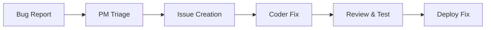

  

# AutoSDLC System Overview

#AutoSDLC #Core #Architecture #Overview

[[AutoSDLC Documentation Hub|← Back to Index]]

## Executive Summary

AutoSDLC revolutionizes software development by creating an autonomous team of AI agents that collaborate to design, implement, test, and deploy software. Built on Claude Code's MCP (Model Context Protocol) capabilities and deep GitHub integration, it transforms how software is created.

## Vision

> "Transform software development from a manual, error-prone process to an intelligent, self-organizing system where AI agents collaborate seamlessly to deliver high-quality software."

## Key Concepts

### 1. Agent-Based Architecture
- **Autonomous Agents**: Each agent has a specific role and expertise
- **Collaborative Intelligence**: Agents work together, not in isolation
- **Self-Organizing**: Agents coordinate without human intervention

### 2. Continuous Development
- **Iterative Process**: Small, frequent improvements
- **Automated Testing**: Every change is validated
- **Continuous Deployment**: Automated release pipeline

### 3. Human-in-the-Loop
- **Oversight**: Humans maintain control over critical decisions
- **Customization**: Agents can be configured and prompted
- **Monitoring**: Real-time visibility into agent activities

## System Components

### Agent Team
1. **[[11-Customer-Agent|Customer Agent]]** #Agent
   - Maintains product vision
   - Validates implementations
   - Provides requirements clarification

2. **[[12-Product-Manager-Agent|Product Manager Agent]]** #Agent
   - Translates requirements
   - Manages GitHub issues
   - Coordinates development

3. **[[13-Coder-Agent|Coder Agent]]** #Agent
   - Implements features
   - Writes tests
   - Creates pull requests

4. **[[14-Code-Reviewer-Agent|Code Reviewer Agent]]** #Agent
   - Reviews code quality
   - Ensures standards
   - Suggests improvements

5. **[[15-Tester-Agent|Tester Agent]]** #Agent
   - Monitors CI/CD
   - Analyzes test results
   - Reports issues

### Infrastructure Components
- **[[20-MCP-Integration|MCP Server/Client]]**: Agent communication backbone
- **[[21-GitHub-Integration|GitHub Integration]]**: Version control and workflow
- **[[22-Workflow-Engine|Workflow Engine]]**: Process orchestration
- **[[40-UI-Architecture|Control Dashboard]]**: Monitoring and configuration

## Core Workflows

### Feature Development Flow

### Bug Fix Flow

## Benefits

### For Development Teams
- ✅ **Increased Velocity**: 10x faster feature delivery
- ✅ **Improved Quality**: Consistent code standards
- ✅ **Reduced Burnout**: Automate repetitive tasks
- ✅ **24/7 Development**: Agents work continuously

### For Organizations
- ✅ **Cost Reduction**: Lower development costs
- ✅ **Faster Time-to-Market**: Rapid iteration
- ✅ **Scalability**: Handle multiple projects
- ✅ **Innovation**: Focus on creative work

## Implementation Philosophy

### 1. **Gradual Adoption**
Start with simple workflows and expand gradually. Begin with automated code reviews, then add implementation capabilities.

### 2. **Human Oversight**
Maintain checkpoints for critical decisions. Humans approve architectural changes and validate business logic.

### 3. **Continuous Learning**
Agents improve through feedback loops. Performance metrics drive optimization.

### 4. **Transparency**
All agent actions are logged and auditable. Decision rationale is documented.

## Success Metrics

### Technical Metrics
- **Response Time**: < 5 seconds per agent action
- **Accuracy**: > 95% successful implementations
- **Uptime**: > 99.9% system availability

### Business Metrics
- **Velocity Increase**: 5-10x improvement
- **Defect Reduction**: 70% fewer bugs
- **Cost Savings**: 60% reduction in development costs

## Getting Started

1. **[[03-Getting-Started|Read the Getting Started Guide]]**
2. **[[02-Architecture|Understand the Architecture]]**
3. **[[20-MCP-Integration|Set up MCP Integration]]**
4. **[[21-GitHub-Integration|Configure GitHub]]**

## Related Documents

- [[02-Architecture|System Architecture]] - Technical deep dive
- [[10-Agent-Framework|Agent Framework]] - Agent system design
- [[22-Workflow-Engine|Workflow Engine]] - Process automation
- [[50-Deployment-Guide|Deployment Guide]] - Production setup

---

**Tags**: #AutoSDLC #Overview #Core #Architecture
**Last Updated**: 2025-06-09
**Next**: [[02-Architecture|System Architecture →]]