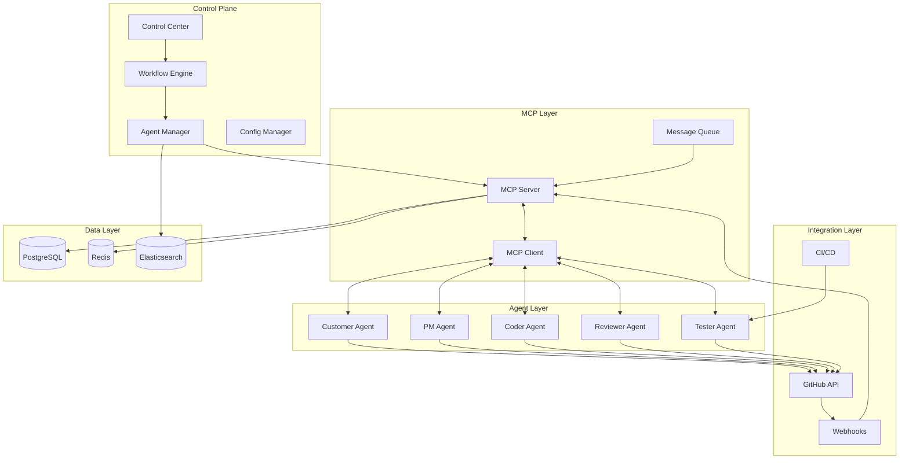
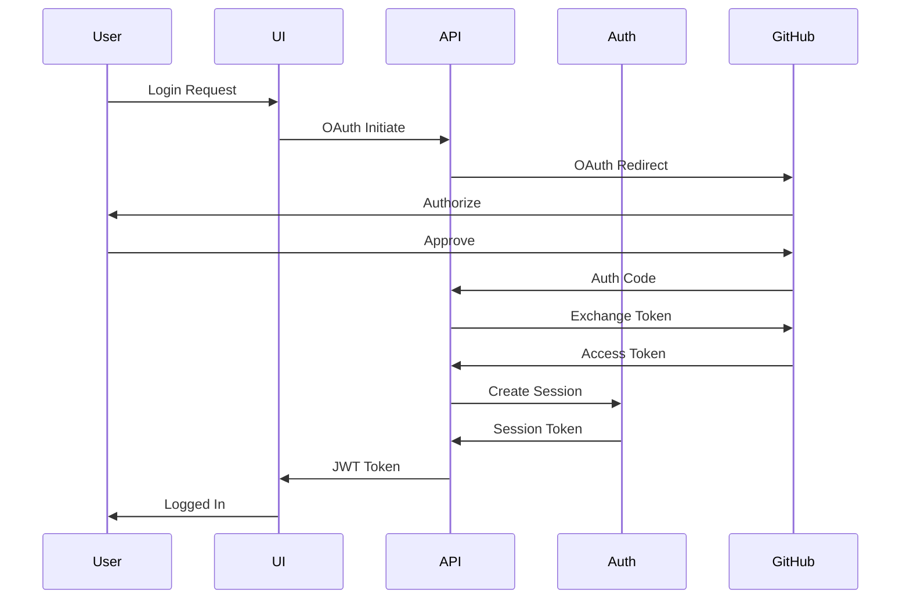

# AutoSDLC System Architecture

#AutoSDLC #Core #Architecture #Technical

[[AutoSDLC Documentation Hub|← Back to Index]] | [[01-Overview|← Overview]] | [[03-Getting-Started|Getting Started →]]

## Architecture Overview



## Design Principles

### 1. **Microservices Architecture**
- Each agent runs as independent service
- Communication via MCP protocol
- Fault isolation and resilience

### 2. **Event-Driven Design**
- Asynchronous message passing
- Event sourcing for audit trail
- Reactive workflows

### 3. **Cloud-Native**
- Container-based deployment
- Kubernetes orchestration
- Auto-scaling capabilities

### 4. **Security-First**
- Zero-trust networking
- Encrypted communications
- Role-based access control

## Core Components

### Control Plane

#### Control Center
```typescript
interface ControlCenter {
  // System orchestration
  startSystem(): Promise<void>;
  stopSystem(): Promise<void>;
  getSystemStatus(): SystemStatus;
  
  // Agent management
  deployAgent(config: AgentConfig): Promise<AgentInstance>;
  scaleAgent(agentId: string, replicas: number): Promise<void>;
  
  // Monitoring
  getMetrics(): SystemMetrics;
  getHealthStatus(): HealthStatus;
}
```

#### Workflow Engine
- **Purpose**: Orchestrate complex multi-agent workflows
- **Technology**: State machine implementation
- **Features**: 
  - Visual workflow designer
  - Conditional branching
  - Parallel execution
  - Error handling

See [[22-Workflow-Engine|Workflow Engine Design]] for details.

### MCP Integration Layer

#### MCP Server Components
```typescript
interface MCPServerConfig {
  port: number;
  authentication: AuthConfig;
  rateLimiting: RateLimitConfig;
  logging: LogConfig;
}

class MCPServer {
  // Core functionality
  async initialize(config: MCPServerConfig): Promise<void>;
  async registerAgent(agent: Agent): Promise<string>;
  async handleRequest(request: MCPRequest): Promise<MCPResponse>;
  
  // Tool management
  async registerTool(tool: Tool): Promise<void>;
  async executeTool(toolName: string, params: any): Promise<any>;
}
```

#### Message Queue Architecture
- **Technology**: RabbitMQ with AMQP protocol
- **Patterns**: 
  - Pub/Sub for broadcasts
  - Work queues for task distribution
  - RPC for synchronous calls

See [[23-Inter-Agent-Communication|Inter-Agent Communication Protocol]] for details.

### Agent Architecture

#### Claude Code Integration
Each agent runs as both an MCP client and server using Claude Code in headless mode:

```bash
# Agent execution using Claude Code
cc -p agents/customer-agent
cc -p agents/pm-agent
cc -p agents/coder-agent
```

#### Agent Directory Structure
```
agents/
├── customer-agent/
│   ├── CLAUDE.md           # Agent-specific Claude instructions
│   ├── .claude/
│   │   └── commands/       # Custom commands for this agent
│   ├── Agent_Output.md     # Status and activity log (writable)
│   └── src/                # Agent implementation
├── pm-agent/
│   ├── CLAUDE.md
│   ├── .claude/commands/
│   ├── Agent_Output.md
│   └── src/
└── shared/
    └── Agent_Status/       # Read-only status from all agents
```

#### Base Agent Class
```typescript
abstract class BaseAgent {
  protected id: string;
  protected type: AgentType;
  protected mcpClient: MCPClient;
  protected mcpServer: MCPServer;  // Agent as MCP server
  protected agentDir: string;      // Agent's directory
  
  // Lifecycle methods
  abstract async initialize(): Promise<void>;
  abstract async shutdown(): Promise<void>;
  
  // Core functionality
  abstract async processTask(task: Task): Promise<TaskResult>;
  abstract async handleMessage(message: Message): Promise<void>;
  
  // Common functionality
  async reportStatus(): Promise<AgentStatus>;
  async logActivity(activity: Activity): Promise<void>;
  async updateAgentOutput(content: string): Promise<void>;
  async readOtherAgentStatus(agentType: string): Promise<string>;
}
```

#### Agent Communication
```typescript
interface AgentMessage {
  id: string;
  from: string;
  to: string;
  type: MessageType;
  payload: any;
  timestamp: Date;
  correlationId?: string;
}

enum MessageType {
  TASK_ASSIGNMENT = 'TASK_ASSIGNMENT',
  STATUS_UPDATE = 'STATUS_UPDATE',
  RESULT_NOTIFICATION = 'RESULT_NOTIFICATION',
  ERROR_REPORT = 'ERROR_REPORT',
  COORDINATION_REQUEST = 'COORDINATION_REQUEST'
}
```

### Data Architecture

#### Primary Database (PostgreSQL)
```sql
-- Core tables
CREATE TABLE projects (
  id UUID PRIMARY KEY,
  name VARCHAR(255),
  repository_url TEXT,
  configuration JSONB,
  created_at TIMESTAMP,
  updated_at TIMESTAMP
);

CREATE TABLE agents (
  id UUID PRIMARY KEY,
  type VARCHAR(50),
  project_id UUID REFERENCES projects(id),
  status VARCHAR(50),
  configuration JSONB,
  performance_metrics JSONB
);

CREATE TABLE tasks (
  id UUID PRIMARY KEY,
  type VARCHAR(50),
  agent_id UUID REFERENCES agents(id),
  status VARCHAR(50),
  input_data JSONB,
  output_data JSONB,
  created_at TIMESTAMP,
  completed_at TIMESTAMP
);

CREATE TABLE workflows (
  id UUID PRIMARY KEY,
  name VARCHAR(255),
  definition JSONB,
  status VARCHAR(50),
  variables JSONB,
  created_at TIMESTAMP
);
```

#### Cache Layer (Redis)
- **Agent State**: Current agent status and assignments
- **Workflow State**: Active workflow instances
- **GitHub Data**: Cached API responses
- **Session Data**: User sessions and preferences

#### Search & Analytics (Elasticsearch)
- **Log Aggregation**: All agent logs
- **Metrics Storage**: Performance data
- **Full-Text Search**: Code and documentation
- **Analytics**: Usage patterns and insights

## Integration Architecture

### GitHub Integration

#### Webhook Handler
```typescript
class GitHubWebhookHandler {
  async handleWebhook(event: GitHubEvent): Promise<void> {
    switch (event.type) {
      case 'issues':
        await this.handleIssueEvent(event);
        break;
      case 'pull_request':
        await this.handlePREvent(event);
        break;
      case 'workflow_run':
        await this.handleWorkflowEvent(event);
        break;
    }
  }
  
  private async handleIssueEvent(event: IssueEvent): Promise<void> {
    // Route to appropriate agent
    const message = this.createAgentMessage(event);
    await this.mcpClient.sendMessage(message);
  }
}
```

See [[21-GitHub-Integration|GitHub Integration Guide]] for complete details.

### API Architecture

#### GraphQL Schema
```graphql
type Query {
  # Project queries
  project(id: ID!): Project
  projects(filter: ProjectFilter): [Project!]!
  
  # Agent queries
  agent(id: ID!): Agent
  agents(projectId: ID!): [Agent!]!
  
  # Workflow queries
  workflow(id: ID!): Workflow
  workflows(projectId: ID!): [Workflow!]!
}

type Mutation {
  # Project mutations
  createProject(input: CreateProjectInput!): Project!
  updateProject(id: ID!, input: UpdateProjectInput!): Project!
  
  # Agent mutations
  deployAgent(input: DeployAgentInput!): Agent!
  updateAgentConfig(id: ID!, config: JSON!): Agent!
  
  # Workflow mutations
  startWorkflow(input: StartWorkflowInput!): Workflow!
  pauseWorkflow(id: ID!): Workflow!
}

type Subscription {
  # Real-time updates
  agentStatus(agentId: ID!): AgentStatus!
  workflowProgress(workflowId: ID!): WorkflowProgress!
  systemLogs(filter: LogFilter): LogEntry!
}
```

See [[30-API-Specification|API Specification]] for complete schema.

## Deployment Architecture

### Container Structure
```yaml
services:
  # Control plane
  control-center:
    image: autosdlc/control-center:latest
    replicas: 2
    
  workflow-engine:
    image: autosdlc/workflow-engine:latest
    replicas: 2
    
  # MCP layer
  mcp-server:
    image: autosdlc/mcp-server:latest
    replicas: 3
    
  # Claude Code Agents (running in headless mode)
  customer-agent:
    image: autosdlc/claude-agent:latest
    command: ["cc", "-p", "/workspace/agents/customer-agent"]
    volumes:
      - ./agents/customer-agent:/workspace/agents/customer-agent
      - ./agents/shared:/workspace/agents/shared:ro
    replicas: 1-5
    
  pm-agent:
    image: autosdlc/claude-agent:latest
    command: ["cc", "-p", "/workspace/agents/pm-agent"]
    volumes:
      - ./agents/pm-agent:/workspace/agents/pm-agent
      - ./agents/shared:/workspace/agents/shared:ro
    replicas: 1-5
    
  coder-agent:
    image: autosdlc/claude-agent:latest
    command: ["cc", "-p", "/workspace/agents/coder-agent"]
    volumes:
      - ./agents/coder-agent:/workspace/agents/coder-agent
      - ./agents/shared:/workspace/agents/shared:ro
    replicas: 2-10
    
  reviewer-agent:
    image: autosdlc/claude-agent:latest
    command: ["cc", "-p", "/workspace/agents/reviewer-agent"]
    volumes:
      - ./agents/reviewer-agent:/workspace/agents/reviewer-agent
      - ./agents/shared:/workspace/agents/shared:ro
    replicas: 2-8
    
  tester-agent:
    image: autosdlc/claude-agent:latest
    command: ["cc", "-p", "/workspace/agents/tester-agent"]
    volumes:
      - ./agents/tester-agent:/workspace/agents/tester-agent
      - ./agents/shared:/workspace/agents/shared:ro
    replicas: 1-5
```

### Kubernetes Architecture
- **Namespaces**: Separate environments (dev, staging, prod)
- **Services**: Load balancing and service discovery
- **ConfigMaps**: Configuration management
- **Secrets**: Sensitive data storage
- **HPA**: Horizontal pod autoscaling

See [[50-Deployment-Guide|Deployment Guide]] for detailed instructions.

## Security Architecture

### Authentication Flow


### Security Layers
1. **Network Security**
   - TLS 1.3 for all communications
   - mTLS between services
   - Network policies in Kubernetes

2. **Application Security**
   - Input validation
   - SQL injection prevention
   - XSS protection

3. **Data Security**
   - Encryption at rest
   - Key rotation
   - Data masking

See [[52-Security-Guidelines|Security Guidelines]] for implementation details.

## Performance Considerations

### Optimization Strategies
1. **Caching**
   - Redis for hot data
   - CDN for static assets
   - API response caching

2. **Database Optimization**
   - Query optimization
   - Connection pooling
   - Read replicas

3. **Async Processing**
   - Background jobs
   - Event streaming
   - Batch processing

### Scalability Targets
- **Concurrent Projects**: 1,000+
- **Active Agents**: 10,000+
- **Messages/Second**: 100,000+
- **API Requests/Second**: 10,000+

## Monitoring & Observability

### Metrics Collection
```typescript
interface SystemMetrics {
  // Agent metrics
  agentResponseTime: Histogram;
  agentSuccessRate: Gauge;
  agentTaskQueue: Gauge;
  
  // System metrics
  apiLatency: Histogram;
  errorRate: Counter;
  activeWorkflows: Gauge;
  
  // Resource metrics
  cpuUsage: Gauge;
  memoryUsage: Gauge;
  diskUsage: Gauge;
}
```

### Logging Strategy
- **Structured Logging**: JSON format
- **Log Levels**: DEBUG, INFO, WARN, ERROR
- **Correlation IDs**: Track requests across services
- **Log Aggregation**: Elasticsearch/Kibana

See [[51-Monitoring-Setup|Monitoring & Logging Setup]] for configuration.

## Related Documents

- [[10-Agent-Framework|Agent Framework Overview]]
- [[20-MCP-Integration|MCP Integration Guide]]
- [[22-Workflow-Engine|Workflow Engine Design]]
- [[30-API-Specification|API Specification]]
- [[50-Deployment-Guide|Deployment Guide]]

---

**Tags**: #AutoSDLC #Architecture #Core #Technical #Design
**Last Updated**: 2025-06-09
**Next**: [[03-Getting-Started|Getting Started Guide →]]