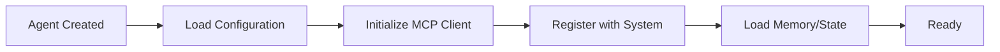
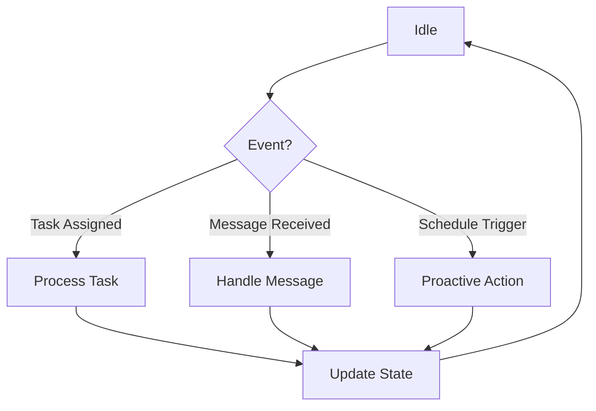
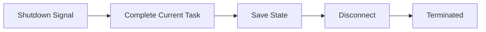

# Agent Framework Overview

#AutoSDLC #Agent #Architecture #Framework

[[AutoSDLC Documentation Hub|← Back to Index]] | [[03-Getting-Started|← Getting Started]]

## Introduction

The Agent Framework is the heart of AutoSDLC, providing the infrastructure for creating, managing, and coordinating AI agents that collaborate to develop software autonomously. Each agent is a specialized AI entity with specific responsibilities, capabilities, and interaction patterns.

## Core Concepts

### Agent Definition
An **agent** in AutoSDLC is:
- An autonomous AI entity powered by Claude Code running in headless mode
- Uses BAML framework for type-safe, schema-validated LLM interactions
- Acts as both MCP client and server for bidirectional communication
- Specialized for specific SDLC tasks with structured prompt engineering
- Capable of independent decision-making with multi-model support
- Able to collaborate with other agents through shared status files
- Stateful and persistent with Agent_Output.md for status tracking

### Agent Characteristics
1. **Autonomy**: Makes decisions within its domain
2. **Reactivity**: Responds to environmental changes
3. **Proactivity**: Takes initiative to achieve goals
4. **Social Ability**: Communicates with other agents

## Agent Architecture

### Base Agent Structure

```typescript
abstract class BaseAgent {
  // Identity
  protected id: string;
  protected type: AgentType;
  protected name: string;
  protected workingDirectory: string;
  
  // BAML Integration - Type-safe LLM interactions
  protected bamlClient: BamlClient;
  protected schemaValidator: SchemaValidator;
  
  // Communication - Claude as both client and server
  protected mcpClient: MCPClient;
  protected mcpServer: MCPServer;
  protected messageQueue: MessageQueue;
  
  // State Management
  protected state: AgentState;
  protected memory: AgentMemory;
  protected agentOutputPath: string;
  
  // Configuration
  protected config: AgentConfig;
  protected prompts: PromptTemplates;
  protected claudeInstructions: string; // From CLAUDE.md
  
  // Lifecycle Methods
  abstract async initialize(): Promise<void>;
  abstract async start(): Promise<void>;
  abstract async stop(): Promise<void>;
  abstract async shutdown(): Promise<void>;
  
  // Core Functionality
  abstract async processTask(task: Task): Promise<TaskResult>;
  abstract async handleMessage(message: Message): Promise<void>;
  abstract async makeDecision(context: DecisionContext): Promise<Decision>;
  
  // Common Methods
  async communicate(target: string, message: Message): Promise<Response>;
  async updateState(newState: Partial<AgentState>): Promise<void>;
  async logActivity(activity: Activity): Promise<void>;
  async reportMetrics(metrics: Metrics): Promise<void>;
  
  // Agent Output Management
  async updateAgentOutput(status: AgentStatus): Promise<void>;
  async readAgentStatus(agentType: string): Promise<AgentStatus>;
  async executeCustomCommand(command: string, args: string[]): Promise<any>;
}
```

### Claude Code Integration

Each agent runs as a Claude Code instance in headless mode, with its own directory structure:

```typescript
interface AgentDirectory {
  claudeMd: string;           // CLAUDE.md - Agent instructions
  agentOutput: string;        // Agent_Output.md - Status updates
  customCommands: string;     // .claude/commands/ - Custom scripts
  sourceCode: string;         // src/ - Agent implementation
}

class ClaudeAgentManager {
  async startAgent(agentType: string): Promise<void> {
    const agentDir = `./agents/${agentType}-agent`;
    
    // Start Claude Code in headless mode
    const process = spawn('cc', ['-p', agentDir], {
      detached: true,
      stdio: 'pipe'
    });
    
    // Monitor agent output
    this.monitorAgentOutput(agentType, `${agentDir}/Agent_Output.md`);
  }
  
  private async monitorAgentOutput(agentType: string, outputPath: string): Promise<void> {
    // Watch for changes in Agent_Output.md
    fs.watch(outputPath, async (eventType) => {
      if (eventType === 'change') {
        const content = await fs.readFile(outputPath, 'utf-8');
        await this.syncToSharedStatus(agentType, content);
      }
    });
  }
  
  private async syncToSharedStatus(agentType: string, content: string): Promise<void> {
    // Copy to shared read-only directory
    const sharedPath = `./agents/shared/Agent_Status/${agentType}_status.md`;
    await fs.writeFile(sharedPath, content);
  }
}
```

### Agent State Management

```typescript
interface AgentState {
  status: AgentStatus;
  currentTask?: Task;
  taskQueue: Task[];
  capabilities: Capability[];
  performance: PerformanceMetrics;
  lastActivity: Date;
}

enum AgentStatus {
  INITIALIZING = 'INITIALIZING',
  IDLE = 'IDLE',
  BUSY = 'BUSY',
  THINKING = 'THINKING',
  COMMUNICATING = 'COMMUNICATING',
  ERROR = 'ERROR',
  SHUTDOWN = 'SHUTDOWN'
}

interface AgentMemory {
  shortTerm: Map<string, any>;
  longTerm: {
    get(key: string): Promise<any>;
    set(key: string, value: any): Promise<void>;
    search(query: string): Promise<any[]>;
  };
}
```

## Agent Lifecycle

### 1. Initialization Phase


### 2. Active Phase


### 3. Shutdown Phase


## Agent Communication Protocol

### Message Types

```typescript
enum MessageType {
  // Task-related
  TASK_REQUEST = 'TASK_REQUEST',
  TASK_ASSIGNMENT = 'TASK_ASSIGNMENT',
  TASK_UPDATE = 'TASK_UPDATE',
  TASK_COMPLETE = 'TASK_COMPLETE',
  
  // Coordination
  COORDINATION_REQUEST = 'COORDINATION_REQUEST',
  INFORMATION_REQUEST = 'INFORMATION_REQUEST',
  CAPABILITY_QUERY = 'CAPABILITY_QUERY',
  
  // Status
  STATUS_UPDATE = 'STATUS_UPDATE',
  HEALTH_CHECK = 'HEALTH_CHECK',
  ERROR_REPORT = 'ERROR_REPORT'
}

interface AgentMessage {
  id: string;
  type: MessageType;
  from: AgentIdentifier;
  to: AgentIdentifier | 'broadcast';
  payload: any;
  timestamp: Date;
  priority: Priority;
  requiresResponse: boolean;
  correlationId?: string;
}
```

### Communication Patterns

#### 1. Request-Response
```typescript
// Agent A requests information from Agent B
const response = await agentA.request(agentB, {
  type: MessageType.INFORMATION_REQUEST,
  payload: { query: 'current sprint status' }
});
```

#### 2. Publish-Subscribe
```typescript
// Agent publishes status update
await agent.publish('status.update', {
  agent: agent.id,
  status: AgentStatus.BUSY,
  task: currentTask
});

// Other agents subscribe to updates
agent.subscribe('status.update', (event) => {
  console.log(`Agent ${event.agent} is now ${event.status}`);
});
```

#### 3. Broadcast
```typescript
// Agent broadcasts to all agents
await agent.broadcast({
  type: MessageType.COORDINATION_REQUEST,
  payload: { action: 'prepare_for_deployment' }
});
```

## Agent Capabilities

### Capability Definition
```typescript
interface Capability {
  name: string;
  description: string;
  version: string;
  parameters: ParameterSchema;
  constraints: Constraint[];
  requiredTools: string[];
}

// Example capabilities
const capabilities = {
  CODE_GENERATION: {
    name: 'code_generation',
    description: 'Generate code based on specifications',
    parameters: {
      language: 'string',
      framework: 'string',
      specifications: 'object'
    }
  },
  
  CODE_REVIEW: {
    name: 'code_review',
    description: 'Review code for quality and standards',
    parameters: {
      pullRequestId: 'string',
      reviewCriteria: 'array'
    }
  }
};
```

### Capability Registration
```typescript
class Agent extends BaseAgent {
  async registerCapabilities(): Promise<void> {
    for (const capability of this.config.capabilities) {
      await this.mcpServer.registerCapability({
        agentId: this.id,
        capability: capability,
        handler: this.createCapabilityHandler(capability)
      });
    }
  }
}
```

## Agent Decision Making

### Decision Framework
```typescript
interface DecisionContext {
  currentState: AgentState;
  availableActions: Action[];
  goals: Goal[];
  constraints: Constraint[];
  historicalData: HistoricalContext;
}

interface Decision {
  action: Action;
  confidence: number;
  reasoning: string;
  alternativeActions: Action[];
}

class DecisionEngine {
  async makeDecision(context: DecisionContext): Promise<Decision> {
    // Analyze context
    const analysis = await this.analyzeContext(context);
    
    // Generate options
    const options = await this.generateOptions(analysis);
    
    // Evaluate options
    const evaluations = await this.evaluateOptions(options, context);
    
    // Select best option
    return this.selectBestOption(evaluations);
  }
}
```

### Goal-Oriented Behavior
```typescript
interface Goal {
  id: string;
  type: GoalType;
  priority: number;
  description: string;
  successCriteria: Criteria[];
  deadline?: Date;
}

class GoalManager {
  private goals: PriorityQueue<Goal>;
  
  async planActions(currentGoal: Goal): Promise<ActionPlan> {
    const subgoals = await this.decomposeGoal(currentGoal);
    const actions = await this.mapGoalsToActions(subgoals);
    return this.optimizeActionSequence(actions);
  }
}
```

## Agent Learning & Adaptation

### Performance Tracking
```typescript
interface PerformanceMetrics {
  tasksCompleted: number;
  successRate: number;
  averageResponseTime: number;
  errorRate: number;
  collaborationScore: number;
  adaptationMetrics: AdaptationMetrics;
}

class PerformanceTracker {
  async trackTaskCompletion(task: Task, result: TaskResult): Promise<void> {
    const metrics = {
      taskId: task.id,
      duration: result.endTime - result.startTime,
      success: result.success,
      errors: result.errors,
      quality: await this.assessQuality(result)
    };
    
    await this.updateMetrics(metrics);
    await this.identifyImprovementAreas(metrics);
  }
}
```

### Prompt Optimization
```typescript
interface PromptTemplate {
  id: string;
  template: string;
  variables: Variable[];
  performance: PromptPerformance;
  version: number;
}

class PromptOptimizer {
  async optimizePrompt(
    template: PromptTemplate, 
    feedback: Feedback[]
  ): Promise<PromptTemplate> {
    const analysis = await this.analyzeFeedback(feedback);
    const improvements = await this.generateImprovements(template, analysis);
    return this.applyImprovements(template, improvements);
  }
}
```

## Agent Types

### 1. [[11-Customer-Agent|Customer Agent]]
- **Role**: Product vision guardian
- **Key Capabilities**: Requirement validation, acceptance testing
- **Communication**: Primarily with PM Agent

### 2. [[12-Product-Manager-Agent|Product Manager Agent]]
- **Role**: Requirement translator and coordinator
- **Key Capabilities**: Issue management, sprint planning
- **Communication**: Hub for all agents

### 3. [[13-Coder-Agent|Coder Agent]]
- **Role**: Implementation specialist
- **Key Capabilities**: Code generation, testing
- **Communication**: With PM and Reviewer agents

### 4. [[14-Code-Reviewer-Agent|Code Reviewer Agent]]
- **Role**: Quality gatekeeper
- **Key Capabilities**: Code analysis, standard enforcement
- **Communication**: With Coder and PM agents

### 5. [[15-Tester-Agent|Tester Agent]]
- **Role**: Automated QA specialist
- **Key Capabilities**: Test monitoring, result analysis
- **Communication**: With all agents for status updates

## Agent Orchestration

### Workflow Coordination
```typescript
class AgentOrchestrator {
  private agents: Map<string, Agent>;
  private workflows: Map<string, Workflow>;
  
  async executeWorkflow(workflowId: string): Promise<WorkflowResult> {
    const workflow = this.workflows.get(workflowId);
    const execution = new WorkflowExecution(workflow);
    
    for (const step of workflow.steps) {
      const agent = this.selectAgent(step.requiredCapabilities);
      const result = await this.executeStep(agent, step, execution.context);
      execution.recordStepResult(step.id, result);
      
      if (!result.success && step.critical) {
        return execution.fail(result.error);
      }
    }
    
    return execution.complete();
  }
  
  private selectAgent(capabilities: string[]): Agent {
    // Select best available agent based on capabilities and load
    return this.agents.values()
      .filter(agent => agent.hasCapabilities(capabilities))
      .sort((a, b) => a.getCurrentLoad() - b.getCurrentLoad())[0];
  }
}
```

### Load Balancing
```typescript
class LoadBalancer {
  async distributeTask(task: Task): Promise<AgentAssignment> {
    const capableAgents = await this.findCapableAgents(task.requiredCapabilities);
    
    const agentLoads = await Promise.all(
      capableAgents.map(agent => ({
        agent,
        load: agent.getCurrentLoad(),
        performance: agent.getPerformanceScore()
      }))
    );
    
    // Select agent with best score (low load + high performance)
    const selected = agentLoads
      .sort((a, b) => {
        const scoreA = a.load / a.performance;
        const scoreB = b.load / b.performance;
        return scoreA - scoreB;
      })[0];
    
    return {
      agentId: selected.agent.id,
      task: task,
      estimatedCompletion: this.estimateCompletion(selected, task)
    };
  }
}
```

## Monitoring & Debugging

### Agent Monitoring
```typescript
interface AgentMonitor {
  // Health monitoring
  checkHealth(agentId: string): Promise<HealthStatus>;
  getMetrics(agentId: string): Promise<AgentMetrics>;
  
  // Activity monitoring
  getCurrentActivity(agentId: string): Promise<Activity>;
  getActivityHistory(agentId: string, timeRange: TimeRange): Promise<Activity[]>;
  
  // Performance monitoring
  getPerformanceReport(agentId: string): Promise<PerformanceReport>;
  identifyBottlenecks(): Promise<Bottleneck[]>;
}
```

### Debug Tools
```typescript
class AgentDebugger {
  async traceExecution(agentId: string, taskId: string): Promise<ExecutionTrace> {
    const trace = new ExecutionTrace();
    
    // Collect all events related to task
    const events = await this.collectEvents(agentId, taskId);
    
    // Build execution timeline
    const timeline = this.buildTimeline(events);
    
    // Identify issues
    const issues = await this.identifyIssues(timeline);
    
    return {
      timeline,
      issues,
      recommendations: await this.generateRecommendations(issues)
    };
  }
}
```

## Best Practices

### 1. Agent Design
- **Single Responsibility**: Each agent should have one clear purpose
- **Stateless Operations**: Prefer stateless operations when possible
- **Graceful Degradation**: Handle failures without system-wide impact

### 2. Communication
- **Async by Default**: Use asynchronous communication
- **Timeout Handling**: Always set reasonable timeouts
- **Message Validation**: Validate all incoming messages

### 3. Error Handling
- **Retry Logic**: Implement exponential backoff
- **Circuit Breakers**: Prevent cascade failures
- **Error Reporting**: Comprehensive error tracking

### 4. Performance
- **Resource Limits**: Set memory and CPU limits
- **Caching**: Cache frequently accessed data
- **Batch Processing**: Group similar operations

## Configuration Reference

### Agent Configuration Schema
```yaml
# agent-config.yaml
agent:
  id: "coder-001"
  type: "coder"
  name: "Primary Coder Agent"
  workingDirectory: "./agents/coder-agent"
  
# Claude Code specific configuration
claudeCode:
  mode: "headless"
  profile: "coder-agent"
  instructionsFile: "CLAUDE.md"
  outputFile: "Agent_Output.md"
  commandsDirectory: ".claude/commands"
  
capabilities:
  - code_generation
  - test_generation
  - documentation_writing
  - tdd_implementation
  
resources:
  memory: "2Gi"
  cpu: "1000m"
  maxConcurrentTasks: 5
  
communication:
  timeout: 30s
  retries: 3
  messageQueueSize: 100
  mcpServerPort: 8081  # Agent as MCP server
  
prompts:
  systemPrompt: |
    You are a Coder Agent in the AutoSDLC system.
    Follow the instructions in CLAUDE.md for all operations.
  
  templates:
    codeGeneration: "prompts/code_generation.txt"
    testGeneration: "prompts/test_generation.txt"
    tddImplementation: "prompts/tdd_implementation.txt"
    
monitoring:
  healthCheckInterval: 30s
  metricsInterval: 60s
  logLevel: "info"
  statusUpdateInterval: 60s  # Update Agent_Output.md
```

### CLAUDE.md Template

```markdown
# agents/{agent-type}-agent/CLAUDE.md

## Agent Role and Responsibilities

[Detailed description of the agent's role]

## Working Directory Structure

```
./
├── CLAUDE.md          # This file
├── Agent_Output.md    # Your status updates (write here)
├── .claude/
│   └── commands/      # Custom commands you can execute
├── src/               # Source code
└── config.yaml        # Configuration
```

## Permissions

- **Write Access**: Only to files in your agent directory
- **Read Access**: 
  - Your own directory (full access)
  - `../shared/Agent_Status/` (read-only access to other agents' status)
  
## Communication Protocol

1. **Status Updates**: Write to `Agent_Output.md` every 60 seconds
2. **Reading Other Agents**: Check `../shared/Agent_Status/{agent}_status.md`
3. **MCP Communication**: Use both client and server capabilities

## Available Commands

Execute commands from `.claude/commands/`:
- `validate-code.sh`: Validate code quality
- `run-tests.sh`: Execute test suites
- `generate-report.sh`: Create status reports

## TDD Workflow (for Coder Agent)

1. Read test specifications
2. Verify tests are failing (red)
3. Implement minimal code to pass tests
4. Refactor while keeping tests green
5. Update Agent_Output.md with progress
```

## Related Documents

- [[11-Customer-Agent|Customer Agent Specification]]
- [[12-Product-Manager-Agent|PM Agent Specification]]
- [[13-Coder-Agent|Coder Agent Specification]]
- [[14-Code-Reviewer-Agent|Code Reviewer Agent Specification]]
- [[15-Tester-Agent|Tester Agent Specification]]
- [[20-MCP-Integration|MCP Integration Guide]]
- [[23-Inter-Agent-Communication|Inter-Agent Communication]]

---

**Tags**: #AutoSDLC #Agent #Framework #Architecture #Core
**Last Updated**: 2025-06-09
**Next**: [[11-Customer-Agent|Customer Agent Specification →]]