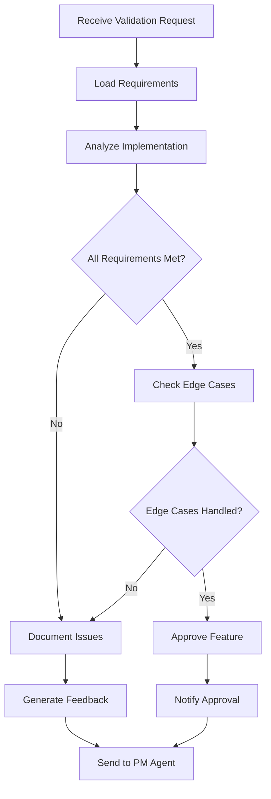
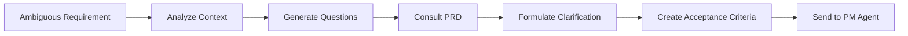

# Customer Agent Specification

#AutoSDLC #Agent #Customer #Specification

[[AutoSDLC Documentation Hub|← Back to Index]] | [[10-Agent-Framework|← Agent Framework]]

## Overview

The Customer Agent represents the voice of the customer within the AutoSDLC system. It maintains the product vision, validates implementations against requirements, and ensures that delivered features meet customer expectations.

## Core Responsibilities

### 1. Product Vision Maintenance
- Maintains and interprets the Product Requirements Document (PRD)
- Ensures consistency with overall product strategy
- Guards against scope creep and feature drift

### 2. Requirement Clarification
- Provides detailed explanations when requirements are ambiguous
- Generates acceptance criteria for features
- Answers questions from other agents about user intent

### 3. Feature Validation
- Reviews implemented features against specifications
- Provides acceptance or rejection with detailed feedback
- Suggests improvements to better meet user needs

### 4. User Story Generation
- Creates user stories from high-level requirements
- Defines clear acceptance criteria
- Prioritizes features based on business value

## Agent Architecture

### Class Definition

```typescript
export class CustomerAgent extends BaseAgent {
  private prd: ProductRequirementsDocument;
  private productVision: ProductVision;
  private validationHistory: ValidationHistory;
  private workingDir: string = './agents/customer-agent';
  
  constructor(config: CustomerAgentConfig) {
    super(config);
    this.type = AgentType.CUSTOMER;
    this.capabilities = [
      'requirement_validation',
      'acceptance_testing',
      'vision_maintenance',
      'user_story_generation'
    ];
  }
  
  async initialize(): Promise<void> {
    await super.initialize();
    await this.loadProductDocumentation();
    await this.initializeValidationEngine();
    await this.initializeClaudeCode();
    await this.startMCPServer(8081); // Agent as MCP server
  }
  
  async processTask(task: Task): Promise<TaskResult> {
    // Update Agent_Output.md with task start
    await this.updateAgentOutput({
      status: 'processing',
      currentTask: task.type,
      timestamp: new Date()
    });
    
    let result: TaskResult;
    switch (task.type) {
      case 'validate_feature':
        result = await this.validateFeature(task);
        break;
      case 'clarify_requirement':
        result = await this.clarifyRequirement(task);
        break;
      case 'generate_acceptance_criteria':
        result = await this.generateAcceptanceCriteria(task);
        break;
      case 'review_implementation':
        result = await this.reviewImplementation(task);
        break;
      default:
        throw new Error(`Unknown task type: ${task.type}`);
    }
    
    // Update Agent_Output.md with task completion
    await this.updateAgentOutput({
      status: 'idle',
      lastCompletedTask: task.type,
      lastResult: result.success ? 'success' : 'failed',
      timestamp: new Date()
    });
    
    return result;
  }
  
  private async updateAgentOutput(status: any): Promise<void> {
    const outputPath = path.join(this.workingDir, 'Agent_Output.md');
    const content = `# Customer Agent Status

**Last Updated**: ${status.timestamp}
**Status**: ${status.status}
**Current Task**: ${status.currentTask || 'None'}
**Last Completed**: ${status.lastCompletedTask || 'None'}
**Result**: ${status.lastResult || 'N/A'}

## Recent Activities
${this.formatRecentActivities()}
`;
    
    await fs.writeFile(outputPath, content);
  }
}
```

### State Management

```typescript
interface CustomerAgentState extends AgentState {
  currentValidations: Map<string, ValidationSession>;
  pendingClarifications: ClarificationRequest[];
  featureApprovals: Map<string, ApprovalStatus>;
  satisfactionMetrics: SatisfactionMetrics;
}

interface ValidationSession {
  id: string;
  featureId: string;
  startTime: Date;
  requirements: Requirement[];
  implementationDetails: Implementation;
  validationSteps: ValidationStep[];
  currentStep: number;
  decision?: ValidationDecision;
}
```

## Core Capabilities

### 1. Requirement Validation

```typescript
class RequirementValidator {
  async validateFeature(
    feature: Feature,
    requirements: Requirement[]
  ): Promise<ValidationResult> {
    const checks = await Promise.all([
      this.checkFunctionalRequirements(feature, requirements),
      this.checkNonFunctionalRequirements(feature, requirements),
      this.checkUserExperience(feature, requirements),
      this.checkBusinessConstraints(feature, requirements)
    ]);
    
    return {
      passed: checks.every(c => c.passed),
      score: this.calculateValidationScore(checks),
      feedback: this.generateFeedback(checks),
      suggestions: this.generateSuggestions(checks)
    };
  }
  
  private async checkFunctionalRequirements(
    feature: Feature,
    requirements: Requirement[]
  ): Promise<Check> {
    // Verify each functional requirement is met
    const functionalReqs = requirements.filter(r => r.type === 'functional');
    const results = await Promise.all(
      functionalReqs.map(req => this.verifyRequirement(feature, req))
    );
    
    return {
      category: 'functional',
      passed: results.every(r => r.met),
      details: results
    };
  }
}
```

### 2. Acceptance Criteria Generation

```typescript
class AcceptanceCriteriaGenerator {
  async generateCriteria(
    userStory: UserStory
  ): Promise<AcceptanceCriteria[]> {
    const criteria: AcceptanceCriteria[] = [];
    
    // Given-When-Then format
    const scenarios = await this.identifyScenarios(userStory);
    
    for (const scenario of scenarios) {
      criteria.push({
        id: generateId(),
        scenario: scenario.description,
        given: scenario.preconditions,
        when: scenario.actions,
        then: scenario.expectedResults,
        priority: scenario.priority,
        testable: true
      });
    }
    
    return criteria;
  }
}
```

### 3. Feature Review Process

```typescript
class FeatureReviewer {
  async reviewImplementation(
    implementation: Implementation,
    requirements: Requirement[]
  ): Promise<ReviewResult> {
    const review = new ReviewSession();
    
    // Step 1: Functional review
    review.addStep(await this.functionalReview(implementation, requirements));
    
    // Step 2: User experience review
    review.addStep(await this.uxReview(implementation));
    
    // Step 3: Edge case handling
    review.addStep(await this.edgeCaseReview(implementation));
    
    // Step 4: Performance validation
    review.addStep(await this.performanceReview(implementation));
    
    // Generate comprehensive feedback
    return {
      decision: review.getDecision(),
      feedback: review.generateFeedback(),
      requiredChanges: review.getRequiredChanges(),
      suggestions: review.getSuggestions()
    };
  }
}
```

## Communication Patterns

### With Product Manager Agent

```typescript
// Requirement clarification request
interface ClarificationRequest {
  type: 'CLARIFICATION_REQUEST';
  from: 'customer-agent';
  to: 'pm-agent';
  payload: {
    requirementId: string;
    ambiguity: string;
    suggestedClarification: string;
    context: RequirementContext;
  };
}

// Feature approval notification
interface ApprovalNotification {
  type: 'FEATURE_APPROVAL';
  from: 'customer-agent';
  to: 'pm-agent';
  payload: {
    featureId: string;
    approved: boolean;
    feedback: string;
    conditions?: string[];
  };
}
```

### With Coder Agent

```typescript
// Implementation feedback
interface ImplementationFeedback {
  type: 'IMPLEMENTATION_FEEDBACK';
  from: 'customer-agent';
  to: 'coder-agent';
  payload: {
    implementationId: string;
    issues: Issue[];
    suggestions: Suggestion[];
    exampleCode?: string;
  };
}
```

## Claude Integration

### CLAUDE.md Configuration

```markdown
# agents/customer-agent/CLAUDE.md

## Customer Agent Instructions

You are the Customer Agent in the AutoSDLC system. Your role is to represent the customer's perspective and ensure all implementations align with the product vision and requirements.

### Working Directory
- **Write Access**: `./Agent_Output.md` and files in your directory
- **Read Access**: 
  - Your own directory (full access)
  - `../shared/Agent_Status/` (read other agents' status)
  - Product requirements documents

### Key Responsibilities
1. Maintain deep understanding of product requirements and vision
2. Validate features against specifications  
3. Provide clear, actionable feedback
4. Generate acceptance criteria
5. Ensure user satisfaction

### Communication Protocol
1. Update `Agent_Output.md` every 60 seconds with your status
2. Check other agents' status before validation:
   - `../shared/Agent_Status/pm_status.md`
   - `../shared/Agent_Status/coder_status.md`
3. Use MCP for formal communications

### Available Commands
Execute from `.claude/commands/`:
- `validate-implementation.sh [PR_NUMBER]` - Validate a pull request
- `check-requirements.sh [REQ_ID]` - Check requirement details
- `generate-criteria.sh [STORY_ID]` - Generate acceptance criteria

### Guidelines
- Always prioritize user experience and business value
- Be specific in feedback - provide examples when possible
- Consider edge cases and error scenarios
- Think about non-functional requirements (performance, security, usability)
- Maintain consistency with existing product features
```

### Custom Commands

```bash
# agents/customer-agent/.claude/commands/validate-implementation.sh
#!/bin/bash
# Validate implementation against requirements

PR_NUMBER=$1
REQ_ID=$2

echo "Validating PR #$PR_NUMBER against requirement $REQ_ID"

# Fetch PR details
gh pr view $PR_NUMBER --json files,title,body > pr_details.json

# Check requirements
cat ../requirements/$REQ_ID.md

# Run validation checks
node ../scripts/validate-pr.js $PR_NUMBER $REQ_ID

# Update Agent_Output.md with results
echo "Validation completed at $(date)" >> ../Agent_Output.md
```

## Prompt Engineering

### System Prompt

```
You are the Customer Agent in the AutoSDLC system. Follow the instructions in CLAUDE.md for all operations.

Your primary interface is through:
1. The Agent_Output.md file for status updates
2. Custom commands in .claude/commands/ for specific tasks
3. MCP communication for inter-agent coordination

Always maintain the customer perspective and ensure quality.
```

### Validation Template

```
Task: Validate the following implementation against requirements

Implementation Details:
{implementation_summary}
{code_changes}
{test_coverage}

Requirements:
{relevant_requirements}

Acceptance Criteria:
{acceptance_criteria}

Please evaluate:
1. Does the implementation fully satisfy all requirements?
2. Are all acceptance criteria met?
3. Are there any missing edge cases?
4. Is the user experience optimal?
5. Are there any potential issues or improvements?

Provide:
- Validation decision (APPROVED/REJECTED/CONDITIONAL)
- Detailed feedback for each requirement
- Specific issues that must be addressed
- Suggestions for improvement
```

### Clarification Template

```
A clarification is needed for the following requirement:

Requirement: {requirement_text}
Context: {requirement_context}
Ambiguity: {identified_ambiguity}

The development team needs clarification on:
{specific_questions}

Based on the product vision and user needs, please provide:
1. Clear interpretation of the requirement
2. Specific acceptance criteria
3. Examples of expected behavior
4. Any constraints or considerations
```

## Configuration

### Agent Configuration

```yaml
# config/agents/customer.yaml
agent:
  id: customer-001
  type: customer
  name: "Customer Agent"
  workingDirectory: "./agents/customer-agent"
  
# Claude Code configuration
claudeCode:
  mode: "headless"
  profile: "customer-agent"
  instructionsFile: "CLAUDE.md"
  outputFile: "Agent_Output.md"
  commandsDirectory: ".claude/commands"
  
# MCP configuration (agent as both client and server)
mcp:
  client:
    serverUrl: "http://localhost:8080"
  server:
    port: 8081
    capabilities:
      - "validation_results"
      - "requirement_queries"
      - "status_updates"
  
capabilities:
  - requirement_validation
  - acceptance_testing
  - vision_maintenance
  - user_story_generation
  
settings:
  validation:
    strictMode: true
    requireAllCriteria: true
    edgeCaseChecking: enabled
    
  feedback:
    detailLevel: high
    includeExamples: true
    suggestImprovements: true
    
  response:
    maxResponseTime: 30s
    priorityHandling: true
    
  statusUpdate:
    interval: 60s
    includeMetrics: true
    
prompts:
  systemPrompt: "You are the Customer Agent. Follow CLAUDE.md instructions."
  validationPrompt: "prompts/customer/validation.txt"
  clarificationPrompt: "prompts/customer/clarification.txt"
  
memory:
  type: "long-term"
  provider: "postgresql"
  retention: "permanent"
```

### Validation Rules

```yaml
# config/validation-rules.yaml
validation:
  functional:
    - id: "req-coverage"
      description: "All requirements must be addressed"
      severity: "critical"
      
    - id: "acceptance-criteria"
      description: "All acceptance criteria must pass"
      severity: "critical"
      
  non-functional:
    - id: "performance"
      description: "Response time < 200ms"
      severity: "major"
      
    - id: "accessibility"
      description: "WCAG 2.1 AA compliance"
      severity: "major"
      
  user-experience:
    - id: "intuitive-flow"
      description: "User flow must be intuitive"
      severity: "major"
      
    - id: "error-handling"
      description: "Clear error messages"
      severity: "minor"
```

## Workflows

### Feature Validation Workflow



### Requirement Clarification Workflow



## Performance Metrics

### Key Performance Indicators

```typescript
interface CustomerAgentMetrics {
  // Validation metrics
  validationAccuracy: number;         // % of correct validations
  averageValidationTime: number;      // ms
  validationThroughput: number;       // validations/hour
  
  // Quality metrics
  requirementCoverage: number;        // % requirements validated
  falsePositiveRate: number;          // % incorrect rejections
  falseNegativeRate: number;          // % incorrect approvals
  
  // Collaboration metrics
  clarificationResponseTime: number;  // ms
  feedbackQualityScore: number;       // 0-100
  agentSatisfactionScore: number;     // 0-100
}
```

### Performance Optimization

```typescript
class PerformanceOptimizer {
  async optimizeValidation(metrics: CustomerAgentMetrics): Promise<Optimization> {
    const optimizations = [];
    
    if (metrics.averageValidationTime > 30000) {
      optimizations.push({
        type: 'caching',
        target: 'requirement_loading',
        expectedImprovement: '40%'
      });
    }
    
    if (metrics.falsePositiveRate > 0.05) {
      optimizations.push({
        type: 'prompt_tuning',
        target: 'validation_criteria',
        expectedImprovement: '60%'
      });
    }
    
    return this.applyOptimizations(optimizations);
  }
}
```

## Error Handling

### Common Errors

```typescript
enum CustomerAgentError {
  MISSING_REQUIREMENTS = 'MISSING_REQUIREMENTS',
  INVALID_IMPLEMENTATION = 'INVALID_IMPLEMENTATION',
  PRD_NOT_FOUND = 'PRD_NOT_FOUND',
  VALIDATION_TIMEOUT = 'VALIDATION_TIMEOUT',
  AMBIGUOUS_CRITERIA = 'AMBIGUOUS_CRITERIA'
}

class CustomerAgentErrorHandler {
  async handle(error: CustomerAgentError, context: ErrorContext): Promise<Resolution> {
    switch (error) {
      case CustomerAgentError.MISSING_REQUIREMENTS:
        return await this.requestRequirements(context);
        
      case CustomerAgentError.VALIDATION_TIMEOUT:
        return await this.extendValidationTime(context);
        
      case CustomerAgentError.AMBIGUOUS_CRITERIA:
        return await this.clarifyWithPM(context);
        
      default:
        return await this.escalateToHuman(error, context);
    }
  }
}
```

## Integration Examples

### Starting the Customer Agent

```typescript
import { CustomerAgent } from '@autosdlc/agents';

const agent = new CustomerAgent({
  id: 'customer-001',
  mcpServerUrl: process.env.MCP_SERVER_URL,
  config: {
    validationMode: 'strict',
    feedbackDetail: 'high',
    memoryProvider: 'postgresql'
  }
});

await agent.initialize();
await agent.start();

// Agent is now ready to process tasks
```

### Handling Validation Requests

```typescript
// Listen for validation requests
agent.on('task:validate_feature', async (task) => {
  const result = await agent.validateFeature({
    implementation: task.payload.implementation,
    requirements: task.payload.requirements,
    acceptanceCriteria: task.payload.criteria
  });
  
  await agent.respond(task.id, result);
});
```

## Best Practices

### 1. Requirement Management
- Keep PRD and acceptance criteria up to date
- Version all requirement changes
- Maintain traceability from requirements to implementation

### 2. Validation Process
- Always validate against specific, measurable criteria
- Consider both happy path and edge cases
- Provide actionable feedback with examples

### 3. Communication
- Be clear and specific in feedback
- Respond promptly to clarification requests
- Maintain professional, constructive tone

### 4. Performance
- Cache frequently accessed requirements
- Batch validation operations when possible
- Use parallel processing for independent checks

## Related Documents

- [[10-Agent-Framework|Agent Framework Overview]]
- [[12-Product-Manager-Agent|Product Manager Agent]]
- [[61-Agent-Prompt-Engineering|Agent Prompt Engineering]]
- [[22-Workflow-Engine|Workflow Engine Design]]

---

**Tags**: #AutoSDLC #Agent #Customer #Specification #Validation
**Last Updated**: 2025-06-09
**Next**: [[12-Product-Manager-Agent|Product Manager Agent →]]