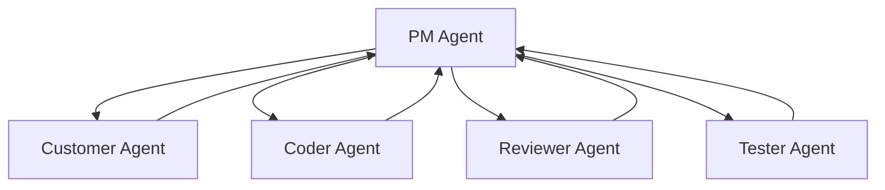
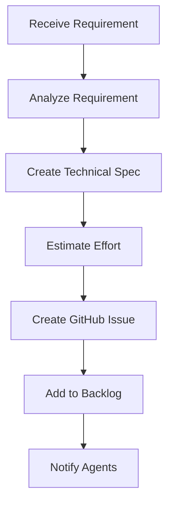
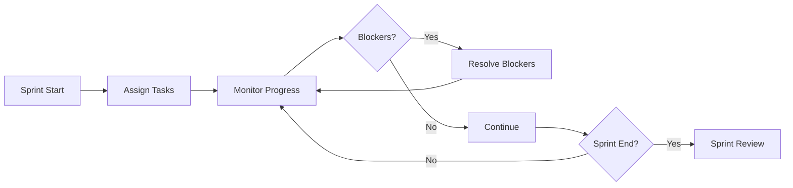

# Product Manager Agent Specification

#AutoSDLC #Agent #ProductManager #Specification

[[AutoSDLC Documentation Hub|← Back to Index]] | [[11-Customer-Agent|← Customer Agent]]

## Overview

The Product Manager (PM) Agent serves as the central coordinator and translator in the AutoSDLC system. It bridges the gap between business requirements and technical implementation, managing the entire development workflow from requirement analysis to deployment.

## Core Responsibilities

### 1. Requirement Translation
- Converts customer requirements into technical specifications
- Creates detailed GitHub issues with implementation guidance
- Breaks down epics into manageable user stories
- Defines clear acceptance criteria

### 2. Work Coordination
- Manages product backlog and sprint planning
- Assigns tasks to appropriate agents
- Tracks progress across all development activities
- Facilitates inter-agent communication

### 3. GitHub Management
- Creates and manages GitHub issues
- Updates issue status and labels
- Links PRs to issues
- Manages milestones and project boards

### 4. Decision Making
- Prioritizes features based on business value
- Resolves conflicts between requirements
- Makes trade-off decisions
- Escalates critical decisions to stakeholders

## Agent Architecture

### Class Definition

```typescript
export class ProductManagerAgent extends BaseAgent {
  private backlog: ProductBacklog;
  private sprintManager: SprintManager;
  private githubClient: GitHubClient;
  private decisionEngine: DecisionEngine;
  
  constructor(config: PMAgentConfig) {
    super(config);
    this.type = AgentType.PRODUCT_MANAGER;
    this.capabilities = [
      'requirement_analysis',
      'issue_management',
      'sprint_planning',
      'task_coordination',
      'progress_tracking',
      'stakeholder_communication'
    ];
  }
  
  async initialize(): Promise<void> {
    await super.initialize();
    await this.connectToGitHub();
    await this.loadProductBacklog();
    await this.initializeSprintManager();
  }
  
  async processTask(task: Task): Promise<TaskResult> {
    switch (task.type) {
      case 'analyze_requirement':
        return await this.analyzeRequirement(task);
      case 'create_issue':
        return await this.createGitHubIssue(task);
      case 'plan_sprint':
        return await this.planSprint(task);
      case 'coordinate_agents':
        return await this.coordinateAgents(task);
      case 'track_progress':
        return await this.trackProgress(task);
      default:
        throw new Error(`Unknown task type: ${task.type}`);
    }
  }
}
```

### State Management

```typescript
interface PMAgentState extends AgentState {
  activeSpint: Sprint;
  backlogItems: BacklogItem[];
  agentAssignments: Map<string, Assignment[]>;
  blockingIssues: BlockingIssue[];
  progressMetrics: ProgressMetrics;
}

interface Sprint {
  id: string;
  number: number;
  startDate: Date;
  endDate: Date;
  goals: SprintGoal[];
  committedItems: BacklogItem[];
  velocity: number;
  status: SprintStatus;
}

interface BacklogItem {
  id: string;
  type: 'feature' | 'bug' | 'task' | 'improvement';
  title: string;
  description: string;
  acceptanceCriteria: string[];
  priority: Priority;
  estimate: number;
  assignedAgent?: string;
  status: ItemStatus;
  githubIssueNumber?: number;
}
```

## Core Capabilities

### 1. Requirement Analysis

```typescript
class RequirementAnalyzer {
  async analyzeRequirement(
    requirement: CustomerRequirement
  ): Promise<TechnicalSpecification> {
    // Break down the requirement
    const components = await this.decomposeRequirement(requirement);
    
    // Identify technical challenges
    const challenges = await this.identifyTechnicalChallenges(components);
    
    // Determine implementation approach
    const approach = await this.determineImplementationApproach(
      components,
      challenges
    );
    
    // Create technical specification
    return {
      id: generateId(),
      requirement: requirement,
      components: components,
      technicalApproach: approach,
      dependencies: await this.identifyDependencies(components),
      estimatedEffort: await this.estimateEffort(components),
      risks: await this.assessRisks(challenges),
      implementationSteps: await this.createImplementationSteps(approach)
    };
  }
  
  private async decomposeRequirement(
    requirement: CustomerRequirement
  ): Promise<Component[]> {
    const prompts = [
      `Analyze the following requirement and break it down into technical components:`,
      `Requirement: ${requirement.description}`,
      `Acceptance Criteria: ${requirement.acceptanceCriteria.join(', ')}`,
      `Identify: 1) Core functionality 2) Data requirements 3) UI components 4) Integration points`
    ];
    
    const analysis = await this.llm.analyze(prompts.join('\n'));
    return this.parseComponents(analysis);
  }
}
```

### 2. GitHub Issue Management

```typescript
class GitHubIssueManager {
  async createIssue(
    spec: TechnicalSpecification,
    backlogItem: BacklogItem
  ): Promise<GitHubIssue> {
    const issue = {
      title: this.generateIssueTitle(backlogItem),
      body: this.generateIssueBody(spec, backlogItem),
      labels: this.determineLabels(spec),
      milestone: this.selectMilestone(backlogItem.priority),
      assignees: [], // Will be assigned by agent coordinator
    };
    
    const created = await this.githubClient.issues.create({
      owner: this.config.owner,
      repo: this.config.repo,
      ...issue
    });
    
    // Link to project board
    await this.addToProjectBoard(created.data.number, backlogItem);
    
    return created.data;
  }
  
  private generateIssueBody(
    spec: TechnicalSpecification,
    item: BacklogItem
  ): string {
    return `
## Description
${item.description}

## Technical Specification
${spec.technicalApproach.summary}

## Acceptance Criteria
${item.acceptanceCriteria.map(ac => `- [ ] ${ac}`).join('\n')}

## Implementation Steps
${spec.implementationSteps.map((step, i) => `${i + 1}. ${step}`).join('\n')}

## Technical Details
- **Estimated Effort**: ${spec.estimatedEffort} story points
- **Dependencies**: ${spec.dependencies.join(', ') || 'None'}
- **Risk Level**: ${spec.risks.level}

## Definition of Done
- [ ] Code implemented and tested
- [ ] Unit tests written (coverage > 80%)
- [ ] Code reviewed and approved
- [ ] Documentation updated
- [ ] Acceptance criteria verified

---
*Generated by AutoSDLC PM Agent*
    `;
  }
}
```

### 3. Sprint Planning

```typescript
class SprintPlanner {
  async planSprint(
    velocity: number,
    duration: number,
    priorities: Priority[]
  ): Promise<SprintPlan> {
    // Get available backlog items
    const availableItems = await this.getReadyItems();
    
    // Calculate capacity
    const capacity = this.calculateCapacity(velocity, duration);
    
    // Select items for sprint
    const selectedItems = await this.selectItems(
      availableItems,
      capacity,
      priorities
    );
    
    // Assign to agents
    const assignments = await this.createAgentAssignments(selectedItems);
    
    // Create sprint plan
    return {
      items: selectedItems,
      assignments: assignments,
      goals: await this.defineSprintGoals(selectedItems),
      risks: await this.identifySprintRisks(selectedItems),
      dependencies: await this.mapDependencies(selectedItems)
    };
  }
  
  private async selectItems(
    items: BacklogItem[],
    capacity: number,
    priorities: Priority[]
  ): Promise<BacklogItem[]> {
    const selected: BacklogItem[] = [];
    let remainingCapacity = capacity;
    
    // Sort by priority and dependencies
    const sorted = this.sortByPriorityAndDependencies(items, priorities);
    
    for (const item of sorted) {
      if (item.estimate <= remainingCapacity) {
        selected.push(item);
        remainingCapacity -= item.estimate;
      }
    }
    
    return selected;
  }
}
```

### 4. Agent Coordination

```typescript
class AgentCoordinator {
  async coordinateAgents(
    task: DevelopmentTask
  ): Promise<CoordinationResult> {
    const workflow = await this.selectWorkflow(task);
    const execution = new WorkflowExecution(workflow);
    
    for (const step of workflow.steps) {
      // Select appropriate agent
      const agent = await this.selectAgent(step.requiredCapabilities);
      
      // Prepare task for agent
      const agentTask = await this.prepareAgentTask(step, task, execution.context);
      
      // Assign task to agent
      const assignment = await this.assignTask(agent, agentTask);
      
      // Monitor execution
      const result = await this.monitorExecution(assignment);
      
      // Update execution context
      execution.recordResult(step.id, result);
      
      // Handle failures
      if (!result.success) {
        await this.handleFailure(result, execution);
      }
    }
    
    return execution.complete();
  }
  
  private async selectAgent(capabilities: string[]): Promise<Agent> {
    const availableAgents = await this.getAvailableAgents(capabilities);
    
    // Score agents based on availability and performance
    const scores = await Promise.all(
      availableAgents.map(async agent => ({
        agent,
        score: await this.scoreAgent(agent, capabilities)
      }))
    );
    
    // Select best agent
    return scores.sort((a, b) => b.score - a.score)[0].agent;
  }
}
```

## Communication Patterns

### Hub Communication Model



### Message Types

```typescript
// Task Assignment
interface TaskAssignment {
  type: 'TASK_ASSIGNMENT';
  from: 'pm-agent';
  to: string; // target agent
  payload: {
    taskId: string;
    taskType: string;
    priority: Priority;
    deadline: Date;
    specifications: any;
    dependencies: string[];
  };
}

// Progress Request
interface ProgressRequest {
  type: 'PROGRESS_REQUEST';
  from: 'pm-agent';
  to: string;
  payload: {
    taskId: string;
    includeDetails: boolean;
  };
}

// Coordination Message
interface CoordinationMessage {
  type: 'COORDINATION';
  from: 'pm-agent';
  to: string[];
  payload: {
    action: 'prepare' | 'execute' | 'complete';
    workflow: string;
    context: any;
  };
}
```

## Claude Integration

### CLAUDE.md Configuration

```markdown
# agents/pm-agent/CLAUDE.md

## Product Manager Agent Instructions

You are the Product Manager Agent in the AutoSDLC system. Your role is to translate business requirements into technical tasks, coordinate agent activities, and ensure successful delivery of features.

### Working Directory
- **Write Access**: `./Agent_Output.md` and files in your directory
- **Read Access**: 
  - Your own directory (full access)
  - `../shared/Agent_Status/` (all agents' status)
  - Project requirements and documentation

### Key Responsibilities
1. Analyze and break down requirements into actionable tasks
2. Create detailed GitHub issues with clear specifications
3. Coordinate work across multiple agents
4. Track progress and remove blockers
5. Make prioritization and trade-off decisions

### Communication Protocol
1. Update `Agent_Output.md` every 60 seconds with:
   - Current sprint status
   - Active tasks and assignments
   - Blockers and issues
2. Monitor all agents' status:
   - `../shared/Agent_Status/customer_status.md`
   - `../shared/Agent_Status/coder_status.md`
   - `../shared/Agent_Status/reviewer_status.md`
   - `../shared/Agent_Status/tester_status.md`
3. Use MCP for task assignments and coordination

### Available Commands
Execute from `.claude/commands/`:
- `create-issue.sh [TITLE] [DESCRIPTION]` - Create GitHub issue
- `assign-task.sh [AGENT] [TASK_ID]` - Assign task to agent
- `check-progress.sh` - Get current sprint progress
- `resolve-blocker.sh [ISSUE_ID]` - Help resolve blockers

### Guidelines
- Always create clear, unambiguous specifications
- Consider technical feasibility and constraints
- Balance business value with implementation effort
- Maintain clear communication with all agents
- Think about edge cases and error scenarios
- Ensure all work is properly tracked in GitHub

### TDD Integration
- Ensure all features have tests written first
- Verify tests are red before assigning implementation
- Track test coverage for all requirements
```

### Custom Commands

```bash
# agents/pm-agent/.claude/commands/create-issue.sh
#!/bin/bash
# Create GitHub issue from requirement

TITLE="$1"
DESCRIPTION="$2"
REQ_ID="$3"

echo "Creating GitHub issue: $TITLE"

# Generate issue body
cat > issue_body.md << EOF
## Description
$DESCRIPTION

## Requirement ID
$REQ_ID

## Acceptance Criteria
$(cat ../requirements/$REQ_ID/acceptance_criteria.md)

## Technical Specification
$(cat ../requirements/$REQ_ID/tech_spec.md)

## TDD Status
- [ ] Tests written
- [ ] Tests verified as red
- [ ] Implementation started
- [ ] Tests passing

---
*Generated by AutoSDLC PM Agent*
EOF

# Create issue
gh issue create --title "$TITLE" --body-file issue_body.md --label "feature"

# Update Agent_Output.md
echo "Issue created at $(date)" >> ../Agent_Output.md
```

## Prompt Engineering

### System Prompt

```
You are the Product Manager Agent in the AutoSDLC system. Follow the instructions in CLAUDE.md for all operations.

Your primary interface is through:
1. The Agent_Output.md file for status updates
2. Custom commands in .claude/commands/ for specific tasks
3. MCP communication for agent coordination
4. GitHub API for issue management

Maintain a holistic view of the project and ensure smooth coordination.
```

### Requirement Analysis Template

```
Analyze the following customer requirement and create a technical specification:

Customer Requirement:
{requirement_description}

Context:
- Product Area: {product_area}
- User Persona: {user_persona}
- Business Value: {business_value}

Please provide:
1. Technical components breakdown
2. Implementation approach
3. Required agent capabilities
4. Estimated effort (story points)
5. Dependencies and prerequisites
6. Potential risks and mitigation strategies
7. Step-by-step implementation plan

Format the response as a structured specification that can be converted to a GitHub issue.
```

### Sprint Planning Template

```
Plan the next sprint based on the following information:

Sprint Details:
- Duration: {duration} days
- Team Velocity: {velocity} story points
- Previous Sprint Completion: {completion_rate}%

Available Backlog Items:
{backlog_items_json}

Priorities:
1. {priority_1}
2. {priority_2}
3. {priority_3}

Constraints:
- {constraint_1}
- {constraint_2}

Please:
1. Select items for the sprint (within velocity)
2. Assign items to appropriate agents
3. Identify dependencies between items
4. Define 3-5 sprint goals
5. Highlight any risks or concerns
```

## Configuration

### Agent Configuration

```yaml
# config/agents/product-manager.yaml
agent:
  id: pm-001
  type: product-manager
  name: "Product Manager Agent"
  workingDirectory: "./agents/pm-agent"
  
# Claude Code configuration
claudeCode:
  mode: "headless"
  profile: "pm-agent"
  instructionsFile: "CLAUDE.md"
  outputFile: "Agent_Output.md"
  commandsDirectory: ".claude/commands"
  
# MCP configuration (agent as both client and server)
mcp:
  client:
    serverUrl: "http://localhost:8080"
  server:
    port: 8082
    capabilities:
      - "task_assignments"
      - "progress_queries"
      - "coordination_requests"
  
capabilities:
  - requirement_analysis
  - issue_management  
  - sprint_planning
  - task_coordination
  - progress_tracking
  - tdd_orchestration
  
github:
  owner: "your-org"
  repo: "your-repo"
  token: ${GITHUB_TOKEN}
  
  labels:
    feature: "enhancement"
    bug: "bug"
    task: "task"
    improvement: "improvement"
    tdd_required: "tdd"
    tests_written: "tests-written"
    tests_passing: "tests-passing"
    
  projects:
    boardId: 1
    columns:
      backlog: "Backlog"
      ready: "Ready"
      testsWritten: "Tests Written"
      inProgress: "In Progress"
      review: "In Review"
      done: "Done"
      
sprint:
  duration: 14  # days
  velocityBuffer: 0.8  # 80% of average velocity
  
coordination:
  maxRetries: 3
  taskTimeout: 3600  # seconds
  checkInterval: 300  # seconds
  
statusUpdate:
  interval: 60s
  includeMetrics: true
  syncToShared: true
  
prompts:
  systemPrompt: "You are the PM Agent. Follow CLAUDE.md instructions."
  requirementAnalysis: "prompts/pm/requirement-analysis.txt"
  sprintPlanning: "prompts/pm/sprint-planning.txt"
  issueCreation: "prompts/pm/issue-creation.txt"
  tddCoordination: "prompts/pm/tdd-coordination.txt"
```

### Workflow Definitions

```yaml
# config/workflows/feature-development.yaml
workflow:
  id: feature-development
  name: "Feature Development Workflow"
  
  steps:
    - id: requirement-analysis
      name: "Analyze Requirement"
      agent: pm-agent
      capabilities: [requirement_analysis]
      outputs: [technical_spec]
      
    - id: create-issue
      name: "Create GitHub Issue"
      agent: pm-agent
      capabilities: [issue_management]
      inputs: [technical_spec]
      outputs: [github_issue]
      
    - id: implementation
      name: "Implement Feature"
      agent: coder-agent
      capabilities: [code_generation]
      inputs: [github_issue, technical_spec]
      outputs: [pull_request]
      
    - id: code-review
      name: "Review Code"
      agent: reviewer-agent
      capabilities: [code_review]
      inputs: [pull_request]
      outputs: [review_result]
      
    - id: testing
      name: "Run Tests"
      agent: tester-agent
      capabilities: [test_execution]
      inputs: [pull_request]
      outputs: [test_report]
      
    - id: validation
      name: "Validate Feature"
      agent: customer-agent
      capabilities: [feature_validation]
      inputs: [pull_request, test_report]
      outputs: [validation_result]
```

## Workflows

### Requirement to Issue Workflow



### Sprint Execution Workflow



## Performance Metrics

### Key Performance Indicators

```typescript
interface PMAgentMetrics {
  // Planning metrics
  requirementAnalysisTime: number;    // avg time to analyze
  sprintPlanningAccuracy: number;     // % of sprint completed
  velocityPredictionError: number;    // % error in velocity
  
  // Coordination metrics
  taskAssignmentTime: number;         // time to assign tasks
  agentUtilization: number;           // % agent capacity used
  blockingIssueResolutionTime: number;
  
  // Delivery metrics
  featuresDelivered: number;          // features/sprint
  bugEscapeRate: number;              // bugs found post-delivery
  cycleTime: number;                  // requirement to deployment
  
  // Quality metrics
  requirementClarityScore: number;    // 0-100
  issueQualityScore: number;          // 0-100
  customerSatisfaction: number;       // 0-100
}
```

### Performance Optimization

```typescript
class PMPerformanceOptimizer {
  async optimizePerformance(
    metrics: PMAgentMetrics
  ): Promise<Optimization[]> {
    const optimizations = [];
    
    // Optimize planning accuracy
    if (metrics.sprintPlanningAccuracy < 0.8) {
      optimizations.push({
        area: 'sprint_planning',
        action: 'adjust_velocity_calculation',
        expected: '15% improvement'
      });
    }
    
    // Optimize coordination
    if (metrics.agentUtilization < 0.7) {
      optimizations.push({
        area: 'task_assignment',
        action: 'improve_load_balancing',
        expected: '20% better utilization'
      });
    }
    
    return optimizations;
  }
}
```

## Error Handling

### Common Errors

```typescript
enum PMAgentError {
  GITHUB_API_ERROR = 'GITHUB_API_ERROR',
  INVALID_REQUIREMENT = 'INVALID_REQUIREMENT',
  NO_AVAILABLE_AGENTS = 'NO_AVAILABLE_AGENTS',
  WORKFLOW_TIMEOUT = 'WORKFLOW_TIMEOUT',
  CONFLICTING_PRIORITIES = 'CONFLICTING_PRIORITIES'
}

class PMErrorHandler {
  async handle(error: PMAgentError, context: ErrorContext): Promise<Resolution> {
    switch (error) {
      case PMAgentError.GITHUB_API_ERROR:
        return await this.retryGitHubOperation(context);
        
      case PMAgentError.NO_AVAILABLE_AGENTS:
        return await this.waitForAgentAvailability(context);
        
      case PMAgentError.CONFLICTING_PRIORITIES:
        return await this.escalatePriorityDecision(context);
        
      default:
        return await this.notifyStakeholders(error, context);
    }
  }
}
```

## Integration Examples

### Starting the PM Agent

```typescript
import { ProductManagerAgent } from '@autosdlc/agents';

const agent = new ProductManagerAgent({
  id: 'pm-001',
  mcpServerUrl: process.env.MCP_SERVER_URL,
  githubConfig: {
    token: process.env.GITHUB_TOKEN,
    owner: 'your-org',
    repo: 'your-repo'
  },
  config: {
    sprintDuration: 14,
    velocityBuffer: 0.8
  }
});

await agent.initialize();
await agent.start();

console.log('PM Agent started and ready');
```

### Creating Issues from Requirements

```typescript
// Handle new requirements
agent.on('requirement:new', async (requirement) => {
  // Analyze requirement
  const spec = await agent.analyzeRequirement(requirement);
  
  // Create GitHub issue
  const issue = await agent.createIssue(spec);
  
  // Add to backlog
  await agent.addToBacklog({
    requirementId: requirement.id,
    issueNumber: issue.number,
    estimate: spec.estimatedEffort
  });
  
  // Notify other agents
  await agent.broadcast({
    type: 'NEW_WORK_ITEM',
    payload: { issue, spec }
  });
});
```

## Best Practices

### 1. Requirement Management
- Always validate requirements with Customer Agent
- Create clear, testable acceptance criteria
- Include technical constraints in specifications

### 2. Sprint Planning
- Use historical velocity for accurate planning
- Account for agent availability
- Include buffer for unexpected issues

### 3. Communication
- Over-communicate status and blockers
- Keep all agents informed of changes
- Document decisions and rationale

### 4. GitHub Integration
- Use consistent labeling scheme
- Link all PRs to issues
- Keep issue status updated

## Related Documents

- [[10-Agent-Framework|Agent Framework Overview]]
- [[11-Customer-Agent|Customer Agent]]
- [[13-Coder-Agent|Coder Agent]]
- [[21-GitHub-Integration|GitHub Integration Guide]]
- [[22-Workflow-Engine|Workflow Engine Design]]

---

**Tags**: #AutoSDLC #Agent #ProductManager #Specification #Coordination
**Last Updated**: 2025-06-09
**Next**: [[13-Coder-Agent|Coder Agent →]]