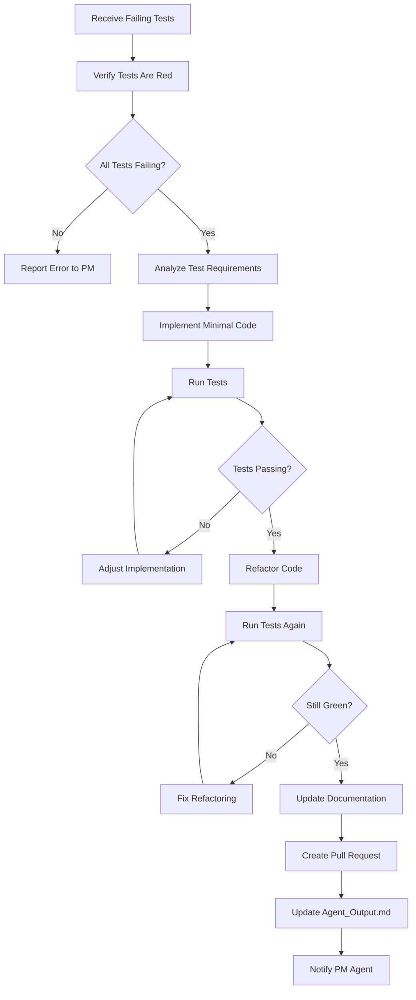

# Coder Agent Specification

#AutoSDLC #Agent #Coder #Specification

[[AutoSDLC Documentation Hub|← Back to Index]] | [[12-Product-Manager-Agent|← PM Agent]]

## Overview

The Coder Agent is the implementation specialist within the AutoSDLC system. It transforms technical specifications into working code, writes comprehensive tests, creates documentation, and ensures code quality through best practices and design patterns.

## Core Responsibilities

### 1. Code Implementation
- Analyzes technical specifications from GitHub issues
- Generates production-ready code following best practices
- Implements features across multiple programming languages
- Applies appropriate design patterns and architectures

### 2. Test-Driven Development (TDD)
- **CRITICAL**: Always follows strict TDD workflow
- Receives test specifications or failing tests from PM Agent
- **Verifies ALL tests are red before any implementation**
- **Verifies test coverage matches product specifications**
- Writes minimal code to make tests pass (no extra features)
- Refactors only after tests are green
- **Never uses mocks** - works with real implementations only
- Updates Agent_Output.md with test status at each phase

### 3. Documentation
- Generates inline code documentation
- Creates API documentation
- Updates README files
- Writes technical documentation for complex features

### 4. Code Quality
- Follows coding standards and conventions
- Implements error handling and logging
- Optimizes for performance and scalability
- Ensures security best practices

## Agent Architecture

### Agent Architecture

```typescript
class CoderAgent extends BaseAgent {
  // Core components
  codeGenerator: CodeGenerator;
  testRunner: TestRunner;
  tddImplementer: TDDImplementer;
  documentationEngine: DocumentationEngine;
  codeAnalyzer: CodeAnalyzer;
  
  // Agent capabilities
  capabilities = [
    'tdd_implementation',
    'code_generation',
    'test_verification',
    'documentation_writing',
    'refactoring',
    'bug_fixing',
    'api_development'
  ];
  
  // Task processing pattern
  async processTask(task: Task): Promise<TaskResult> {
    // 1. Update status in Agent_Output.md
    // 2. Route to appropriate handler based on task type
    // 3. Execute implementation with TDD workflow
    // 4. Update completion status and test results
    // 5. Return structured result
  }
}
```

### State Management

```typescript
interface CoderAgentState extends AgentState {
  currentImplementation: Implementation;
  codebaseContext: CodebaseContext;
  testCoverage: TestCoverage;
  technicalDebt: TechnicalDebt[];
  performanceMetrics: CodePerformanceMetrics;
}

// Implementation tracking
interface Implementation {
  id: string;
  taskId: string;
  githubIssue: number;
  branch: string;
  files: ImplementedFile[];
  tests: TestFile[];
  status: ImplementationStatus;
  pullRequestUrl?: string;
}

// Codebase awareness
interface CodebaseContext {
  projectStructure: ProjectStructure;
  dependencies: Dependency[];
  codingStandards: CodingStandard[];
  architecturePatterns: Pattern[];
  existingAPIs: API[];
}
```

## Core Capabilities

### 1. Code Generation Patterns

- **Specification Analysis**: Parse technical requirements and acceptance criteria
- **Approach Determination**: Select appropriate design patterns and architectures
- **Structure Generation**: Create modular, maintainable code organization
- **Component Implementation**: Build individual features with proper interfaces
- **Integration**: Combine components into cohesive solutions
- **Optimization**: Refine for performance, readability, and maintainability

**Template-Based Generation**:
- API endpoints (REST, GraphQL)
- React/Vue components
- Database models and repositories
- Service layers and business logic
- Configuration and deployment files

### 2. Test-Driven Development Workflow

**Red-Green-Refactor Cycle**:
1. **Red Phase**: Verify all tests fail before implementation
2. **Green Phase**: Write minimal code to make tests pass
3. **Refactor Phase**: Improve code while keeping tests green

**TDD Implementation Pattern**:
- Receive failing tests from PM Agent
- Analyze test requirements to understand expected behavior
- Implement minimal code targeting test satisfaction
- Iteratively adjust implementation based on test feedback
- Refactor for quality once all tests pass
- Update Agent_Output.md with progress at each phase

**No-Mocks Policy**:
- Tests run against real implementations only
- Real database connections for data layer tests
- Actual API calls for integration tests
- Live services for end-to-end validation

### 3. Bug Fixing Capabilities

**Root Cause Analysis**:
- Reproduce bugs based on reported steps
- Analyze code paths and data flow
- Identify underlying causes vs. symptoms
- Consider environmental and dependency factors

**Fix Strategy Development**:
- Generate multiple solution approaches
- Evaluate impact and risk of each fix
- Select optimal solution balancing safety and effectiveness
- Plan implementation to minimize disruption

**Regression Prevention**:
- Create tests that verify the bug is fixed
- Add edge case coverage around the bug area
- Ensure fix doesn't introduce new issues
- Update documentation with lessons learned

### 4. Code Refactoring Patterns

**Code Analysis**:
- Identify code smells and anti-patterns
- Measure complexity and maintainability metrics
- Find duplication and coupling issues
- Assess performance bottlenecks

**Refactoring Strategies**:
- Extract methods and classes for better organization
- Simplify conditional logic and control flow
- Improve naming and code clarity
- Optimize algorithms and data structures
- Apply design patterns where appropriate

**Safety-First Approach**:
- Run full test suite after each refactoring step
- Maintain backwards compatibility
- Preserve existing behavior while improving structure
- Document refactoring decisions and trade-offs

## Agent Communication Patterns

### With Product Manager Agent

**Task Flow**:
- Receive implementation tasks with technical specifications
- Acknowledge tasks with time estimates and dependency analysis
- Request clarification when specifications are ambiguous
- Report progress updates during TDD cycles
- Notify completion with pull request and metrics

**Information Exchange**:
- Task acknowledgments with estimated completion times
- Implementation status updates with test results
- Completion notifications with code metrics
- Risk assessments and dependency conflicts

### With Code Reviewer Agent

**Review Coordination**:
- Submit pull requests for code review
- Specify review focus areas and context
- Respond to feedback with code changes
- Discuss complex implementation decisions
- Confirm review resolution

**Quality Collaboration**:
- Request reviews for critical code changes
- Address feedback with explanations
- Iterate on improvements based on suggestions
- Learn from review patterns to improve future code

## Claude Code Integration

### Agent Configuration

**Working Directory Structure**:
- `./Agent_Output.md` - Status updates and progress tracking
- `./code/` - Implementation files and generated code
- `./tests/` - Test files and coverage reports
- `../shared/Agent_Status/` - Read access to other agents' status

**Key Responsibilities**:
1. Verify tests are red before implementation
2. Write minimal code to make tests pass
3. Refactor while keeping tests green
4. Never use mocks - work with real implementations
5. Document code and update Agent_Output.md

**TDD Workflow Commands**:
- `verify-red.sh` - Ensure all tests fail before coding
- `run-tests.sh` - Execute test suites with coverage
- `check-coverage.sh` - Validate coverage thresholds
- `commit-implementation.sh` - Save implementation milestones

**Communication Protocol**:
- Update `Agent_Output.md` with implementation progress
- Monitor PM Agent status for new tasks
- Coordinate with Code Reviewer for pull request reviews
- Report completion with metrics and deliverables

## Task Templates

### Feature Implementation

**Required Context**:
- GitHub issue with technical specification
- Acceptance criteria and requirements
- Existing codebase structure and patterns
- Language/framework and coding standards

**Implementation Deliverables**:
- Core functionality meeting all requirements
- Comprehensive test coverage (>80%)
- Error handling and validation
- Performance optimizations
- Documentation and API specs

### Bug Fix Process

**Analysis Requirements**:
- Bug reproduction steps and environment
- Root cause identification
- Impact assessment and affected components
- Solution strategies and trade-offs

**Fix Deliverables**:
- Root cause analysis documentation
- Targeted fix implementation
- Regression tests preventing recurrence
- Verification of fix effectiveness

## Agent Configuration

### Core Settings

**Agent Identity**:
- Type: Coder Agent
- Role: Implementation specialist
- MCP Server Port: 8083
- Working Directory: `./agents/coder-agent`

**Capabilities**:
- TDD implementation
- Code generation across multiple languages
- Test verification and coverage analysis
- Documentation writing
- Code refactoring and optimization
- Bug fixing and debugging
- API development

**Language Support**:
- **Primary**: TypeScript, JavaScript, Python, Java
- **Secondary**: Go, Rust, C#, Ruby
- **Frameworks**: React, Vue, Angular, Node.js, Django, Spring, FastAPI
- **Testing**: Jest, Pytest, JUnit, Mocha

**Quality Standards**:
- Test coverage threshold: 80%
- No mocks policy for TDD
- Cyclomatic complexity limit: 10
- Function length limit: 50 lines
- Automated linting and formatting

### Code Templates

**Available Templates**:
- API endpoints (Express, FastAPI, Spring)
- Frontend components (React, Vue, Angular)
- Test suites (Jest, Pytest, JUnit)
- Design patterns (Repository, Factory, Builder)
- Database models and migrations
- Configuration files

## Workflow Patterns

### TDD Implementation Flow



### Bug Fix Process


## Performance Metrics

### Key Performance Indicators

**Productivity Metrics**:
- Lines of code per hour
- Features implemented per sprint
- Average implementation time
- Task completion velocity

**Quality Metrics**:
- Defect density (bugs per 1000 lines)
- Test coverage percentage
- Code complexity (cyclomatic)
- Documentation completeness

**Efficiency Metrics**:
- First-time success rate (PRs approved without changes)
- Rework rate (code requiring modifications)
- Build success rate
- Test execution time

**Collaboration Metrics**:
- Review turnaround time
- Communication response time
- Cross-agent coordination efficiency

### Optimization Strategies

**Quality Improvement**:
- Increase test coverage for defect reduction
- Enhance coding standards adherence
- Implement automated quality checks

**Productivity Enhancement**:
- Expand code template library
- Optimize development environment setup
- Streamline repetitive tasks

**Collaboration Efficiency**:
- Improve communication protocols
- Reduce review cycles through better initial quality
- Enhance cross-agent coordination patterns

## Error Handling Patterns

### Common Error Scenarios

**Specification Issues**:
- Unclear or ambiguous requirements
- Missing acceptance criteria
- Conflicting specifications
- Incomplete technical details

**Implementation Challenges**:
- Dependency conflicts
- Test failures during TDD cycles
- Build and compilation errors
- Performance regressions
- Merge conflicts

**Resolution Strategies**:
- Request clarification from PM Agent for unclear specs
- Coordinate with other agents for dependency resolution
- Debug systematically using test feedback
- Escalate complex issues with detailed context
- Document lessons learned for future prevention

### Error Recovery Process

1. **Immediate Response**: Log error and update Agent_Output.md
2. **Analysis**: Identify root cause and impact scope
3. **Strategy**: Determine appropriate resolution approach
4. **Implementation**: Execute fix with proper testing
5. **Verification**: Confirm resolution and prevent recurrence
6. **Communication**: Update relevant agents and stakeholders

## Integration Patterns

### Agent Initialization

**Setup Process**:
- Configure agent with language and framework preferences
- Initialize MCP client/server connections
- Load code templates and quality rules
- Establish communication channels with other agents
- Prepare development environment and tools

**Configuration Elements**:
- Supported languages and frameworks
- Testing framework preferences
- Code quality thresholds
- Template and pattern libraries
- Performance optimization settings

### Task Processing Flow

**Implementation Task Handling**:
1. Receive task from PM Agent via MCP
2. Parse GitHub issue and technical specifications
3. Create feature branch for implementation
4. Execute TDD workflow (red-green-refactor)
5. Generate documentation and update README
6. Create pull request with comprehensive details
7. Notify completion and provide metrics

**Error Handling Integration**:
- Log errors with context to Agent_Output.md
- Communicate issues to relevant agents
- Implement recovery strategies
- Escalate unresolvable problems
- Document solutions for future reference

## Implementation Best Practices

### Code Quality Standards
- Follow established coding conventions consistently
- Use meaningful names for variables, functions, and classes
- Keep functions focused on single responsibilities
- Implement comprehensive error handling and logging
- Apply SOLID principles and design patterns appropriately

### Testing Excellence
- Strictly follow TDD methodology (red-green-refactor)
- Cover edge cases, error scenarios, and boundary conditions
- Write descriptive test names that explain expected behavior
- Maintain high coverage while ensuring test quality
- Use real implementations instead of mocks

### Documentation Practices
- Document complex algorithms and business logic clearly
- Keep API documentation current and comprehensive
- Write concise, helpful comments that explain "why" not "what"
- Include practical examples in technical documentation
- Update README files with new features and changes

### Performance Considerations
- Profile code to identify performance bottlenecks
- Optimize algorithms and data structures for efficiency
- Implement appropriate caching strategies
- Monitor memory usage and resource consumption
- Consider scalability implications in design decisions

### Security Fundamentals
- Validate and sanitize all input data
- Use parameterized queries to prevent injection attacks
- Implement proper authentication and authorization
- Keep dependencies updated with security patches
- Follow security best practices for the target platform

## Related Documents

- [[10-Agent-Framework|Agent Framework Overview]]
- [[12-Product-Manager-Agent|Product Manager Agent]]
- [[14-Code-Reviewer-Agent|Code Reviewer Agent]]
- [[15-Tester-Agent|Tester Agent]]
- [[21-GitHub-Integration|GitHub Integration Guide]]

---

**Tags**: #AutoSDLC #Agent #Coder #Implementation #Specification
**Last Updated**: 2025-06-09
**Next**: [[14-Code-Reviewer-Agent|Code Reviewer Agent →]]