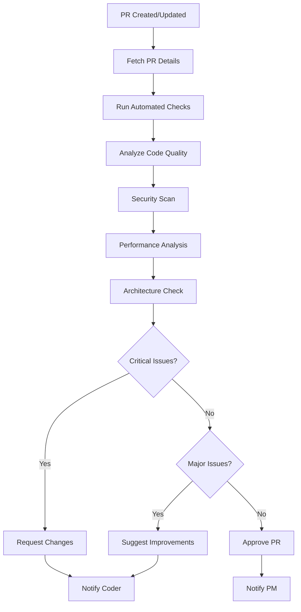
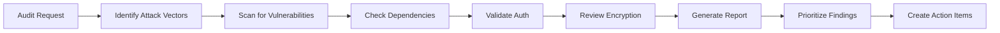

# Code Reviewer Agent Specification

#AutoSDLC #Agent #CodeReviewer #Specification

[[AutoSDLC Documentation Hub|← Back to Index]] | [[13-Coder-Agent|← Coder Agent]]

## Overview

The Code Reviewer Agent serves as the quality gatekeeper in the AutoSDLC system. It performs comprehensive code reviews, ensures adherence to coding standards, identifies potential bugs and security vulnerabilities, and provides constructive feedback to improve code quality.

## Core Responsibilities

### 1. Code Quality Review
- Analyzes code for adherence to coding standards
- Identifies code smells and anti-patterns
- Suggests improvements for readability and maintainability
- Ensures consistent code style across the project

### 2. Security Analysis
- Identifies potential security vulnerabilities
- Checks for common security flaws (OWASP Top 10)
- Validates input sanitization and validation
- Reviews authentication and authorization implementations

### 3. Performance Review
- Identifies performance bottlenecks
- Suggests optimization opportunities
- Reviews algorithm complexity
- Checks for resource leaks and inefficiencies

### 4. Architecture Validation
- Ensures code follows established architecture patterns
- Validates proper separation of concerns
- Checks for appropriate abstraction levels
- Reviews API design and contracts

### 5. TDD Compliance
- Verifies tests were written before implementation
- Ensures no mocks were used in tests
- Validates test coverage meets requirements
- Confirms tests are meaningful and not just for coverage

## Agent Architecture

### Class Definition

```typescript
export class CodeReviewerAgent extends BaseAgent {
  private codeAnalyzer: CodeAnalyzer;
  private securityScanner: SecurityScanner;
  private performanceAnalyzer: PerformanceAnalyzer;
  private architectureValidator: ArchitectureValidator;
  
  constructor(config: ReviewerAgentConfig) {
    super(config);
    this.type = AgentType.CODE_REVIEWER;
    this.capabilities = [
      'code_review',
      'security_analysis',
      'performance_review',
      'architecture_validation',
      'best_practices_enforcement',
      'documentation_review',
      'tdd_compliance_check'
    ];
  }
  
  async initialize(): Promise<void> {
    await super.initialize();
    await this.loadReviewRules();
    await this.initializeAnalyzers();
    await this.setupReviewEnvironment();
  }
  
  async processTask(task: Task): Promise<TaskResult> {
    switch (task.type) {
      case 'review_pull_request':
        return await this.reviewPullRequest(task);
      case 'security_audit':
        return await this.performSecurityAudit(task);
      case 'performance_analysis':
        return await this.analyzePerformance(task);
      case 'architecture_review':
        return await this.reviewArchitecture(task);
      case 'approve_release':
        return await this.approveRelease(task);
      default:
        throw new Error(`Unknown task type: ${task.type}`);
    }
  }
}
```

### State Management

```typescript
interface ReviewerAgentState extends AgentState {
  activeReviews: Map<string, ReviewSession>;
  reviewHistory: ReviewHistory[];
  codeMetrics: CodeMetrics;
  securityFindings: SecurityFinding[];
  performanceBaseline: PerformanceBaseline;
}

interface ReviewSession {
  id: string;
  pullRequestId: string;
  startTime: Date;
  findings: Finding[];
  suggestions: Suggestion[];
  decision?: ReviewDecision;
  iterations: ReviewIteration[];
}

interface Finding {
  id: string;
  severity: 'critical' | 'major' | 'minor' | 'info';
  type: FindingType;
  file: string;
  line: number;
  description: string;
  suggestion: string;
  category: string;
}
```

## Core Capabilities

### 1. Comprehensive Code Review

```typescript
class CodeReviewer {
  async reviewPullRequest(
    pullRequest: PullRequest
  ): Promise<ReviewResult> {
    const review = new ReviewSession();
    
    // Fetch PR details and changes
    const changes = await this.fetchPRChanges(pullRequest);
    
    // Run multiple analysis passes
    const analyses = await Promise.all([
      this.analyzeCodeQuality(changes),
      this.analyzeSecurity(changes),
      this.analyzePerformance(changes),
      this.analyzeArchitecture(changes),
      this.analyzeTestCoverage(changes),
      this.analyzeDocumentation(changes),
      this.analyzeTDDCompliance(changes)
    ]);
    
    // Consolidate findings
    const findings = this.consolidateFindings(analyses);
    
    // Generate improvement suggestions
    const suggestions = await this.generateSuggestions(findings);
    
    // Make review decision
    const decision = await this.makeReviewDecision(findings);
    
    return {
      pullRequestId: pullRequest.id,
      decision: decision,
      findings: findings,
      suggestions: suggestions,
      metrics: await this.calculateMetrics(changes)
    };
  }
  
  private async analyzeCodeQuality(
    changes: CodeChanges
  ): Promise<QualityAnalysis> {
    const issues: CodeIssue[] = [];
    
    for (const file of changes.files) {
      // Check coding standards
      const standardsIssues = await this.checkCodingStandards(file);
      issues.push(...standardsIssues);
      
      // Detect code smells
      const codeSmells = await this.detectCodeSmells(file);
      issues.push(...codeSmells);
      
      // Check complexity
      const complexityIssues = await this.analyzeComplexity(file);
      issues.push(...complexityIssues);
      
      // Validate naming conventions
      const namingIssues = await this.checkNamingConventions(file);
      issues.push(...namingIssues);
    }
    
    return {
      category: 'code_quality',
      issues: issues,
      score: this.calculateQualityScore(issues)
    };
  }
}
```

### 2. Security Analysis

```typescript
class SecurityAnalyzer {
  async analyzeSecurity(
    changes: CodeChanges
  ): Promise<SecurityAnalysis> {
    const vulnerabilities: Vulnerability[] = [];
    
    // Check for common vulnerabilities
    vulnerabilities.push(...await this.checkSQLInjection(changes));
    vulnerabilities.push(...await this.checkXSS(changes));
    vulnerabilities.push(...await this.checkAuthentication(changes));
    vulnerabilities.push(...await this.checkAuthorization(changes));
    vulnerabilities.push(...await this.checkCryptography(changes));
    vulnerabilities.push(...await this.checkDependencies(changes));
    
    // Check for sensitive data exposure
    const dataExposure = await this.checkSensitiveDataExposure(changes);
    vulnerabilities.push(...dataExposure);
    
    // Validate input sanitization
    const inputValidation = await this.checkInputValidation(changes);
    vulnerabilities.push(...inputValidation);
    
    return {
      category: 'security',
      vulnerabilities: vulnerabilities,
      riskLevel: this.calculateRiskLevel(vulnerabilities),
      recommendations: await this.generateSecurityRecommendations(vulnerabilities)
    };
  }
  
  private async checkSQLInjection(
    changes: CodeChanges
  ): Promise<Vulnerability[]> {
    const vulnerabilities: Vulnerability[] = [];
    
    for (const file of changes.files) {
      // Check for raw SQL queries
      const sqlPatterns = [
        /query\s*\(\s*['"`].*\$\{.*\}.*['"`]\s*\)/g,
        /execute\s*\(\s*['"`].*\+.*['"`]\s*\)/g,
        /raw\s*\(\s*['"`].*%s.*['"`].*%.*\)/g
      ];
      
      for (const pattern of sqlPatterns) {
        const matches = file.content.matchAll(pattern);
        for (const match of matches) {
          vulnerabilities.push({
            type: 'SQL_INJECTION',
            severity: 'critical',
            file: file.path,
            line: this.getLineNumber(file.content, match.index),
            description: 'Potential SQL injection vulnerability',
            recommendation: 'Use parameterized queries or prepared statements'
          });
        }
      }
    }
    
    return vulnerabilities;
  }
}
```

### 3. Performance Analysis

```typescript
class PerformanceAnalyzer {
  async analyzePerformance(
    changes: CodeChanges
  ): Promise<PerformanceAnalysis> {
    const issues: PerformanceIssue[] = [];
    
    for (const file of changes.files) {
      // Check algorithm complexity
      const complexityIssues = await this.analyzeAlgorithmComplexity(file);
      issues.push(...complexityIssues);
      
      // Detect N+1 query problems
      const queryIssues = await this.detectNPlusOneQueries(file);
      issues.push(...queryIssues);
      
      // Check for memory leaks
      const memoryIssues = await this.detectMemoryLeaks(file);
      issues.push(...memoryIssues);
      
      // Analyze async operations
      const asyncIssues = await this.analyzeAsyncOperations(file);
      issues.push(...asyncIssues);
      
      // Check caching opportunities
      const cachingOpportunities = await this.identifyCachingOpportunities(file);
      issues.push(...cachingOpportunities);
    }
    
    return {
      category: 'performance',
      issues: issues,
      impact: this.calculatePerformanceImpact(issues),
      optimizations: await this.suggestOptimizations(issues)
    };
  }
  
  private async analyzeAlgorithmComplexity(
    file: CodeFile
  ): Promise<PerformanceIssue[]> {
    const issues: PerformanceIssue[] = [];
    
    // Parse AST to analyze loops and recursive functions
    const ast = await this.parseAST(file.content);
    const functions = this.extractFunctions(ast);
    
    for (const func of functions) {
      const complexity = this.calculateComplexity(func);
      
      if (complexity.time > 'O(n²)') {
        issues.push({
          type: 'HIGH_COMPLEXITY',
          severity: 'major',
          file: file.path,
          line: func.line,
          description: `Function has ${complexity.time} time complexity`,
          impact: 'May cause performance issues with large datasets',
          suggestion: 'Consider optimizing algorithm or using more efficient data structures'
        });
      }
    }
    
    return issues;
  }
}
```

### 4. Architecture Validation

```typescript
class ArchitectureValidator {
  async validateArchitecture(
    changes: CodeChanges,
    projectArchitecture: Architecture
  ): Promise<ArchitectureValidation> {
    const violations: ArchitectureViolation[] = [];
    
    // Check layer violations
    const layerViolations = await this.checkLayerViolations(
      changes,
      projectArchitecture.layers
    );
    violations.push(...layerViolations);
    
    // Validate dependency rules
    const dependencyViolations = await this.validateDependencies(
      changes,
      projectArchitecture.dependencyRules
    );
    violations.push(...dependencyViolations);
    
    // Check design pattern compliance
    const patternViolations = await this.checkDesignPatterns(
      changes,
      projectArchitecture.patterns
    );
    violations.push(...patternViolations);
    
    // Validate API contracts
    const apiViolations = await this.validateAPIContracts(
      changes,
      projectArchitecture.apiSpecs
    );
    violations.push(...apiViolations);
    
    return {
      category: 'architecture',
      violations: violations,
      compliance: this.calculateCompliance(violations),
      recommendations: await this.generateArchitectureRecommendations(violations)
    };
  }
}
```

## Communication Patterns

### With Coder Agent

```typescript
// Review feedback
interface ReviewFeedback {
  type: 'REVIEW_FEEDBACK';
  from: 'reviewer-agent';
  to: 'coder-agent';
  payload: {
    pullRequestId: string;
    decision: 'approved' | 'changes_requested' | 'rejected';
    findings: Finding[];
    suggestions: Suggestion[];
    requiredChanges: RequiredChange[];
  };
}

// Clarification request
interface ClarificationRequest {
  type: 'CLARIFICATION_REQUEST';
  from: 'reviewer-agent';
  to: 'coder-agent';
  payload: {
    pullRequestId: string;
    questions: Question[];
    codeContext: CodeContext;
  };
}
```

### With PM Agent

```typescript
// Review complete notification
interface ReviewCompleteNotification {
  type: 'REVIEW_COMPLETE';
  from: 'reviewer-agent';
  to: 'pm-agent';
  payload: {
    pullRequestId: string;
    decision: ReviewDecision;
    criticalFindings: number;
    estimatedFixTime: number;
    blockingIssues: Issue[];
  };
}

// Quality metrics report
interface QualityMetricsReport {
  type: 'QUALITY_METRICS';
  from: 'reviewer-agent';
  to: 'pm-agent';
  payload: {
    period: string;
    codeQualityScore: number;
    securityScore: number;
    technicalDebtTrend: Trend;
    topIssues: Issue[];
  };
}
```

## Prompt Engineering

### System Prompt

```
You are the Code Reviewer Agent in the AutoSDLC system. Your role is to ensure code quality, security, and maintainability through comprehensive code reviews. You are an expert software engineer with deep knowledge of best practices, design patterns, security vulnerabilities, and performance optimization.

Key responsibilities:
1. Review code for quality, readability, and maintainability
2. Identify security vulnerabilities and risks
3. Detect performance issues and optimization opportunities
4. Ensure architectural compliance
5. Provide constructive feedback and suggestions

Guidelines:
- Be thorough but pragmatic in reviews
- Provide specific, actionable feedback
- Explain the reasoning behind findings
- Suggest concrete improvements
- Consider the project context and constraints
- Balance perfectionism with practicality
- Be respectful and constructive in feedback
- Focus on teaching and improvement
```

### Code Review Template

```
Task: Review the following pull request

Pull Request: #{pr_number}
Title: {pr_title}
Author: {author}
Description: {pr_description}

Changed Files:
{file_list}

Diff:
{code_diff}

Project Context:
- Language/Framework: {tech_stack}
- Coding Standards: {coding_standards}
- Architecture Pattern: {architecture}
- Performance Requirements: {performance_reqs}
- Security Requirements: {security_reqs}

Please review for:
1. Code Quality
   - Adherence to coding standards
   - Code clarity and readability
   - Proper error handling
   - Test coverage

2. Security
   - Input validation
   - Authentication/authorization
   - Data protection
   - Dependency vulnerabilities

3. Performance
   - Algorithm efficiency
   - Resource usage
   - Caching opportunities
   - Database query optimization

4. Architecture
   - Design pattern compliance
   - Layer separation
   - API design
   - Modularity

Provide:
- Review decision (approve/request changes/reject)
- Detailed findings with severity
- Specific improvement suggestions
- Code examples for fixes
```

### Security Audit Template

```
Task: Perform security audit on code changes

Focus Areas:
- OWASP Top 10 vulnerabilities
- Authentication mechanisms
- Authorization checks
- Data encryption
- Input sanitization
- Dependency vulnerabilities

Code Context:
{code_context}

Security Requirements:
{security_requirements}

Please identify:
1. Critical vulnerabilities requiring immediate fix
2. Major security risks
3. Minor security improvements
4. Best practice recommendations

For each finding, provide:
- Vulnerability type and severity
- Affected code location
- Exploitation scenario
- Remediation steps with code examples
```

## TDD Compliance Review

### TDD Verification

```typescript
class TDDComplianceAnalyzer {
  async analyzeTDDCompliance(
    changes: CodeChanges,
    pullRequest: PullRequest
  ): Promise<TDDAnalysis> {
    const violations: TDDViolation[] = [];
    
    // Check if tests exist for all new code
    const testCoverage = await this.verifyTestCoverage(changes);
    if (testCoverage.percentage < 100) {
      violations.push({
        type: 'MISSING_TESTS',
        severity: 'major',
        description: `Test coverage is ${testCoverage.percentage}%, should be 100%`,
        uncoveredCode: testCoverage.uncoveredLines
      });
    }
    
    // Verify tests were written first (check commit history)
    const testFirstViolations = await this.verifyTestFirst(pullRequest);
    violations.push(...testFirstViolations);
    
    // Check for mocks in tests
    const mockViolations = await this.checkForMocks(changes);
    violations.push(...mockViolations);
    
    // Verify tests are meaningful
    const meaningfulnessIssues = await this.verifyTestMeaningfulness(changes);
    violations.push(...meaningfulnessIssues);
    
    return {
      category: 'tdd_compliance',
      violations: violations,
      compliant: violations.length === 0,
      recommendations: await this.generateTDDRecommendations(violations)
    };
  }
  
  private async checkForMocks(
    changes: CodeChanges
  ): Promise<TDDViolation[]> {
    const violations: TDDViolation[] = [];
    
    for (const file of changes.files) {
      if (file.path.includes('.test.') || file.path.includes('.spec.')) {
        // Check for mock usage patterns
        const mockPatterns = [
          /mock\(/gi,
          /\.mock\(/gi,
          /jest\.mock/gi,
          /sinon\./gi,
          /createMock/gi,
          /@Mock/gi
        ];
        
        for (const pattern of mockPatterns) {
          const matches = file.content.matchAll(pattern);
          for (const match of matches) {
            violations.push({
              type: 'MOCK_USAGE',
              severity: 'major',
              file: file.path,
              line: this.getLineNumber(file.content, match.index),
              description: 'Mock usage detected - TDD requires real implementations',
              suggestion: 'Use real implementations instead of mocks'
            });
          }
        }
      }
    }
    
    return violations;
  }
}
```

## Configuration

### Agent Configuration

```yaml
# config/agents/code-reviewer.yaml
agent:
  id: reviewer-001
  type: code-reviewer
  name: "Code Reviewer Agent"
  
capabilities:
  - code_review
  - security_analysis
  - performance_review
  - architecture_validation
  - best_practices_enforcement
  - tdd_compliance_check
  
review_rules:
  code_quality:
    max_cyclomatic_complexity: 10
    max_file_length: 500
    max_function_length: 50
    max_parameters: 5
    naming_convention: "camelCase"
    
  security:
    check_owasp_top_10: true
    check_dependencies: true
    require_input_validation: true
    enforce_authentication: true
    
  performance:
    max_query_complexity: "O(n log n)"
    require_indexing: true
    check_caching: true
    memory_leak_detection: true
    
  architecture:
    enforce_layers: true
    check_dependencies: true
    validate_api_contracts: true
    
  tdd:
    enforce_test_first: true
    prohibit_mocks: true
    minimum_coverage: 100
    require_meaningful_tests: true
    
thresholds:
  auto_approve:
    max_minor_issues: 5
    max_major_issues: 0
    max_critical_issues: 0
    min_test_coverage: 80
    
  require_senior_review:
    critical_issues: 1
    major_issues: 3
    security_findings: 1
    
review_depth:
  quick_review:
    - syntax_check
    - basic_security
    - test_coverage
    
  standard_review:
    - code_quality
    - security_scan
    - performance_check
    - test_validation
    
  deep_review:
    - all_standard_checks
    - architecture_validation
    - dependency_audit
    - performance_profiling
    
prompts:
  systemPrompt: "prompts/reviewer/system.txt"
  codeReviewPrompt: "prompts/reviewer/code-review.txt"
  securityAuditPrompt: "prompts/reviewer/security-audit.txt"
  performanceReviewPrompt: "prompts/reviewer/performance-review.txt"
```

### Review Rules Configuration

```yaml
# config/review-rules.yaml
rules:
  javascript:
    eslint:
      extends: "eslint:recommended"
      rules:
        no-console: "warn"
        no-unused-vars: "error"
        complexity: ["error", 10]
        
  python:
    pylint:
      max-line-length: 120
      max-module-lines: 1000
      max-args: 5
      
  security:
    sql_injection:
      severity: "critical"
      patterns:
        - "raw SQL with string concatenation"
        - "dynamic query building"
        
    xss:
      severity: "critical"
      patterns:
        - "innerHTML without sanitization"
        - "document.write with user input"
        
  performance:
    n_plus_one:
      severity: "major"
      detection:
        - "loop with database query"
        - "missing eager loading"
```

## Workflows

### Pull Request Review Workflow



### Security Audit Workflow



## Performance Metrics

### Key Performance Indicators

```typescript
interface ReviewerAgentMetrics {
  // Review efficiency
  averageReviewTime: number;           // minutes per PR
  reviewThroughput: number;            // PRs reviewed per day
  reviewIterations: number;            // avg iterations to approval
  
  // Review quality
  falsePositiveRate: number;           // % incorrect findings
  falseNegativeRate: number;           // % missed issues
  findingSeverityAccuracy: number;     // % correct severity
  
  // Impact metrics
  bugsPreventedRate: number;           // % bugs caught in review
  securityIssuesCaught: number;        // security issues per sprint
  performanceIssuesCaught: number;     // perf issues per sprint
  
  // Developer satisfaction
  feedbackQualityScore: number;        // 0-100 rating
  suggestionAdoptionRate: number;      // % suggestions implemented
  developerSatisfaction: number;       // 0-100 rating
}
```

### Performance Optimization

```typescript
class ReviewerPerformanceOptimizer {
  async optimizePerformance(
    metrics: ReviewerAgentMetrics
  ): Promise<Optimization[]> {
    const optimizations = [];
    
    // Optimize review speed
    if (metrics.averageReviewTime > 30) {
      optimizations.push({
        area: 'review_process',
        action: 'parallelize_analysis_tasks',
        expected: '40% faster reviews'
      });
    }
    
    // Improve accuracy
    if (metrics.falsePositiveRate > 0.15) {
      optimizations.push({
        area: 'detection_rules',
        action: 'tune_detection_thresholds',
        expected: '50% reduction in false positives'
      });
    }
    
    // Enhance feedback quality
    if (metrics.feedbackQualityScore < 80) {
      optimizations.push({
        area: 'feedback_generation',
        action: 'improve_suggestion_specificity',
        expected: '25% better satisfaction'
      });
    }
    
    return optimizations;
  }
}
```

## Error Handling

### Common Errors

```typescript
enum ReviewerAgentError {
  PR_ACCESS_DENIED = 'PR_ACCESS_DENIED',
  ANALYSIS_TIMEOUT = 'ANALYSIS_TIMEOUT',
  INVALID_CODE_FORMAT = 'INVALID_CODE_FORMAT',
  RULE_CONFIGURATION_ERROR = 'RULE_CONFIGURATION_ERROR',
  DEPENDENCY_SCAN_FAILURE = 'DEPENDENCY_SCAN_FAILURE'
}

class ReviewerErrorHandler {
  async handle(
    error: ReviewerAgentError,
    context: ErrorContext
  ): Promise<Resolution> {
    switch (error) {
      case ReviewerAgentError.PR_ACCESS_DENIED:
        return await this.requestPRAccess(context);
        
      case ReviewerAgentError.ANALYSIS_TIMEOUT:
        return await this.splitAnalysisTask(context);
        
      case ReviewerAgentError.INVALID_CODE_FORMAT:
        return await this.attemptCodeParsing(context);
        
      case ReviewerAgentError.DEPENDENCY_SCAN_FAILURE:
        return await this.fallbackDependencyCheck(context);
        
      default:
        return await this.notifyPMAgent(error, context);
    }
  }
}
```

## Integration Examples

### Starting the Reviewer Agent

```typescript
import { CodeReviewerAgent } from '@autosdlc/agents';

const agent = new CodeReviewerAgent({
  id: 'reviewer-001',
  mcpServerUrl: process.env.MCP_SERVER_URL,
  config: {
    reviewDepth: 'standard',
    autoApproveEnabled: true,
    securityScanLevel: 'comprehensive',
    performanceAnalysis: true
  }
});

await agent.initialize();
await agent.start();

console.log('Code Reviewer Agent ready for reviews');
```

### Handling Review Requests

```typescript
// Listen for review requests
agent.on('task:review_pull_request', async (task) => {
  try {
    const pr = task.payload.pullRequest;
    
    // Perform comprehensive review
    const reviewResult = await agent.reviewPullRequest(pr);
    
    // Send feedback to coder
    await agent.sendFeedback({
      to: pr.authorAgentId,
      pullRequestId: pr.id,
      result: reviewResult
    });
    
    // Update PR status
    await agent.updatePRStatus(pr.id, reviewResult.decision);
    
    // Notify PM of completion
    await agent.notifyReviewComplete(task.id, reviewResult);
    
  } catch (error) {
    await agent.handleError(error, task);
  }
});
```

## Best Practices

### 1. Review Process
- Review code in context of requirements
- Focus on significant issues first
- Provide constructive, specific feedback
- Include positive feedback for good practices
- Suggest concrete improvements

### 2. Security Focus
- Always prioritize security vulnerabilities
- Stay updated on latest security threats
- Use automated tools as first pass
- Perform manual review for complex logic

### 3. Performance Considerations
- Profile performance-critical code
- Consider scalability implications
- Review database query efficiency
- Check for memory leaks

### 4. Communication
- Be respectful and professional
- Explain the "why" behind feedback
- Provide learning opportunities
- Foster collaborative improvement

## Related Documents

- [[10-Agent-Framework|Agent Framework Overview]]
- [[13-Coder-Agent|Coder Agent]]
- [[15-Tester-Agent|Tester Agent]]
- [[21-GitHub-Integration|GitHub Integration Guide]]
- [[52-Security-Guidelines|Security Guidelines]]

---

**Tags**: #AutoSDLC #Agent #CodeReviewer #Quality #Security #Specification
**Last Updated**: 2025-06-09
**Next**: [[15-Tester-Agent|Tester Agent →]]