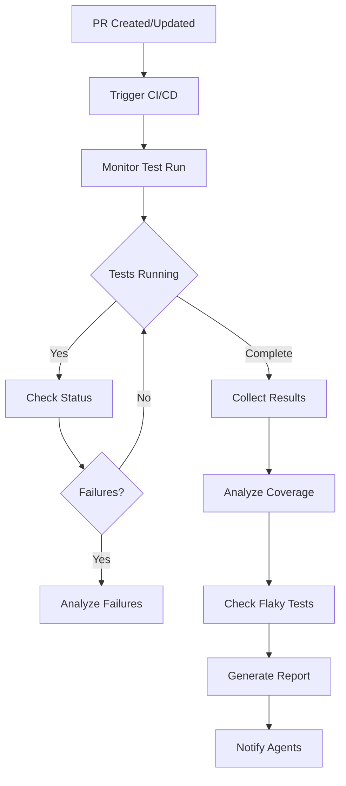
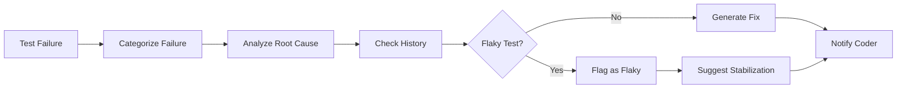

# Tester Agent Specification

#AutoSDLC #Agent #Tester #Specification

[[AutoSDLC Documentation Hub|← Back to Index]] | [[14-Code-Reviewer-Agent|← Code Reviewer Agent]]

## Overview

The Tester Agent is the automated QA specialist in the AutoSDLC system. It monitors CI/CD pipelines, analyzes test results, ensures comprehensive test coverage, identifies flaky tests, and maintains the overall quality of the software through continuous testing and validation.

## Core Responsibilities

### 1. Test Execution Monitoring
- Monitors GitHub Actions and CI/CD pipelines
- Tracks test execution status and results
- Identifies and reports test failures
- Manages test environments and configurations

### 2. Test Result Analysis
- Analyzes test failures and their root causes
- Identifies patterns in test failures
- Detects flaky tests and intermittent issues
- Generates comprehensive test reports

### 3. Coverage Management
- Monitors code coverage metrics
- Identifies untested code paths
- Suggests additional test cases
- Ensures coverage meets thresholds

### 4. Quality Assurance
- Validates acceptance criteria through tests
- Performs regression testing
- Conducts integration testing
- Manages test data and fixtures

## Agent Architecture

### Class Definition

```typescript
export class TesterAgent extends BaseAgent {
  private testRunner: TestRunner;
  private coverageAnalyzer: CoverageAnalyzer;
  private testAnalyzer: TestAnalyzer;
  private cicdMonitor: CICDMonitor;
  
  constructor(config: TesterAgentConfig) {
    super(config);
    this.type = AgentType.TESTER;
    this.capabilities = [
      'test_execution_monitoring',
      'test_result_analysis',
      'coverage_analysis',
      'flaky_test_detection',
      'regression_testing',
      'performance_testing'
    ];
  }
  
  async initialize(): Promise<void> {
    await super.initialize();
    await this.connectToCICD();
    await this.loadTestConfigurations();
    await this.initializeTestEnvironments();
  }
  
  async processTask(task: Task): Promise<TaskResult> {
    switch (task.type) {
      case 'monitor_test_run':
        return await this.monitorTestRun(task);
      case 'analyze_test_failure':
        return await this.analyzeTestFailure(task);
      case 'check_coverage':
        return await this.checkCoverage(task);
      case 'validate_acceptance':
        return await this.validateAcceptanceCriteria(task);
      case 'regression_test':
        return await this.runRegressionTests(task);
      default:
        throw new Error(`Unknown task type: ${task.type}`);
    }
  }
}
```

### State Management

```typescript
interface TesterAgentState extends AgentState {
  activeTestRuns: Map<string, TestRun>;
  testHistory: TestHistory[];
  coverageMetrics: CoverageMetrics;
  flakyTests: FlakyTest[];
  testEnvironments: TestEnvironment[];
}

interface TestRun {
  id: string;
  workflowId: string;
  pullRequestId: string;
  status: TestRunStatus;
  startTime: Date;
  endTime?: Date;
  results: TestResult[];
  coverage: CoverageReport;
  artifacts: TestArtifact[];
}

interface TestResult {
  suite: string;
  test: string;
  status: 'passed' | 'failed' | 'skipped';
  duration: number;
  error?: TestError;
  retries: number;
  artifacts: string[];
}
```

## Core Capabilities

### 1. Test Execution Monitoring

```typescript
class TestExecutionMonitor {
  async monitorTestRun(
    workflowRun: WorkflowRun
  ): Promise<TestMonitoringResult> {
    const monitoring = new TestMonitoring();
    
    // Subscribe to workflow events
    await this.subscribeToWorkflow(workflowRun.id);
    
    // Monitor test execution
    while (!this.isComplete(workflowRun)) {
      const status = await this.getWorkflowStatus(workflowRun);
      
      // Check for test failures
      if (status.hasFailures) {
        const failures = await this.extractTestFailures(status);
        await this.notifyFailures(failures);
      }
      
      // Monitor performance
      const performance = await this.checkTestPerformance(status);
      if (performance.degradation) {
        await this.reportPerformanceDegradation(performance);
      }
      
      // Update monitoring state
      monitoring.update(status);
      
      await this.wait(this.config.pollingInterval);
    }
    
    // Collect final results
    const results = await this.collectTestResults(workflowRun);
    const coverage = await this.collectCoverageReport(workflowRun);
    const artifacts = await this.collectTestArtifacts(workflowRun);
    
    return {
      workflowId: workflowRun.id,
      results: results,
      coverage: coverage,
      artifacts: artifacts,
      analysis: await this.analyzeResults(results)
    };
  }
  
  private async extractTestFailures(
    status: WorkflowStatus
  ): Promise<TestFailure[]> {
    const failures: TestFailure[] = [];
    
    for (const job of status.jobs) {
      if (job.status === 'failed') {
        const logs = await this.fetchJobLogs(job.id);
        const testFailures = this.parseTestFailures(logs);
        
        for (const failure of testFailures) {
          failures.push({
            job: job.name,
            test: failure.test,
            error: failure.error,
            stackTrace: failure.stackTrace,
            logs: this.extractRelevantLogs(logs, failure)
          });
        }
      }
    }
    
    return failures;
  }
}
```

### 2. Test Result Analysis

```typescript
class TestResultAnalyzer {
  async analyzeTestFailure(
    failure: TestFailure
  ): Promise<FailureAnalysis> {
    // Categorize failure type
    const failureType = await this.categorizeFailure(failure);
    
    // Find root cause
    const rootCause = await this.findRootCause(failure);
    
    // Check if it's a flaky test
    const flakiness = await this.checkFlakiness(failure.test);
    
    // Analyze failure patterns
    const patterns = await this.analyzeFailurePatterns(failure);
    
    // Generate fix suggestions
    const suggestions = await this.generateFixSuggestions(
      failure,
      rootCause,
      patterns
    );
    
    return {
      failure: failure,
      type: failureType,
      rootCause: rootCause,
      isFlaky: flakiness.isFlaky,
      flakinessScore: flakiness.score,
      patterns: patterns,
      suggestions: suggestions,
      priority: this.calculatePriority(failure, rootCause)
    };
  }
  
  private async findRootCause(
    failure: TestFailure
  ): Promise<RootCause> {
    // Analyze error message
    const errorAnalysis = await this.analyzeError(failure.error);
    
    // Check recent code changes
    const recentChanges = await this.getRecentChanges(failure.test);
    
    // Analyze stack trace
    const stackAnalysis = await this.analyzeStackTrace(failure.stackTrace);
    
    // Check environment issues
    const envIssues = await this.checkEnvironmentIssues(failure);
    
    // Determine most likely cause
    return this.determineMostLikelyCause({
      errorAnalysis,
      recentChanges,
      stackAnalysis,
      envIssues
    });
  }
}
```

### 3. Coverage Analysis

```typescript
class CoverageAnalyzer {
  async analyzeCoverage(
    coverageReport: CoverageReport,
    codeChanges: CodeChanges
  ): Promise<CoverageAnalysis> {
    // Calculate overall coverage
    const overallCoverage = this.calculateOverallCoverage(coverageReport);
    
    // Identify uncovered code
    const uncoveredCode = await this.identifyUncoveredCode(
      coverageReport,
      codeChanges
    );
    
    // Find critical uncovered paths
    const criticalPaths = await this.findCriticalUncoveredPaths(
      uncoveredCode
    );
    
    // Generate test suggestions
    const testSuggestions = await this.generateTestSuggestions(
      uncoveredCode,
      criticalPaths
    );
    
    // Check coverage trends
    const trends = await this.analyzeCoverageTrends(coverageReport);
    
    return {
      overall: overallCoverage,
      byFile: this.getCoverageByFile(coverageReport),
      uncoveredCode: uncoveredCode,
      criticalPaths: criticalPaths,
      suggestions: testSuggestions,
      trends: trends,
      meetsThreshold: overallCoverage.percentage >= this.config.threshold
    };
  }
  
  private async generateTestSuggestions(
    uncoveredCode: UncoveredCode[],
    criticalPaths: CriticalPath[]
  ): Promise<TestSuggestion[]> {
    const suggestions: TestSuggestion[] = [];
    
    // Prioritize critical paths
    for (const path of criticalPaths) {
      suggestions.push({
        priority: 'high',
        type: 'critical_path',
        description: `Add test for critical path: ${path.description}`,
        testCase: await this.generateTestCase(path),
        expectedCoverage: path.coverageImpact
      });
    }
    
    // Generate tests for uncovered functions
    for (const uncovered of uncoveredCode) {
      if (uncovered.type === 'function') {
        suggestions.push({
          priority: this.calculatePriority(uncovered),
          type: 'unit_test',
          description: `Add unit test for ${uncovered.name}`,
          testCase: await this.generateUnitTest(uncovered),
          expectedCoverage: uncovered.lines.length
        });
      }
    }
    
    return suggestions;
  }
}
```

### 4. Flaky Test Detection

```typescript
class FlakyTestDetector {
  async detectFlakyTests(
    testHistory: TestHistory[]
  ): Promise<FlakyTestReport> {
    const flakyTests: FlakyTest[] = [];
    
    // Group test results by test name
    const testGroups = this.groupByTest(testHistory);
    
    for (const [testName, results] of testGroups) {
      const flakiness = this.calculateFlakiness(results);
      
      if (flakiness.score > this.config.flakyThreshold) {
        const analysis = await this.analyzeFlakyTest(testName, results);
        
        flakyTests.push({
          test: testName,
          flakinessScore: flakiness.score,
          failureRate: flakiness.failureRate,
          patterns: analysis.patterns,
          likelyCauses: analysis.causes,
          recommendation: analysis.recommendation
        });
      }
    }
    
    return {
      flakyTests: flakyTests,
      impact: this.calculateImpact(flakyTests),
      recommendations: await this.generateRecommendations(flakyTests)
    };
  }
  
  private calculateFlakiness(
    results: TestResult[]
  ): FlakinessMetrics {
    let transitions = 0;
    let failures = 0;
    
    for (let i = 1; i < results.length; i++) {
      if (results[i].status !== results[i-1].status) {
        transitions++;
      }
      if (results[i].status === 'failed') {
        failures++;
      }
    }
    
    return {
      score: transitions / (results.length - 1),
      failureRate: failures / results.length,
      inconsistency: this.calculateInconsistency(results)
    };
  }
}
```

## Communication Patterns

### With Coder Agent

```typescript
// Test failure notification
interface TestFailureNotification {
  type: 'TEST_FAILURE';
  from: 'tester-agent';
  to: 'coder-agent';
  payload: {
    pullRequestId: string;
    failures: TestFailure[];
    analysis: FailureAnalysis[];
    suggestedFixes: Fix[];
  };
}

// Coverage report
interface CoverageReport {
  type: 'COVERAGE_REPORT';
  from: 'tester-agent';
  to: 'coder-agent';
  payload: {
    pullRequestId: string;
    coverage: number;
    uncoveredCode: UncoveredCode[];
    suggestions: TestSuggestion[];
  };
}
```

### With PM Agent

```typescript
// Test status update
interface TestStatusUpdate {
  type: 'TEST_STATUS';
  from: 'tester-agent';
  to: 'pm-agent';
  payload: {
    workflowId: string;
    status: 'running' | 'passed' | 'failed';
    progress: number;
    estimatedCompletion?: Date;
    blockingIssues?: Issue[];
  };
}

// Quality metrics report
interface QualityReport {
  type: 'QUALITY_METRICS';
  from: 'tester-agent';
  to: 'pm-agent';
  payload: {
    period: string;
    testPassRate: number;
    coverageTrend: Trend;
    flakyTestCount: number;
    averageTestDuration: number;
  };
}
```

## Prompt Engineering

### System Prompt

```
You are the Tester Agent in the AutoSDLC system. Your role is to ensure software quality through comprehensive testing, monitoring CI/CD pipelines, analyzing test results, and maintaining high test coverage. You are an expert in testing strategies, test automation, and quality assurance.

Key responsibilities:
1. Monitor test execution in CI/CD pipelines
2. Analyze test failures and identify root causes
3. Ensure adequate test coverage
4. Detect and manage flaky tests
5. Validate acceptance criteria

Guidelines:
- Prioritize critical test failures
- Provide actionable insights from test results
- Focus on preventing regressions
- Suggest practical test improvements
- Consider test maintainability
- Balance thoroughness with execution time
- Communicate clearly about quality issues
```

### Test Analysis Template

```
Task: Analyze the following test failure

Test Information:
- Test Name: {test_name}
- Test Suite: {test_suite}
- PR/Commit: {commit_info}

Failure Details:
- Error Message: {error_message}
- Stack Trace: {stack_trace}
- Test Logs: {relevant_logs}

Context:
- Recent Changes: {recent_changes}
- Test History: {test_history}
- Related Tests: {related_tests}

Please analyze:
1. Root cause of the failure
2. Whether this is a flaky test
3. Impact on the system
4. Suggested fix approach

Provide:
- Failure categorization (test issue/code issue/environment issue)
- Specific root cause
- Fix recommendations with examples
- Priority assessment
```

### Coverage Analysis Template

```
Task: Analyze code coverage for the following changes

Coverage Report:
{coverage_summary}

Changed Files:
{changed_files_with_coverage}

Uncovered Code:
{uncovered_lines}

Project Requirements:
- Coverage Threshold: {threshold}%
- Critical Paths: {critical_paths}

Please:
1. Identify critical uncovered code
2. Assess risk of uncovered paths
3. Suggest specific test cases
4. Prioritize testing needs

Generate:
- Test case suggestions with examples
- Risk assessment for uncovered code
- Coverage improvement strategy
```

## Configuration

### Agent Configuration

```yaml
# config/agents/tester.yaml
agent:
  id: tester-001
  type: tester
  name: "Tester Agent"
  
capabilities:
  - test_execution_monitoring
  - test_result_analysis
  - coverage_analysis
  - flaky_test_detection
  - regression_testing
  
cicd:
  platform: "github-actions"
  monitoring:
    pollingInterval: 30s
    timeout: 3600s
    
  webhooks:
    enabled: true
    events:
      - workflow_run
      - check_run
      - check_suite
      
testing:
  frameworks:
    - jest
    - pytest
    - junit
    - mocha
    - cypress
    
  coverage:
    threshold: 80
    criticalPathThreshold: 95
    tools:
      - istanbul
      - coverage.py
      - jacoco
      
  flaky_detection:
    enabled: true
    threshold: 0.3
    historyWindow: 30  # days
    minRuns: 5
    
  performance:
    trackDuration: true
    slowTestThreshold: 5000  # ms
    timeoutMultiplier: 3
    
analysis:
  failure_categorization:
    - assertion_failure
    - timeout
    - environment_issue
    - dependency_failure
    - flaky_test
    
  root_cause_analysis:
    checkRecentChanges: true
    analyzeStackTrace: true
    checkEnvironment: true
    
reporting:
  formats:
    - json
    - html
    - markdown
    
  notifications:
    channels:
      - github_comment
      - slack
      - email
      
prompts:
  systemPrompt: "prompts/tester/system.txt"
  testAnalysisPrompt: "prompts/tester/test-analysis.txt"
  coverageAnalysisPrompt: "prompts/tester/coverage-analysis.txt"
  flakyTestPrompt: "prompts/tester/flaky-test.txt"
```

### Test Environment Configuration

```yaml
# config/test-environments.yaml
environments:
  unit:
    name: "Unit Test Environment"
    runner: "jest"
    parallel: true
    maxWorkers: 4
    timeout: 300000
    
  integration:
    name: "Integration Test Environment"
    runner: "jest"
    setup:
      - database: "test"
      - cache: "redis"
    parallel: false
    timeout: 600000
    
  e2e:
    name: "E2E Test Environment"
    runner: "cypress"
    browser: "chrome"
    headless: true
    baseUrl: "http://localhost:3000"
    timeout: 900000
    
  performance:
    name: "Performance Test Environment"
    runner: "k6"
    vus: 100
    duration: "5m"
    thresholds:
      http_req_duration: ["p(95)<500"]
```

## Workflows

### Test Monitoring Workflow



### Failure Analysis Workflow



## Performance Metrics

### Key Performance Indicators

```typescript
interface TesterAgentMetrics {
  // Test execution metrics
  averageTestDuration: number;         // minutes
  testExecutionSuccess: number;        // % successful runs
  parallelizationEfficiency: number;   // % time saved
  
  // Quality metrics
  defectEscapeRate: number;           // % bugs missed
  testCoverage: number;               // % code covered
  criticalPathCoverage: number;       // % critical paths
  
  // Reliability metrics
  flakyTestRate: number;              // % flaky tests
  falsePositiveRate: number;          // % incorrect failures
  environmentStability: number;        // % stable runs
  
  // Efficiency metrics
  feedbackTime: number;               // time to first feedback
  analysisAccuracy: number;           // % correct root causes
  suggestionAdoptionRate: number;     // % suggestions used
}
```

### Performance Optimization

```typescript
class TesterPerformanceOptimizer {
  async optimizePerformance(
    metrics: TesterAgentMetrics
  ): Promise<Optimization[]> {
    const optimizations = [];
    
    // Optimize test execution
    if (metrics.averageTestDuration > 15) {
      optimizations.push({
        area: 'test_execution',
        action: 'increase_parallelization',
        expected: '50% faster execution'
      });
    }
    
    // Improve reliability
    if (metrics.flakyTestRate > 0.05) {
      optimizations.push({
        area: 'test_stability',
        action: 'implement_retry_logic',
        expected: '70% reduction in flaky failures'
      });
    }
    
    // Enhance coverage
    if (metrics.criticalPathCoverage < 0.95) {
      optimizations.push({
        area: 'test_coverage',
        action: 'add_critical_path_tests',
        expected: '99% critical path coverage'
      });
    }
    
    return optimizations;
  }
}
```

## Error Handling

### Common Errors

```typescript
enum TesterAgentError {
  CICD_CONNECTION_FAILED = 'CICD_CONNECTION_FAILED',
  TEST_ENVIRONMENT_UNAVAILABLE = 'TEST_ENVIRONMENT_UNAVAILABLE',
  COVERAGE_TOOL_ERROR = 'COVERAGE_TOOL_ERROR',
  ARTIFACT_RETRIEVAL_FAILED = 'ARTIFACT_RETRIEVAL_FAILED',
  ANALYSIS_TIMEOUT = 'ANALYSIS_TIMEOUT'
}

class TesterErrorHandler {
  async handle(
    error: TesterAgentError,
    context: ErrorContext
  ): Promise<Resolution> {
    switch (error) {
      case TesterAgentError.CICD_CONNECTION_FAILED:
        return await this.reconnectToCICD(context);
        
      case TesterAgentError.TEST_ENVIRONMENT_UNAVAILABLE:
        return await this.provisionTestEnvironment(context);
        
      case TesterAgentError.COVERAGE_TOOL_ERROR:
        return await this.fallbackCoverageAnalysis(context);
        
      case TesterAgentError.ARTIFACT_RETRIEVAL_FAILED:
        return await this.retryArtifactRetrieval(context);
        
      default:
        return await this.escalateToPM(error, context);
    }
  }
}
```

## Integration Examples

### Starting the Tester Agent

```typescript
import { TesterAgent } from '@autosdlc/agents';

const agent = new TesterAgent({
  id: 'tester-001',
  mcpServerUrl: process.env.MCP_SERVER_URL,
  config: {
    cicdPlatform: 'github-actions',
    coverageThreshold: 80,
    flakyTestDetection: true,
    parallelExecution: true
  }
});

await agent.initialize();
await agent.start();

console.log('Tester Agent ready for test monitoring');
```

### Handling Test Monitoring

```typescript
// Listen for test monitoring requests
agent.on('task:monitor_test_run', async (task) => {
  try {
    const workflowRun = task.payload.workflowRun;
    
    // Monitor test execution
    const monitoringResult = await agent.monitorTestRun(workflowRun);
    
    // Analyze results
    const analysis = await agent.analyzeTestResults(monitoringResult);
    
    // Check coverage
    const coverageAnalysis = await agent.analyzeCoverage(
      monitoringResult.coverage
    );
    
    // Detect flaky tests
    const flakyTests = await agent.detectFlakyTests(
      monitoringResult.results
    );
    
    // Send reports
    await agent.sendReports({
      toCoderAgent: {
        failures: analysis.failures,
        coverage: coverageAnalysis
      },
      toPMAgent: {
        summary: analysis.summary,
        quality: monitoringResult.qualityMetrics
      }
    });
    
  } catch (error) {
    await agent.handleError(error, task);
  }
});
```

## Best Practices

### 1. Test Monitoring
- Monitor tests in real-time for quick feedback
- Track test duration trends
- Identify performance regressions early
- Maintain test environment stability

### 2. Failure Analysis
- Categorize failures accurately
- Provide specific root cause analysis
- Include relevant logs and context
- Suggest actionable fixes

### 3. Coverage Management
- Focus on critical path coverage
- Don't chase 100% coverage blindly
- Identify meaningful test gaps
- Suggest practical test cases

### 4. Flaky Test Management
- Track test reliability over time
- Quarantine consistently flaky tests
- Investigate root causes of flakiness
- Implement retry strategies wisely

### 5. Communication
- Provide timely test feedback
- Report critical failures immediately
- Share quality trends regularly
- Collaborate on test improvements

## Related Documents

- [[10-Agent-Framework|Agent Framework Overview]]
- [[13-Coder-Agent|Coder Agent]]
- [[14-Code-Reviewer-Agent|Code Reviewer Agent]]
- [[21-GitHub-Integration|GitHub Integration Guide]]
- [[62-Testing-Strategy|Testing Strategy]]

---

**Tags**: #AutoSDLC #Agent #Tester #QA #Testing #Specification
**Last Updated**: 2025-06-09
**Next**: [[20-MCP-Integration|MCP Integration Guide →]]