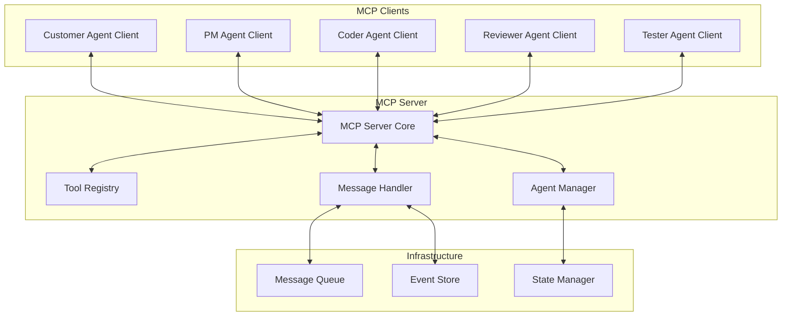

# MCP Integration Guide

#AutoSDLC #MCP #Integration #Technical

[[AutoSDLC Documentation Hub|← Back to Index]] | [[15-Tester-Agent|← Tester Agent]]

## Overview

The Model Context Protocol (MCP) is the communication backbone of AutoSDLC, enabling seamless interaction between AI agents and the system infrastructure. In AutoSDLC, each Claude agent acts as both an MCP client and server, running via Claude Code in headless mode (`cc -p`). This dual nature allows agents to:

- **As MCP Server**: Expose their capabilities and handle incoming requests from other agents
- **As MCP Client**: Request services from other agents and the main MCP server

This bidirectional communication pattern, combined with Agent_Output.md status files and custom commands in `.claude/commands/`, creates a robust, decentralized agent network.

## MCP Architecture

### Core Components



### Protocol Specification

```typescript
interface MCPProtocol {
  version: '1.0';
  encoding: 'json';
  transport: 'websocket' | 'http';
  features: {
    tools: boolean;
    streaming: boolean;
    stateful: boolean;
    multiAgent: boolean;
  };
}

interface MCPMessage {
  id: string;
  type: MessageType;
  timestamp: Date;
  source: AgentIdentifier;
  destination: AgentIdentifier | 'broadcast';
  payload: any;
  metadata: MessageMetadata;
}

interface MessageMetadata {
  correlationId?: string;
  priority: 'low' | 'medium' | 'high' | 'critical';
  ttl?: number;
  requiresAck: boolean;
  encrypted: boolean;
}
```

## MCP Server Implementation

### Server Architecture

```typescript
export class MCPServer {
  private agents: Map<string, AgentConnection>;
  private tools: Map<string, Tool>;
  private messageQueue: MessageQueue;
  private eventStore: EventStore;
  private stateManager: StateManager;
  
  constructor(config: MCPServerConfig) {
    this.config = config;
    this.agents = new Map();
    this.tools = new Map();
    this.messageQueue = new MessageQueue(config.queue);
    this.eventStore = new EventStore(config.eventStore);
    this.stateManager = new StateManager(config.state);
  }
  
  async start(): Promise<void> {
    // Initialize components
    await this.initializeComponents();
    
    // Start WebSocket server
    await this.startWebSocketServer();
    
    // Start HTTP API
    await this.startHTTPServer();
    
    // Initialize message handlers
    this.setupMessageHandlers();
    
    // Start health monitoring
    this.startHealthMonitoring();
    
    console.log(`MCP Server started on port ${this.config.port}`);
  }
}
```

### Claude Agent as MCP Server

Each Claude agent also runs its own MCP server to handle incoming requests:

```typescript
export class ClaudeAgentMCPServer {
  private agentType: string;
  private port: number;
  private workingDir: string;
  private server: MCPServer;
  
  constructor(agentType: string, config: AgentServerConfig) {
    this.agentType = agentType;
    this.port = config.port;
    this.workingDir = config.workingDir;
    
    // Initialize MCP server for this agent
    this.server = new MCPServer({
      port: this.port,
      name: `${agentType}-mcp-server`,
      tools: this.getAgentTools(),
      handlers: this.getAgentHandlers()
    });
  }
  
  private getAgentTools(): Tool[] {
    // Load tools from .claude/commands/
    const commandsDir = path.join(this.workingDir, '.claude/commands');
    return this.loadToolsFromDirectory(commandsDir);
  }
  
  private getAgentHandlers(): MessageHandler[] {
    return [
      this.handleStatusRequest.bind(this),
      this.handleTaskAssignment.bind(this),
      this.handleCollaboration.bind(this)
    ];
  }
  
  async handleStatusRequest(request: MCPRequest): Promise<MCPResponse> {
    // Read current status from Agent_Output.md
    const statusPath = path.join(this.workingDir, 'Agent_Output.md');
    const status = await fs.readFile(statusPath, 'utf-8');
    
    return {
      status: 'success',
      data: { status, timestamp: new Date() }
    };
  }
}
```

### Agent Registration

```typescript
class AgentRegistry {
  private agents: Map<string, RegisteredAgent>;
  private capabilities: Map<string, Set<string>>;
  
  async registerAgent(
    connection: WebSocket,
    registration: AgentRegistration
  ): Promise<string> {
    // Validate registration
    this.validateRegistration(registration);
    
    // Generate agent session ID
    const sessionId = this.generateSessionId();
    
    // Create agent record
    const agent: RegisteredAgent = {
      id: registration.id,
      sessionId: sessionId,
      type: registration.type,
      capabilities: registration.capabilities,
      connection: connection,
      status: 'active',
      registeredAt: new Date(),
      lastHeartbeat: new Date()
    };
    
    // Store agent
    this.agents.set(sessionId, agent);
    
    // Index capabilities
    for (const capability of registration.capabilities) {
      if (!this.capabilities.has(capability)) {
        this.capabilities.set(capability, new Set());
      }
      this.capabilities.get(capability)!.add(sessionId);
    }
    
    // Notify other agents
    await this.broadcastAgentStatus({
      type: 'agent_joined',
      agent: agent.id,
      capabilities: agent.capabilities
    });
    
    return sessionId;
  }
  
  async findAgentsWithCapability(
    capability: string
  ): Promise<RegisteredAgent[]> {
    const agentIds = this.capabilities.get(capability) || new Set();
    return Array.from(agentIds)
      .map(id => this.agents.get(id))
      .filter(agent => agent && agent.status === 'active') as RegisteredAgent[];
  }
}
```

### Tool Management

```typescript
class ToolRegistry {
  private tools: Map<string, RegisteredTool>;
  private toolHandlers: Map<string, ToolHandler>;
  
  async registerTool(tool: ToolDefinition): Promise<void> {
    // Validate tool definition
    this.validateTool(tool);
    
    // Create tool handler
    const handler = this.createToolHandler(tool);
    
    // Register tool
    const registeredTool: RegisteredTool = {
      name: tool.name,
      description: tool.description,
      parameters: tool.parameters,
      requiredCapabilities: tool.requiredCapabilities,
      handler: handler,
      version: tool.version,
      registeredAt: new Date()
    };
    
    this.tools.set(tool.name, registeredTool);
    this.toolHandlers.set(tool.name, handler);
    
    console.log(`Tool registered: ${tool.name}`);
  }
  
  async executeTool(
    toolName: string,
    params: any,
    context: ExecutionContext
  ): Promise<ToolResult> {
    const tool = this.tools.get(toolName);
    if (!tool) {
      throw new Error(`Tool not found: ${toolName}`);
    }
    
    // Validate parameters
    await this.validateParams(tool.parameters, params);
    
    // Check permissions
    await this.checkPermissions(context.agent, tool);
    
    // Execute tool
    const result = await tool.handler.execute(params, context);
    
    // Log execution
    await this.logToolExecution({
      tool: toolName,
      agent: context.agent,
      params: params,
      result: result,
      timestamp: new Date()
    });
    
    return result;
  }
}
```

### Message Handling

```typescript
class MessageHandler {
  private messageQueue: MessageQueue;
  private routingTable: RoutingTable;
  
  async handleMessage(message: MCPMessage): Promise<void> {
    // Validate message
    this.validateMessage(message);
    
    // Store in event store
    await this.eventStore.store(message);
    
    // Route message
    if (message.destination === 'broadcast') {
      await this.broadcastMessage(message);
    } else {
      await this.routeMessage(message);
    }
  }
  
  private async routeMessage(message: MCPMessage): Promise<void> {
    const destination = this.agents.get(message.destination);
    
    if (!destination) {
      throw new Error(`Agent not found: ${message.destination}`);
    }
    
    // Check if agent is online
    if (destination.status === 'active') {
      // Direct delivery
      await this.deliverMessage(destination.connection, message);
    } else {
      // Queue for later delivery
      await this.messageQueue.enqueue(message);
    }
  }
  
  private async broadcastMessage(message: MCPMessage): Promise<void> {
    const activeAgents = Array.from(this.agents.values())
      .filter(agent => agent.status === 'active');
    
    // Parallel broadcast
    await Promise.all(
      activeAgents.map(agent => 
        this.deliverMessage(agent.connection, message)
      )
    );
  }
}
```

## MCP Client Implementation

### Client Architecture

```typescript
export class MCPClient {
  private connection: WebSocket;
  private messageHandlers: Map<string, MessageHandler>;
  private pendingRequests: Map<string, PendingRequest>;
  private reconnectStrategy: ReconnectStrategy;
  
  constructor(config: MCPClientConfig) {
    this.config = config;
    this.messageHandlers = new Map();
    this.pendingRequests = new Map();
    this.reconnectStrategy = new ExponentialBackoff(config.reconnect);
  }
  
  async connect(): Promise<void> {
    return new Promise((resolve, reject) => {
      this.connection = new WebSocket(this.config.serverUrl);
      
      this.connection.on('open', async () => {
        await this.register();
        this.startHeartbeat();
        resolve();
      });
      
      this.connection.on('message', (data) => {
        this.handleMessage(JSON.parse(data.toString()));
      });
      
      this.connection.on('close', () => {
        this.handleDisconnection();
      });
      
      this.connection.on('error', (error) => {
        reject(error);
      });
    });
  }
}
```

### Claude Agent MCP Client/Server Integration

```typescript
export class ClaudeAgentMCP {
  private agentType: string;
  private mcpClient: MCPClient;
  private mcpServer: ClaudeAgentMCPServer;
  private workingDir: string;
  
  constructor(agentType: string, workingDir: string) {
    this.agentType = agentType;
    this.workingDir = workingDir;
    
    // Initialize as MCP client
    this.mcpClient = new MCPClient({
      serverUrl: process.env.MCP_SERVER_URL,
      agentId: `${agentType}-agent`,
      agentType: agentType
    });
    
    // Initialize as MCP server
    this.mcpServer = new ClaudeAgentMCPServer(agentType, {
      port: this.getAgentPort(agentType),
      workingDir: workingDir
    });
  }
  
  async initialize(): Promise<void> {
    // Start MCP server for this agent
    await this.mcpServer.start();
    
    // Connect as MCP client to main server
    await this.mcpClient.connect();
    
    // Register agent capabilities
    await this.registerCapabilities();
    
    // Start monitoring Agent_Output.md
    this.startOutputMonitoring();
  }
  
  private startOutputMonitoring(): void {
    const outputPath = path.join(this.workingDir, 'Agent_Output.md');
    
    fs.watchFile(outputPath, async (curr, prev) => {
      if (curr.mtime > prev.mtime) {
        // Read updated content
        const content = await fs.readFile(outputPath, 'utf-8');
        
        // Broadcast status update
        await this.mcpClient.publish('agent.status.update', {
          agentType: this.agentType,
          status: content,
          timestamp: new Date()
        });
        
        // Sync to shared directory
        await this.syncToSharedStatus(content);
      }
    });
  }
  
  private async syncToSharedStatus(content: string): Promise<void> {
    const sharedPath = path.join(
      this.workingDir,
      '../shared/Agent_Status',
      `${this.agentType}_status.md`
    );
    
    await fs.writeFile(sharedPath, content);
  }
}
```

### Request-Response Pattern

```typescript
class RequestResponseHandler {
  async request(
    destination: string,
    payload: any,
    options: RequestOptions = {}
  ): Promise<any> {
    const requestId = this.generateRequestId();
    
    const message: MCPMessage = {
      id: requestId,
      type: 'request',
      timestamp: new Date(),
      source: this.agentId,
      destination: destination,
      payload: payload,
      metadata: {
        requiresAck: true,
        priority: options.priority || 'medium',
        ttl: options.timeout || 30000
      }
    };
    
    // Create pending request
    const pending = new PendingRequest(requestId, options.timeout);
    this.pendingRequests.set(requestId, pending);
    
    // Send message
    await this.sendMessage(message);
    
    // Wait for response
    try {
      const response = await pending.promise;
      return response.payload;
    } finally {
      this.pendingRequests.delete(requestId);
    }
  }
  
  private handleResponse(message: MCPMessage): void {
    const pending = this.pendingRequests.get(message.metadata.correlationId!);
    if (pending) {
      pending.resolve(message);
    }
  }
}
```

### Event Subscription

```typescript
class EventSubscriptionHandler {
  private subscriptions: Map<string, Set<EventHandler>>;
  
  subscribe(eventType: string, handler: EventHandler): UnsubscribeFunction {
    if (!this.subscriptions.has(eventType)) {
      this.subscriptions.set(eventType, new Set());
    }
    
    this.subscriptions.get(eventType)!.add(handler);
    
    // Send subscription message to server
    this.sendSubscription(eventType);
    
    // Return unsubscribe function
    return () => {
      const handlers = this.subscriptions.get(eventType);
      if (handlers) {
        handlers.delete(handler);
        if (handlers.size === 0) {
          this.subscriptions.delete(eventType);
          this.sendUnsubscription(eventType);
        }
      }
    };
  }
  
  private async handleEvent(event: MCPEvent): Promise<void> {
    const handlers = this.subscriptions.get(event.type) || new Set();
    
    // Execute handlers in parallel
    await Promise.all(
      Array.from(handlers).map(handler => 
        this.executeHandler(handler, event)
      )
    );
  }
}
```

## Tool Implementation

### Tool Definition

```typescript
interface ToolDefinition {
  name: string;
  description: string;
  version: string;
  parameters: ParameterSchema;
  requiredCapabilities?: string[];
  rateLimit?: RateLimit;
  authentication?: AuthRequirement;
}

// Example: GitHub Issue Creation Tool
const createGitHubIssueTool: ToolDefinition = {
  name: 'github_create_issue',
  description: 'Create a new GitHub issue',
  version: '1.0.0',
  parameters: {
    type: 'object',
    properties: {
      title: { type: 'string', description: 'Issue title' },
      body: { type: 'string', description: 'Issue body' },
      labels: { 
        type: 'array',
        items: { type: 'string' },
        description: 'Issue labels'
      },
      assignees: {
        type: 'array',
        items: { type: 'string' },
        description: 'Assignees'
      },
      milestone: { 
        type: 'number',
        description: 'Milestone number'
      }
    },
    required: ['title', 'body']
  },
  requiredCapabilities: ['github_write'],
  rateLimit: {
    requests: 100,
    window: 3600 // 1 hour
  }
};
```

### Tool Handler Implementation

```typescript
class GitHubIssueToolHandler implements ToolHandler {
  private githubClient: GitHubClient;
  
  constructor(config: GitHubConfig) {
    this.githubClient = new GitHubClient(config);
  }
  
  async execute(
    params: CreateIssueParams,
    context: ExecutionContext
  ): Promise<ToolResult> {
    try {
      // Validate permissions
      await this.validatePermissions(context);
      
      // Create issue
      const issue = await this.githubClient.issues.create({
        owner: this.config.owner,
        repo: this.config.repo,
        title: params.title,
        body: params.body,
        labels: params.labels,
        assignees: params.assignees,
        milestone: params.milestone
      });
      
      return {
        success: true,
        data: {
          issueNumber: issue.data.number,
          url: issue.data.html_url,
          id: issue.data.id
        }
      };
    } catch (error) {
      return {
        success: false,
        error: {
          code: 'GITHUB_ERROR',
          message: error.message,
          details: error.response?.data
        }
      };
    }
  }
}
```

## Communication Patterns

### Agent Discovery

```typescript
class AgentDiscovery {
  async discoverAgents(capability?: string): Promise<AgentInfo[]> {
    const request = {
      type: 'discover_agents',
      payload: { capability }
    };
    
    const response = await this.mcpClient.request('_system', request);
    
    return response.agents.map((agent: any) => ({
      id: agent.id,
      type: agent.type,
      capabilities: agent.capabilities,
      status: agent.status,
      load: agent.load
    }));
  }
  
  async getAgentStatus(agentId: string): Promise<AgentStatus> {
    const request = {
      type: 'get_agent_status',
      payload: { agentId }
    };
    
    const response = await this.mcpClient.request('_system', request);
    
    return {
      id: agentId,
      status: response.status,
      currentTasks: response.currentTasks,
      performance: response.performance,
      lastActivity: new Date(response.lastActivity)
    };
  }
}
```

### State Synchronization

```typescript
class StateSynchronization {
  private stateCache: Map<string, any>;
  private syncInterval: number = 5000;
  
  async syncState(key: string, value: any): Promise<void> {
    // Update local cache
    this.stateCache.set(key, value);
    
    // Sync with server
    await this.mcpClient.request('_state', {
      type: 'update_state',
      payload: { key, value }
    });
    
    // Notify subscribers
    await this.notifyStateChange(key, value);
  }
  
  async getSharedState(key: string): Promise<any> {
    // Check cache first
    if (this.stateCache.has(key)) {
      return this.stateCache.get(key);
    }
    
    // Fetch from server
    const response = await this.mcpClient.request('_state', {
      type: 'get_state',
      payload: { key }
    });
    
    // Update cache
    this.stateCache.set(key, response.value);
    
    return response.value;
  }
  
  subscribeToState(key: string, handler: StateChangeHandler): UnsubscribeFunction {
    return this.mcpClient.subscribe(`state.${key}`, handler);
  }
}
```

## Security

### Authentication

```typescript
class MCPAuthentication {
  async authenticateAgent(
    credentials: AgentCredentials
  ): Promise<AuthToken> {
    // Validate credentials
    const valid = await this.validateCredentials(credentials);
    if (!valid) {
      throw new AuthenticationError('Invalid credentials');
    }
    
    // Generate JWT token
    const token = jwt.sign(
      {
        agentId: credentials.agentId,
        type: credentials.agentType,
        capabilities: credentials.capabilities
      },
      this.config.jwtSecret,
      { expiresIn: '24h' }
    );
    
    return {
      token,
      expiresAt: new Date(Date.now() + 24 * 60 * 60 * 1000)
    };
  }
  
  async validateToken(token: string): Promise<TokenPayload> {
    try {
      const payload = jwt.verify(token, this.config.jwtSecret) as TokenPayload;
      return payload;
    } catch (error) {
      throw new AuthenticationError('Invalid token');
    }
  }
}
```

### Message Encryption

```typescript
class MessageEncryption {
  private cipher: Cipher;
  
  async encryptMessage(
    message: MCPMessage,
    recipientKey: string
  ): Promise<EncryptedMessage> {
    // Serialize payload
    const plaintext = JSON.stringify(message.payload);
    
    // Generate IV
    const iv = crypto.randomBytes(16);
    
    // Encrypt
    const encrypted = await this.cipher.encrypt(plaintext, recipientKey, iv);
    
    return {
      ...message,
      payload: encrypted,
      metadata: {
        ...message.metadata,
        encrypted: true,
        iv: iv.toString('base64')
      }
    };
  }
  
  async decryptMessage(
    message: EncryptedMessage,
    privateKey: string
  ): Promise<MCPMessage> {
    // Extract IV
    const iv = Buffer.from(message.metadata.iv, 'base64');
    
    // Decrypt
    const decrypted = await this.cipher.decrypt(
      message.payload,
      privateKey,
      iv
    );
    
    // Parse payload
    const payload = JSON.parse(decrypted);
    
    return {
      ...message,
      payload,
      metadata: {
        ...message.metadata,
        encrypted: false
      }
    };
  }
}
```

## Configuration

### Server Configuration

```yaml
# config/mcp-server.yaml
server:
  port: 8080
  host: "0.0.0.0"
  
transport:
  websocket:
    enabled: true
    port: 8080
    maxConnections: 1000
    
  http:
    enabled: true
    port: 8081
    
security:
  authentication:
    enabled: true
    type: "jwt"
    jwtSecret: ${JWT_SECRET}
    
  encryption:
    enabled: true
    algorithm: "aes-256-gcm"
    
  rateLimit:
    enabled: true
    window: 60 # seconds
    maxRequests: 1000
    
messageQueue:
  type: "rabbitmq"
  url: ${RABBITMQ_URL}
  maxRetries: 3
  retryDelay: 1000
  
eventStore:
  type: "postgresql"
  url: ${DATABASE_URL}
  retention: 30 # days
  
stateManager:
  type: "redis"
  url: ${REDIS_URL}
  
monitoring:
  metrics:
    enabled: true
    port: 9090
    
  healthCheck:
    enabled: true
    interval: 30 # seconds
    
  logging:
    level: "info"
    format: "json"
```

### Client Configuration

```yaml
# config/mcp-client.yaml
client:
  serverUrl: "ws://localhost:8080"
  
  reconnect:
    enabled: true
    strategy: "exponential"
    initialDelay: 1000
    maxDelay: 30000
    maxAttempts: 10
    
  heartbeat:
    enabled: true
    interval: 30000
    timeout: 5000
    
  messageHandling:
    maxConcurrent: 10
    timeout: 30000
    retryOnError: true
    
  cache:
    enabled: true
    ttl: 300 # seconds
    maxSize: 1000
    
  logging:
    level: "info"
    includePayload: false
```

## Monitoring

### Metrics Collection

```typescript
interface MCPMetrics {
  // Connection metrics
  activeConnections: Gauge;
  connectionRate: Counter;
  disconnectionRate: Counter;
  
  // Message metrics
  messagesReceived: Counter;
  messagesSent: Counter;
  messageLatency: Histogram;
  
  // Tool metrics
  toolExecutions: Counter;
  toolLatency: Histogram;
  toolErrors: Counter;
  
  // Performance metrics
  cpuUsage: Gauge;
  memoryUsage: Gauge;
  eventLoopDelay: Histogram;
}

class MCPMonitoring {
  private metrics: MCPMetrics;
  
  async collectMetrics(): Promise<void> {
    // Update connection metrics
    this.metrics.activeConnections.set(this.getActiveConnections());
    
    // Update performance metrics
    const usage = process.cpuUsage();
    this.metrics.cpuUsage.set(usage.user + usage.system);
    this.metrics.memoryUsage.set(process.memoryUsage().heapUsed);
  }
  
  async exportMetrics(): Promise<string> {
    return this.metricsRegistry.metrics();
  }
}
```

## Best Practices

### 1. Connection Management
- Implement robust reconnection logic
- Use connection pooling for scalability
- Monitor connection health continuously
- Handle network interruptions gracefully

### 2. Message Handling
- Validate all incoming messages
- Implement message deduplication
- Use appropriate message priorities
- Set reasonable TTLs

### 3. Tool Development
- Keep tools focused and single-purpose
- Implement comprehensive error handling
- Version tools for backward compatibility
- Document parameters clearly

### 4. Security
- Always authenticate agents
- Encrypt sensitive messages
- Implement rate limiting
- Audit all tool executions

### 5. Performance
- Use message batching where appropriate
- Implement caching strategies
- Monitor latency and throughput
- Optimize hot paths

## Troubleshooting

### Common Issues

#### Connection Failed
```bash
# Check server status
curl http://localhost:8080/health

# Verify network connectivity
telnet localhost 8080

# Check logs
tail -f logs/mcp-server.log
```

#### Message Not Delivered
```typescript
// Enable debug logging
mcpClient.setLogLevel('debug');

// Check message queue
const queueStatus = await mcpClient.getQueueStatus();
console.log('Queue depth:', queueStatus.depth);

// Verify agent registration
const agents = await mcpClient.discoverAgents();
console.log('Active agents:', agents);
```

## Related Documents

- [[10-Agent-Framework|Agent Framework Overview]]
- [[23-Inter-Agent-Communication|Inter-Agent Communication]]
- [[30-API-Specification|API Specification]]
- [[52-Security-Guidelines|Security Guidelines]]

---

**Tags**: #AutoSDLC #MCP #Integration #Communication #Technical
**Last Updated**: 2025-06-09
**Next**: [[21-GitHub-Integration|GitHub Integration Guide →]]