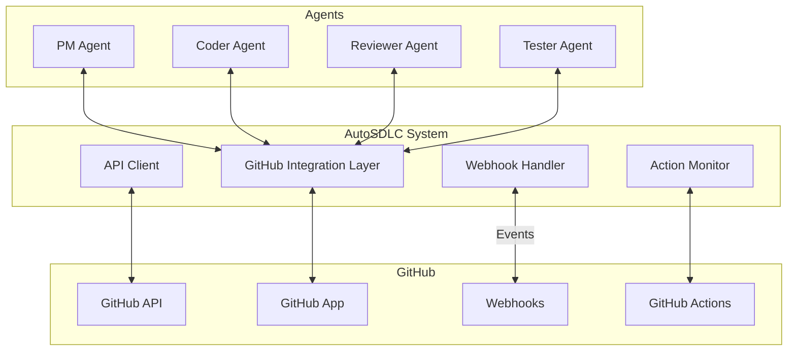

# GitHub Integration Guide

#AutoSDLC #GitHub #Integration #Technical

[[AutoSDLC Documentation Hub|← Back to Index]] | [[20-MCP-Integration|← MCP Integration]]

## Overview

GitHub integration is essential for AutoSDLC's operation, providing version control, issue tracking, pull request management, and CI/CD capabilities. This guide covers the complete GitHub integration including API usage, webhook handling, GitHub Apps, and Actions integration.

## GitHub Architecture

### Integration Components



### Authentication Methods

```typescript
enum AuthMethod {
  PERSONAL_ACCESS_TOKEN = 'pat',
  GITHUB_APP = 'app',
  OAUTH = 'oauth'
}

interface GitHubAuth {
  method: AuthMethod;
  credentials: {
    token?: string;
    appId?: number;
    privateKey?: string;
    clientId?: string;
    clientSecret?: string;
  };
}
```

## GitHub App Setup

### App Configuration

```yaml
# github-app-manifest.yaml
name: AutoSDLC
description: Autonomous Software Development Lifecycle System
url: https://autosdlc.com
hook_attributes:
  url: https://api.autosdlc.com/webhooks/github
  active: true

# Permissions
default_permissions:
  # Repository permissions
  actions: read
  checks: write
  contents: write
  deployments: write
  issues: write
  metadata: read
  pull_requests: write
  statuses: write
  
  # Organization permissions
  members: read
  organization_projects: write

# Events
default_events:
  - check_run
  - check_suite
  - create
  - delete
  - deployment
  - deployment_status
  - issue_comment
  - issues
  - project
  - project_card
  - project_column
  - pull_request
  - pull_request_review
  - pull_request_review_comment
  - push
  - release
  - status
  - workflow_dispatch
  - workflow_run

public: false
```

### App Installation

```typescript
class GitHubAppInstaller {
  async installApp(
    organizationName: string,
    config: AppConfig
  ): Promise<Installation> {
    // Create GitHub App
    const app = await this.createApp(config);
    
    // Generate installation URL
    const installUrl = `https://github.com/apps/${app.slug}/installations/new`;
    
    // Wait for installation
    const installation = await this.waitForInstallation(app.id);
    
    // Configure installation
    await this.configureInstallation(installation, config);
    
    return installation;
  }
  
  private async configureInstallation(
    installation: Installation,
    config: AppConfig
  ): Promise<void> {
    // Set up webhooks
    await this.setupWebhooks(installation);
    
    // Configure permissions
    await this.configurePermissions(installation, config.permissions);
    
    // Create initial labels
    await this.createLabels(installation);
    
    // Set up project board
    await this.setupProjectBoard(installation);
  }
}
```

## API Client Implementation

### Client Architecture

```typescript
export class GitHubClient {
  private octokit: Octokit;
  private rateLimiter: RateLimiter;
  private cache: CacheManager;
  
  constructor(auth: GitHubAuth, config: GitHubConfig) {
    this.octokit = this.createOctokit(auth);
    this.rateLimiter = new RateLimiter(config.rateLimit);
    this.cache = new CacheManager(config.cache);
  }
  
  private createOctokit(auth: GitHubAuth): Octokit {
    switch (auth.method) {
      case AuthMethod.PERSONAL_ACCESS_TOKEN:
        return new Octokit({ auth: auth.credentials.token });
        
      case AuthMethod.GITHUB_APP:
        return new Octokit({
          authStrategy: createAppAuth,
          auth: {
            appId: auth.credentials.appId,
            privateKey: auth.credentials.privateKey,
            installationId: auth.credentials.installationId
          }
        });
        
      case AuthMethod.OAUTH:
        return new Octokit({
          auth: {
            clientId: auth.credentials.clientId,
            clientSecret: auth.credentials.clientSecret
          }
        });
    }
  }
}
```

### Issue Management

```typescript
class IssueManager {
  async createIssue(params: CreateIssueParams): Promise<Issue> {
    // Rate limit check
    await this.rateLimiter.checkLimit('issues.create');
    
    const issue = await this.octokit.issues.create({
      owner: params.owner,
      repo: params.repo,
      title: params.title,
      body: params.body,
      labels: params.labels,
      assignees: params.assignees,
      milestone: params.milestone
    });
    
    // Cache issue
    await this.cache.set(`issue:${issue.data.number}`, issue.data);
    
    // Log activity
    await this.logActivity('issue.created', issue.data);
    
    return issue.data;
  }
  
  async updateIssue(params: UpdateIssueParams): Promise<Issue> {
    await this.rateLimiter.checkLimit('issues.update');
    
    const issue = await this.octokit.issues.update({
      owner: params.owner,
      repo: params.repo,
      issue_number: params.issueNumber,
      ...params.updates
    });
    
    // Invalidate cache
    await this.cache.invalidate(`issue:${params.issueNumber}`);
    
    return issue.data;
  }
  
  async addIssueComment(
    params: AddCommentParams
  ): Promise<IssueComment> {
    await this.rateLimiter.checkLimit('issues.createComment');
    
    const comment = await this.octokit.issues.createComment({
      owner: params.owner,
      repo: params.repo,
      issue_number: params.issueNumber,
      body: params.body
    });
    
    return comment.data;
  }
}
```

### Pull Request Management

```typescript
class PullRequestManager {
  async createPullRequest(
    params: CreatePRParams
  ): Promise<PullRequest> {
    await this.rateLimiter.checkLimit('pulls.create');
    
    // Create PR
    const pr = await this.octokit.pulls.create({
      owner: params.owner,
      repo: params.repo,
      title: params.title,
      body: params.body,
      head: params.head,
      base: params.base,
      draft: params.draft || false
    });
    
    // Add labels
    if (params.labels) {
      await this.addLabels(pr.data.number, params.labels);
    }
    
    // Request reviewers
    if (params.reviewers) {
      await this.requestReviewers(pr.data.number, params.reviewers);
    }
    
    return pr.data;
  }
  
  async mergePullRequest(
    params: MergePRParams
  ): Promise<MergeResult> {
    await this.rateLimiter.checkLimit('pulls.merge');
    
    // Check merge status
    const status = await this.checkMergeability(params.prNumber);
    if (!status.mergeable) {
      throw new Error(`PR not mergeable: ${status.reason}`);
    }
    
    // Merge PR
    const result = await this.octokit.pulls.merge({
      owner: params.owner,
      repo: params.repo,
      pull_number: params.prNumber,
      merge_method: params.mergeMethod || 'merge',
      commit_title: params.commitTitle,
      commit_message: params.commitMessage
    });
    
    // Delete branch if requested
    if (params.deleteBranch) {
      await this.deleteBranch(params.head);
    }
    
    return result.data;
  }
  
  async createReview(
    params: CreateReviewParams
  ): Promise<Review> {
    await this.rateLimiter.checkLimit('pulls.createReview');
    
    const review = await this.octokit.pulls.createReview({
      owner: params.owner,
      repo: params.repo,
      pull_number: params.prNumber,
      body: params.body,
      event: params.event,
      comments: params.comments
    });
    
    return review.data;
  }
}
```

### Repository Management

```typescript
class RepositoryManager {
  async createBranch(
    params: CreateBranchParams
  ): Promise<Branch> {
    // Get base branch SHA
    const baseBranch = await this.getBranch(params.from || 'main');
    
    // Create new branch
    const ref = await this.octokit.git.createRef({
      owner: params.owner,
      repo: params.repo,
      ref: `refs/heads/${params.branch}`,
      sha: baseBranch.commit.sha
    });
    
    return {
      name: params.branch,
      sha: ref.data.object.sha,
      protected: false
    };
  }
  
  async protectBranch(
    params: ProtectBranchParams
  ): Promise<BranchProtection> {
    const protection = await this.octokit.repos.updateBranchProtection({
      owner: params.owner,
      repo: params.repo,
      branch: params.branch,
      required_status_checks: {
        strict: true,
        contexts: params.requiredChecks || []
      },
      enforce_admins: params.enforceAdmins || false,
      required_pull_request_reviews: {
        required_approving_review_count: params.requiredReviews || 1,
        dismiss_stale_reviews: true
      },
      restrictions: null
    });
    
    return protection.data;
  }
  
  async createLabel(
    params: CreateLabelParams
  ): Promise<Label> {
    try {
      const label = await this.octokit.issues.createLabel({
        owner: params.owner,
        repo: params.repo,
        name: params.name,
        color: params.color,
        description: params.description
      });
      
      return label.data;
    } catch (error) {
      if (error.status === 422) {
        // Label already exists
        return await this.getLabel(params.name);
      }
      throw error;
    }
  }
}
```

## Webhook Handling

### Webhook Server

```typescript
export class GitHubWebhookServer {
  private app: Express;
  private webhooks: Webhooks;
  private eventHandlers: Map<string, EventHandler>;
  
  constructor(config: WebhookConfig) {
    this.app = express();
    this.webhooks = new Webhooks({
      secret: config.webhookSecret
    });
    this.eventHandlers = new Map();
    
    this.setupMiddleware();
    this.registerHandlers();
  }
  
  private setupMiddleware(): void {
    this.app.use(express.raw({ type: 'application/json' }));
    
    this.app.post('/webhooks/github', async (req, res) => {
      const signature = req.headers['x-hub-signature-256'] as string;
      const event = req.headers['x-github-event'] as string;
      
      // Verify signature
      const isValid = await this.verifySignature(
        req.body,
        signature
      );
      
      if (!isValid) {
        return res.status(401).send('Invalid signature');
      }
      
      // Process event
      try {
        await this.processEvent(event, JSON.parse(req.body));
        res.status(200).send('OK');
      } catch (error) {
        console.error('Webhook processing error:', error);
        res.status(500).send('Processing error');
      }
    });
  }
}
```

### Event Handlers

```typescript
class WebhookEventHandlers {
  async handleIssueEvent(event: IssueEvent): Promise<void> {
    switch (event.action) {
      case 'opened':
        await this.handleIssueOpened(event);
        break;
      case 'closed':
        await this.handleIssueClosed(event);
        break;
      case 'assigned':
        await this.handleIssueAssigned(event);
        break;
      case 'labeled':
        await this.handleIssueLabeled(event);
        break;
    }
  }
  
  private async handleIssueOpened(event: IssueEvent): Promise<void> {
    // Notify PM Agent
    await this.notifyAgent('pm-agent', {
      type: 'NEW_ISSUE',
      issue: event.issue,
      repository: event.repository
    });
    
    // Add default labels
    await this.addDefaultLabels(event.issue);
    
    // Auto-assign if configured
    if (this.config.autoAssign) {
      await this.autoAssignIssue(event.issue);
    }
  }
  
  async handlePullRequestEvent(event: PullRequestEvent): Promise<void> {
    switch (event.action) {
      case 'opened':
        await this.handlePROpened(event);
        break;
      case 'synchronize':
        await this.handlePRUpdated(event);
        break;
      case 'closed':
        await this.handlePRClosed(event);
        break;
      case 'review_requested':
        await this.handleReviewRequested(event);
        break;
    }
  }
  
  private async handlePROpened(event: PullRequestEvent): Promise<void> {
    // Notify Reviewer Agent
    await this.notifyAgent('reviewer-agent', {
      type: 'NEW_PR',
      pullRequest: event.pull_request,
      repository: event.repository
    });
    
    // Check PR requirements
    await this.checkPRRequirements(event.pull_request);
    
    // Add status checks
    await this.createStatusChecks(event.pull_request);
  }
}
```

### Workflow Run Events

```typescript
class WorkflowEventHandler {
  async handleWorkflowRun(event: WorkflowRunEvent): Promise<void> {
    const run = event.workflow_run;
    
    switch (run.status) {
      case 'completed':
        await this.handleWorkflowCompleted(run);
        break;
      case 'in_progress':
        await this.handleWorkflowInProgress(run);
        break;
      case 'queued':
        await this.handleWorkflowQueued(run);
        break;
    }
  }
  
  private async handleWorkflowCompleted(
    run: WorkflowRun
  ): Promise<void> {
    // Notify Tester Agent
    await this.notifyAgent('tester-agent', {
      type: 'WORKFLOW_COMPLETED',
      workflow: run,
      conclusion: run.conclusion,
      artifacts: await this.fetchArtifacts(run)
    });
    
    // Update PR status
    if (run.pull_requests.length > 0) {
      for (const pr of run.pull_requests) {
        await this.updatePRStatus(pr, run);
      }
    }
    
    // Handle failure
    if (run.conclusion === 'failure') {
      await this.handleWorkflowFailure(run);
    }
  }
}
```

## GitHub Actions Integration

### Custom Actions

```yaml
# .github/actions/autosdlc-notify/action.yml
name: 'AutoSDLC Notify'
description: 'Notify AutoSDLC agents about events'
inputs:
  event-type:
    description: 'Type of event to notify'
    required: true
  agent:
    description: 'Target agent'
    required: true
  payload:
    description: 'Event payload (JSON)'
    required: false
    default: '{}'
  webhook-url:
    description: 'AutoSDLC webhook URL'
    required: true

runs:
  using: 'composite'
  steps:
    - name: Send notification
      shell: bash
      run: |
        curl -X POST ${{ inputs.webhook-url }} \
          -H "Content-Type: application/json" \
          -H "X-Agent-Target: ${{ inputs.agent }}" \
          -d '{
            "event": "${{ inputs.event-type }}",
            "payload": ${{ inputs.payload }},
            "context": {
              "workflow": "${{ github.workflow }}",
              "run_id": "${{ github.run_id }}",
              "repository": "${{ github.repository }}",
              "sha": "${{ github.sha }}"
            }
          }'
```

### Workflow Templates

```yaml
# .github/workflows/autosdlc-ci.yml
name: AutoSDLC CI
on:
  pull_request:
    types: [opened, synchronize, reopened]

jobs:
  setup:
    runs-on: ubuntu-latest
    outputs:
      agent-tasks: ${{ steps.analyze.outputs.tasks }}
    steps:
      - uses: actions/checkout@v3
      
      - name: Analyze changes
        id: analyze
        uses: ./.github/actions/autosdlc-analyze
        with:
          webhook-url: ${{ secrets.AUTOSDLC_WEBHOOK }}
          
  test:
    needs: setup
    runs-on: ubuntu-latest
    steps:
      - uses: actions/checkout@v3
      
      - name: Setup environment
        uses: ./.github/actions/setup-env
        
      - name: Run tests
        run: |
          npm test -- --coverage
          
      - name: Upload coverage
        uses: actions/upload-artifact@v3
        with:
          name: coverage-report
          path: coverage/
          
      - name: Notify Tester Agent
        if: always()
        uses: ./.github/actions/autosdlc-notify
        with:
          event-type: 'test-completed'
          agent: 'tester-agent'
          webhook-url: ${{ secrets.AUTOSDLC_WEBHOOK }}
          payload: |
            {
              "status": "${{ job.status }}",
              "coverage": "${{ steps.test.outputs.coverage }}"
            }
```

## API Rate Limiting

### Rate Limit Handler

```typescript
class RateLimitHandler {
  private limits: Map<string, RateLimit>;
  private queue: RequestQueue;
  
  async checkLimit(endpoint: string): Promise<void> {
    const limit = await this.getCurrentLimit();
    
    if (limit.remaining < this.config.buffer) {
      // Wait until reset
      const waitTime = limit.reset - Date.now();
      await this.delay(waitTime);
    }
    
    // Update limits after request
    this.updateLimits(endpoint);
  }
  
  async handleRateLimitError(error: any): Promise<void> {
    if (error.status === 403 && error.headers['x-ratelimit-remaining'] === '0') {
      const resetTime = parseInt(error.headers['x-ratelimit-reset']) * 1000;
      const waitTime = resetTime - Date.now();
      
      console.log(`Rate limited. Waiting ${waitTime}ms until reset.`);
      
      await this.delay(waitTime);
      
      // Retry request
      return this.retryRequest(error.request);
    }
    
    throw error;
  }
}
```

## Error Handling

### GitHub API Errors

```typescript
class GitHubErrorHandler {
  async handleError(error: any): Promise<void> {
    switch (error.status) {
      case 401:
        throw new AuthenticationError('Invalid GitHub credentials');
        
      case 403:
        if (error.message.includes('rate limit')) {
          return this.handleRateLimitError(error);
        }
        throw new AuthorizationError('Insufficient permissions');
        
      case 404:
        throw new NotFoundError(`Resource not found: ${error.url}`);
        
      case 422:
        throw new ValidationError(`Invalid request: ${error.message}`);
        
      default:
        throw new GitHubAPIError(`GitHub API error: ${error.message}`);
    }
  }
}
```

## Configuration

### GitHub Configuration

```yaml
# config/github.yaml
github:
  auth:
    method: "app"  # "pat", "app", or "oauth"
    appId: ${GITHUB_APP_ID}
    privateKey: ${GITHUB_APP_PRIVATE_KEY}
    installationId: ${GITHUB_INSTALLATION_ID}
    
  api:
    baseUrl: "https://api.github.com"
    timeout: 30000
    retries: 3
    
  rateLimit:
    buffer: 100  # Minimum requests to keep in reserve
    checkInterval: 60000  # Check limits every minute
    
  cache:
    enabled: true
    ttl: 300  # 5 minutes
    maxSize: 1000
    
  webhooks:
    secret: ${GITHUB_WEBHOOK_SECRET}
    path: "/webhooks/github"
    port: 3000
    
  labels:
    feature: 
      color: "0075ca"
      description: "New feature"
    bug:
      color: "d73a4a"
      description: "Something isn't working"
    documentation:
      color: "0052cc"
      description: "Documentation improvements"
    autosdlc:
      color: "7057ff"
      description: "AutoSDLC managed"
      
  defaultBranch: "main"
  
  autoMerge:
    enabled: true
    method: "squash"  # "merge", "squash", or "rebase"
    deleteHeadBranch: true
```

## Best Practices

### 1. API Usage
- Always handle rate limits gracefully
- Cache API responses when possible
- Use conditional requests with ETags
- Batch operations when available

### 2. Webhook Security
- Always verify webhook signatures
- Use HTTPS for webhook endpoints
- Implement idempotent event handlers
- Log all webhook events

### 3. Error Handling
- Implement comprehensive error handling
- Use exponential backoff for retries
- Log errors with context
- Notify relevant agents of failures

### 4. Performance
- Minimize API calls through caching
- Use GraphQL for complex queries
- Implement request queuing
- Monitor API usage metrics

### 5. Security
- Store credentials securely
- Use least-privilege permissions
- Rotate tokens regularly
- Audit all actions

## Monitoring

### Metrics Collection

```typescript
interface GitHubMetrics {
  // API metrics
  apiCalls: Counter;
  apiLatency: Histogram;
  apiErrors: Counter;
  rateLimitRemaining: Gauge;
  
  // Webhook metrics
  webhooksReceived: Counter;
  webhookLatency: Histogram;
  webhookErrors: Counter;
  
  // Operation metrics
  issuesCreated: Counter;
  prsCreated: Counter;
  prseMerged: Counter;
  reviewsCompleted: Counter;
}
```

## Troubleshooting

### Common Issues

#### Authentication Failed
```bash
# Test GitHub App authentication
curl -H "Authorization: Bearer $(gh auth token)" \
  https://api.github.com/app

# Check installation
curl -H "Authorization: Bearer $(gh auth token)" \
  https://api.github.com/app/installations
```

#### Webhook Not Received
```bash
# Check webhook configuration
curl https://api.github.com/repos/OWNER/REPO/hooks

# Test webhook delivery
curl -X POST https://api.github.com/repos/OWNER/REPO/hooks/HOOK_ID/test
```

## Related Documents

- [[10-Agent-Framework|Agent Framework Overview]]
- [[12-Product-Manager-Agent|PM Agent]] - Primary GitHub user
- [[13-Coder-Agent|Coder Agent]] - Creates PRs
- [[14-Code-Reviewer-Agent|Reviewer Agent]] - Reviews PRs
- [[15-Tester-Agent|Tester Agent]] - Monitors Actions

---

**Tags**: #AutoSDLC #GitHub #Integration #API #Webhooks #Technical
**Last Updated**: 2025-06-09
**Next**: [[22-Workflow-Engine|Workflow Engine Design →]]