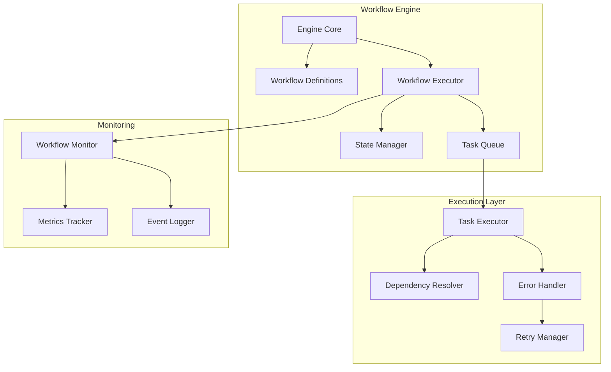
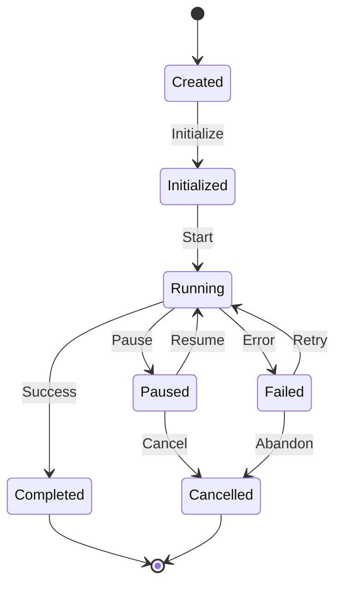

# Workflow Engine Design

#AutoSDLC #Workflow #Architecture #Technical

[[AutoSDLC Documentation Hub|← Back to Index]] | [[21-GitHub-Integration|← GitHub Integration]]

## Overview

The Workflow Engine is the orchestration heart of AutoSDLC, managing complex multi-agent workflows, coordinating task execution, handling dependencies, and ensuring reliable process completion. It provides a flexible, scalable system for defining and executing software development workflows.

## Architecture

### Core Components



### Workflow State Machine



## Workflow Definition

### Workflow Schema

```typescript
interface WorkflowDefinition {
  id: string;
  name: string;
  version: string;
  description: string;
  triggers: Trigger[];
  inputs: InputSchema;
  outputs: OutputSchema;
  steps: Step[];
  errorHandling: ErrorHandlingConfig;
  timeout?: number;
  retryPolicy?: RetryPolicy;
}

interface Step {
  id: string;
  name: string;
  type: StepType;
  agent?: string;
  action: Action;
  inputs: StepInput[];
  outputs: StepOutput[];
  conditions?: Condition[];
  dependencies?: string[];
  timeout?: number;
  retryPolicy?: RetryPolicy;
}

enum StepType {
  TASK = 'task',
  PARALLEL = 'parallel',
  CONDITIONAL = 'conditional',
  LOOP = 'loop',
  SUBWORKFLOW = 'subworkflow'
}
```

### YAML Workflow Definition

```yaml
# workflows/feature-development.yaml
id: feature-development
name: Feature Development Workflow
version: 1.0.0
description: Complete workflow for developing a new feature

triggers:
  - type: github_issue
    conditions:
      - label: feature
  - type: manual
    
inputs:
  issueNumber:
    type: number
    required: true
  repository:
    type: string
    required: true
    
outputs:
  pullRequestUrl:
    type: string
  deploymentUrl:
    type: string
    
steps:
  - id: analyze-requirement
    name: Analyze Requirement
    type: task
    agent: pm-agent
    action: analyze_requirement
    inputs:
      - source: workflow.inputs.issueNumber
        target: issueNumber
    outputs:
      - source: technicalSpec
        target: step.technicalSpec
        
  - id: create-branch
    name: Create Feature Branch
    type: task
    agent: coder-agent
    action: create_branch
    inputs:
      - source: workflow.inputs.issueNumber
        target: issueNumber
    dependencies: [analyze-requirement]
    
  - id: implement-feature
    name: Implement Feature
    type: task
    agent: coder-agent
    action: implement_feature
    inputs:
      - source: step.analyze-requirement.technicalSpec
        target: specification
    dependencies: [create-branch]
    timeout: 7200  # 2 hours
    
  - id: parallel-quality-checks
    name: Quality Checks
    type: parallel
    steps:
      - id: code-review
        agent: reviewer-agent
        action: review_code
        inputs:
          - source: step.implement-feature.pullRequestId
            target: pullRequestId
            
      - id: run-tests
        agent: tester-agent
        action: run_tests
        inputs:
          - source: step.implement-feature.branch
            target: branch
            
  - id: merge-decision
    name: Merge Decision
    type: conditional
    conditions:
      - expression: |
          step['parallel-quality-checks']['code-review'].result.approved &&
          step['parallel-quality-checks']['run-tests'].result.passed
        then: merge-pr
        else: request-changes
        
  - id: merge-pr
    name: Merge Pull Request
    type: task
    agent: pm-agent
    action: merge_pull_request
    inputs:
      - source: step.implement-feature.pullRequestId
        target: pullRequestId
        
errorHandling:
  strategy: retry_then_fail
  maxRetries: 3
  backoff: exponential
  onFailure:
    - action: notify_pm
    - action: create_incident
```

## Workflow Execution

### Execution Engine

```typescript
export class WorkflowExecutor {
  private stateManager: StateManager;
  private taskQueue: TaskQueue;
  private dependencyResolver: DependencyResolver;
  private agentCoordinator: AgentCoordinator;
  
  async executeWorkflow(
    definition: WorkflowDefinition,
    inputs: WorkflowInputs
  ): Promise<WorkflowResult> {
    // Create workflow instance
    const instance = await this.createInstance(definition, inputs);
    
    // Initialize workflow state
    await this.stateManager.initializeWorkflow(instance);
    
    // Start execution
    try {
      await this.executeSteps(instance);
      
      // Collect outputs
      const outputs = await this.collectOutputs(instance);
      
      // Mark as completed
      await this.stateManager.completeWorkflow(instance.id, outputs);
      
      return {
        status: 'completed',
        outputs: outputs,
        duration: Date.now() - instance.startTime
      };
    } catch (error) {
      await this.handleWorkflowError(instance, error);
      throw error;
    }
  }
  
  private async executeSteps(instance: WorkflowInstance): Promise<void> {
    const steps = instance.definition.steps;
    const executionPlan = await this.createExecutionPlan(steps);
    
    for (const batch of executionPlan) {
      await this.executeBatch(instance, batch);
    }
  }
  
  private async executeBatch(
    instance: WorkflowInstance,
    batch: Step[]
  ): Promise<void> {
    const promises = batch.map(step => 
      this.executeStep(instance, step)
    );
    
    await Promise.all(promises);
  }
}
```

### Step Execution

```typescript
class StepExecutor {
  async executeStep(
    instance: WorkflowInstance,
    step: Step
  ): Promise<StepResult> {
    // Update step state
    await this.updateStepState(instance.id, step.id, 'running');
    
    try {
      // Resolve inputs
      const inputs = await this.resolveInputs(instance, step);
      
      // Execute based on step type
      let result: any;
      switch (step.type) {
        case StepType.TASK:
          result = await this.executeTask(step, inputs);
          break;
        case StepType.PARALLEL:
          result = await this.executeParallel(step, inputs);
          break;
        case StepType.CONDITIONAL:
          result = await this.executeConditional(step, inputs);
          break;
        case StepType.LOOP:
          result = await this.executeLoop(step, inputs);
          break;
        case StepType.SUBWORKFLOW:
          result = await this.executeSubworkflow(step, inputs);
          break;
      }
      
      // Store outputs
      await this.storeOutputs(instance, step, result);
      
      // Update state
      await this.updateStepState(instance.id, step.id, 'completed');
      
      return {
        stepId: step.id,
        status: 'completed',
        outputs: result
      };
    } catch (error) {
      return await this.handleStepError(instance, step, error);
    }
  }
  
  private async executeTask(
    step: Step,
    inputs: any
  ): Promise<any> {
    // Find capable agent
    const agent = await this.agentCoordinator.selectAgent(
      step.agent || step.action.requiredCapabilities
    );
    
    // Create task
    const task = {
      id: generateId(),
      action: step.action,
      inputs: inputs,
      timeout: step.timeout
    };
    
    // Assign to agent
    const assignment = await this.agentCoordinator.assignTask(agent, task);
    
    // Wait for completion
    return await this.waitForTaskCompletion(assignment);
  }
}
```

### Dependency Resolution

```typescript
class DependencyResolver {
  async createExecutionPlan(steps: Step[]): Promise<Step[][]> {
    // Build dependency graph
    const graph = this.buildDependencyGraph(steps);
    
    // Topological sort
    const sorted = this.topologicalSort(graph);
    
    // Group into parallel batches
    const batches = this.groupIntoBatches(sorted);
    
    return batches;
  }
  
  private buildDependencyGraph(steps: Step[]): DependencyGraph {
    const graph = new DependencyGraph();
    
    // Add nodes
    steps.forEach(step => graph.addNode(step.id, step));
    
    // Add edges
    steps.forEach(step => {
      if (step.dependencies) {
        step.dependencies.forEach(dep => {
          graph.addEdge(dep, step.id);
        });
      }
    });
    
    // Validate graph
    if (graph.hasCycles()) {
      throw new Error('Circular dependencies detected');
    }
    
    return graph;
  }
  
  private groupIntoBatches(sortedSteps: Step[]): Step[][] {
    const batches: Step[][] = [];
    const processed = new Set<string>();
    
    for (const step of sortedSteps) {
      if (processed.has(step.id)) continue;
      
      // Find all steps that can run in parallel
      const batch = [step];
      processed.add(step.id);
      
      for (const other of sortedSteps) {
        if (processed.has(other.id)) continue;
        
        if (this.canRunInParallel(step, other, processed)) {
          batch.push(other);
          processed.add(other.id);
        }
      }
      
      batches.push(batch);
    }
    
    return batches;
  }
}
```

## State Management

### Workflow State

```typescript
interface WorkflowState {
  id: string;
  definitionId: string;
  status: WorkflowStatus;
  inputs: any;
  outputs?: any;
  currentStep?: string;
  stepStates: Map<string, StepState>;
  variables: Map<string, any>;
  startTime: Date;
  endTime?: Date;
  error?: WorkflowError;
}

interface StepState {
  id: string;
  status: StepStatus;
  inputs?: any;
  outputs?: any;
  startTime?: Date;
  endTime?: Date;
  retryCount: number;
  error?: StepError;
}

enum WorkflowStatus {
  CREATED = 'created',
  INITIALIZED = 'initialized',
  RUNNING = 'running',
  PAUSED = 'paused',
  COMPLETED = 'completed',
  FAILED = 'failed',
  CANCELLED = 'cancelled'
}
```

### State Persistence

```typescript
class StateManager {
  private storage: StateStorage;
  private cache: StateCache;
  
  async saveWorkflowState(state: WorkflowState): Promise<void> {
    // Validate state
    this.validateState(state);
    
    // Save to persistent storage
    await this.storage.save(state.id, state);
    
    // Update cache
    this.cache.set(state.id, state);
    
    // Emit state change event
    await this.emitStateChange(state);
  }
  
  async getWorkflowState(workflowId: string): Promise<WorkflowState> {
    // Check cache
    const cached = this.cache.get(workflowId);
    if (cached) return cached;
    
    // Load from storage
    const state = await this.storage.load(workflowId);
    
    // Update cache
    this.cache.set(workflowId, state);
    
    return state;
  }
  
  async updateStepState(
    workflowId: string,
    stepId: string,
    update: Partial<StepState>
  ): Promise<void> {
    const workflow = await this.getWorkflowState(workflowId);
    
    const stepState = workflow.stepStates.get(stepId) || {
      id: stepId,
      status: StepStatus.PENDING,
      retryCount: 0
    };
    
    // Apply update
    Object.assign(stepState, update);
    workflow.stepStates.set(stepId, stepState);
    
    // Save updated state
    await this.saveWorkflowState(workflow);
  }
}
```

## Error Handling

### Error Strategies

```typescript
enum ErrorStrategy {
  FAIL_FAST = 'fail_fast',
  RETRY_THEN_FAIL = 'retry_then_fail',
  RETRY_THEN_CONTINUE = 'retry_then_continue',
  CONTINUE = 'continue',
  COMPENSATE = 'compensate'
}

class ErrorHandler {
  async handleError(
    instance: WorkflowInstance,
    step: Step,
    error: Error
  ): Promise<ErrorResolution> {
    const strategy = step.errorHandling?.strategy || 
                    instance.definition.errorHandling.strategy;
    
    switch (strategy) {
      case ErrorStrategy.FAIL_FAST:
        return this.failFast(instance, step, error);
        
      case ErrorStrategy.RETRY_THEN_FAIL:
        return this.retryThenFail(instance, step, error);
        
      case ErrorStrategy.RETRY_THEN_CONTINUE:
        return this.retryThenContinue(instance, step, error);
        
      case ErrorStrategy.CONTINUE:
        return this.continueExecution(instance, step, error);
        
      case ErrorStrategy.COMPENSATE:
        return this.compensate(instance, step, error);
    }
  }
  
  private async retryThenFail(
    instance: WorkflowInstance,
    step: Step,
    error: Error
  ): Promise<ErrorResolution> {
    const retryPolicy = step.retryPolicy || 
                       instance.definition.retryPolicy;
    
    const stepState = instance.getStepState(step.id);
    
    if (stepState.retryCount < retryPolicy.maxRetries) {
      // Calculate delay
      const delay = this.calculateRetryDelay(
        stepState.retryCount,
        retryPolicy
      );
      
      // Schedule retry
      await this.scheduleRetry(instance, step, delay);
      
      return {
        action: 'retry',
        delay: delay
      };
    } else {
      // Max retries exceeded
      await this.failWorkflow(instance, step, error);
      
      return {
        action: 'fail',
        error: error
      };
    }
  }
}
```

### Compensation

```typescript
class CompensationHandler {
  async compensate(
    instance: WorkflowInstance,
    failedStep: Step,
    error: Error
  ): Promise<void> {
    // Get completed steps in reverse order
    const completedSteps = this.getCompletedSteps(instance);
    completedSteps.reverse();
    
    for (const step of completedSteps) {
      if (step.compensation) {
        await this.executeCompensation(instance, step);
      }
    }
    
    // Mark workflow as compensated
    await this.stateManager.updateWorkflowStatus(
      instance.id,
      WorkflowStatus.COMPENSATED
    );
  }
  
  private async executeCompensation(
    instance: WorkflowInstance,
    step: Step
  ): Promise<void> {
    try {
      // Execute compensation action
      await this.stepExecutor.executeStep(
        instance,
        step.compensation
      );
      
      // Update state
      await this.stateManager.updateStepState(
        instance.id,
        step.id,
        { compensated: true }
      );
    } catch (error) {
      // Log compensation failure
      console.error(`Compensation failed for step ${step.id}:`, error);
      
      // Continue with other compensations
    }
  }
}
```

## Workflow Patterns

### Parallel Execution

```typescript
class ParallelExecutor {
  async executeParallel(
    steps: Step[],
    inputs: any
  ): Promise<ParallelResult> {
    const promises = steps.map(step => 
      this.executeStep(step, inputs)
        .then(result => ({ step: step.id, result, error: null }))
        .catch(error => ({ step: step.id, result: null, error }))
    );
    
    const results = await Promise.all(promises);
    
    // Check for failures
    const failures = results.filter(r => r.error);
    if (failures.length > 0 && this.config.failOnError) {
      throw new ParallelExecutionError(failures);
    }
    
    return {
      results: results,
      succeeded: results.filter(r => !r.error).length,
      failed: failures.length
    };
  }
}
```

### Conditional Execution

```typescript
class ConditionalExecutor {
  async executeConditional(
    step: ConditionalStep,
    context: ExecutionContext
  ): Promise<any> {
    // Evaluate conditions
    for (const condition of step.conditions) {
      const result = await this.evaluateCondition(
        condition.expression,
        context
      );
      
      if (result) {
        // Execute matching branch
        return await this.executeStep(
          condition.then,
          context
        );
      }
    }
    
    // Execute else branch if no conditions match
    if (step.else) {
      return await this.executeStep(step.else, context);
    }
    
    return null;
  }
  
  private async evaluateCondition(
    expression: string,
    context: ExecutionContext
  ): Promise<boolean> {
    // Safe expression evaluation
    const sandbox = {
      step: context.stepResults,
      workflow: context.workflowInputs,
      env: context.environment
    };
    
    return this.expressionEvaluator.evaluate(expression, sandbox);
  }
}
```

### Loop Execution

```typescript
class LoopExecutor {
  async executeLoop(
    step: LoopStep,
    inputs: any
  ): Promise<any[]> {
    const results: any[] = [];
    
    if (step.forEach) {
      // For-each loop
      const items = await this.resolveItems(step.forEach, inputs);
      
      for (const [index, item] of items.entries()) {
        const loopContext = {
          ...inputs,
          loop: { index, item, total: items.length }
        };
        
        const result = await this.executeStep(
          step.do,
          loopContext
        );
        
        results.push(result);
      }
    } else if (step.while) {
      // While loop
      while (await this.evaluateCondition(step.while, inputs)) {
        const result = await this.executeStep(step.do, inputs);
        results.push(result);
        
        // Update inputs with loop results
        inputs = { ...inputs, lastResult: result };
        
        // Safety check
        if (results.length > this.config.maxLoopIterations) {
          throw new Error('Maximum loop iterations exceeded');
        }
      }
    }
    
    return results;
  }
}
```

## Monitoring

### Workflow Metrics

```typescript
interface WorkflowMetrics {
  // Execution metrics
  workflowsStarted: Counter;
  workflowsCompleted: Counter;
  workflowsFailed: Counter;
  workflowDuration: Histogram;
  
  // Step metrics
  stepsExecuted: Counter;
  stepDuration: Histogram;
  stepRetries: Counter;
  
  // Performance metrics
  queueDepth: Gauge;
  activeWorkflows: Gauge;
  throughput: Gauge;
}

class WorkflowMonitor {
  async trackWorkflowExecution(
    instance: WorkflowInstance
  ): Promise<void> {
    // Track start
    this.metrics.workflowsStarted.inc({
      workflow: instance.definition.id
    });
    
    // Track active
    this.metrics.activeWorkflows.inc();
    
    // Monitor execution
    instance.on('completed', () => {
      this.metrics.workflowsCompleted.inc({
        workflow: instance.definition.id
      });
      
      this.metrics.workflowDuration.observe(
        instance.duration,
        { workflow: instance.definition.id }
      );
      
      this.metrics.activeWorkflows.dec();
    });
    
    instance.on('failed', () => {
      this.metrics.workflowsFailed.inc({
        workflow: instance.definition.id,
        error: instance.error?.code
      });
      
      this.metrics.activeWorkflows.dec();
    });
  }
}
```

## Configuration

### Engine Configuration

```yaml
# config/workflow-engine.yaml
engine:
  workers: 10
  maxConcurrentWorkflows: 100
  maxConcurrentSteps: 500
  
execution:
  defaultTimeout: 3600  # 1 hour
  maxRetries: 3
  retryDelay: 1000
  maxLoopIterations: 1000
  
queue:
  type: "redis"
  url: ${REDIS_URL}
  maxQueueSize: 10000
  
storage:
  type: "postgresql"
  url: ${DATABASE_URL}
  
  retention:
    completed: 30  # days
    failed: 90     # days
    
monitoring:
  metrics:
    enabled: true
    interval: 10  # seconds
    
  tracing:
    enabled: true
    sampleRate: 0.1
    
errorHandling:
  defaultStrategy: "retry_then_fail"
  notificationChannels:
    - email
    - slack
```

## Best Practices

### 1. Workflow Design
- Keep workflows focused and modular
- Use sub-workflows for reusability
- Define clear inputs and outputs
- Handle errors at appropriate levels

### 2. Performance
- Minimize dependencies between steps
- Use parallel execution where possible
- Set appropriate timeouts
- Monitor resource usage

### 3. Error Handling
- Define compensation logic
- Use appropriate retry strategies
- Log errors with context
- Notify relevant stakeholders

### 4. Testing
- Test workflows in isolation
- Mock agent interactions
- Test error scenarios
- Validate compensation logic

## Related Documents

- [[10-Agent-Framework|Agent Framework Overview]]
- [[20-MCP-Integration|MCP Integration]]
- [[23-Inter-Agent-Communication|Inter-Agent Communication]]
- [[62-Testing-Strategy|Testing Strategy]]

---

**Tags**: #AutoSDLC #Workflow #Orchestration #Architecture #Technical
**Last Updated**: 2025-06-09
**Next**: [[23-Inter-Agent-Communication|Inter-Agent Communication →]]