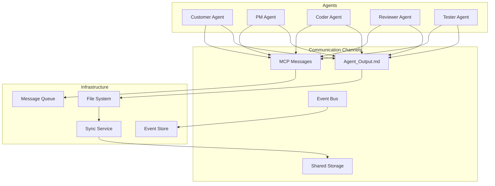

# Inter-Agent Communication Protocol

#AutoSDLC #Agent #Communication #Protocol

[[AutoSDLC Documentation Hub|← Back to Index]] | [[22-Workflow-Engine|← Workflow Engine]]

## Overview

The Inter-Agent Communication Protocol defines how AutoSDLC agents communicate with each other to collaborate on software development tasks. This protocol leverages MCP (Model Context Protocol) for structured messaging, Agent_Output.md files for status sharing, and event-driven architectures for real-time coordination.

## Communication Architecture

### Multi-Channel Communication



### Communication Patterns

```typescript
enum CommunicationPattern {
  REQUEST_RESPONSE = 'request_response',
  PUBLISH_SUBSCRIBE = 'publish_subscribe',
  BROADCAST = 'broadcast',
  WORKFLOW_COORDINATION = 'workflow_coordination',
  STATUS_POLLING = 'status_polling'
}

interface CommunicationChannel {
  mcp: MCPChannel;           // Direct agent-to-agent
  status: StatusChannel;     // Via Agent_Output.md
  events: EventChannel;      // Event-driven updates
  shared: SharedChannel;     // Shared file system
}
```

## Message Protocol

### Message Structure

```typescript
interface AgentMessage {
  // Message metadata
  id: string;
  version: '1.0';
  timestamp: Date;
  
  // Routing information
  source: AgentIdentifier;
  destination: AgentIdentifier | 'broadcast';
  replyTo?: string;
  correlationId?: string;
  
  // Message content
  type: MessageType;
  priority: MessagePriority;
  payload: any;
  
  // Delivery guarantees
  requiresAck: boolean;
  ttl?: number;
  retryPolicy?: RetryPolicy;
}

enum MessageType {
  // Task management
  TASK_ASSIGNMENT = 'task_assignment',
  TASK_COMPLETION = 'task_completion',
  
  // Coordination
  COORDINATION_REQUEST = 'coordination_request',
  COORDINATION_RESPONSE = 'coordination_response',
  
  // TDD specific
  TEST_SPEC_READY = 'test_spec_ready',
  TESTS_RED_CONFIRMED = 'tests_red_confirmed',
  TESTS_GREEN_ACHIEVED = 'tests_green_achieved',
  
  // Collaboration
  REVIEW_REQUEST = 'review_request',
  CLARIFICATION_REQUEST = 'clarification_request',
  
  // System
  STATUS_UPDATE = 'status_update',
  WORKFLOW_EVENT = 'workflow_event'
}
```

### Message Flow Examples

#### Task Assignment Flow
```
PM Agent → Coder Agent: TASK_ASSIGNMENT
Coder Agent → PM Agent: TASK_ACCEPTANCE
Coder Agent → Broadcast: TESTS_RED_CONFIRMED
Coder Agent → Broadcast: TESTS_GREEN_ACHIEVED
Coder Agent → Reviewer Agent: REVIEW_REQUEST
Reviewer Agent → Coder Agent: REVIEW_FEEDBACK
Coder Agent → PM Agent: TASK_COMPLETION
```

#### TDD Coordination Flow
```
PM Agent: Creates test specification
Coder Agent: Writes failing tests → RED phase
Coder Agent → Broadcast: TESTS_RED_CONFIRMED
Coder Agent: Implements minimal code → GREEN phase  
Coder Agent → Broadcast: TESTS_GREEN_ACHIEVED
Coder Agent: Refactors → REFACTOR phase
Coder Agent → PM Agent: Implementation ready for review
```

## Communication Patterns

### 1. Request-Response Pattern
**Usage**: Direct agent-to-agent coordination requiring acknowledgment
- **Flow**: Agent A → Request → Agent B → Response → Agent A
- **Examples**: Task assignment, clarification requests, review requests
- **Features**: Timeout handling, correlation IDs, retry policies

### 2. Publish-Subscribe Pattern  
**Usage**: Event-driven updates across multiple agents
- **Flow**: Agent A → Publish Event → All Subscribed Agents receive
- **Examples**: TDD phase transitions, workflow events, status changes
- **Features**: Topic-based routing, multiple subscribers, broadcast capability

### 3. Status Polling Pattern
**Usage**: Monitoring agent health and activity via Agent_Output.md files
- **Flow**: Monitor reads status files → Detect changes → Emit events
- **Examples**: Health checks, progress monitoring, resource availability
- **Features**: File watching, change detection, caching

### 4. Workflow Coordination Pattern
**Usage**: Multi-agent collaborative workflows
- **Flow**: Coordinator → Step 1 Agent → Step 2 Agent → Result
- **Examples**: Complete feature development, release workflows
- **Features**: Step sequencing, capability matching, rollback support

## Agent-Specific Communication

### Customer Agent Communication
**Primary Role**: Requirements validation and product vision
- **Main Partner**: PM Agent for requirements clarification
- **Communication Pattern**: Request-response for validation feedback
- **Key Messages**: 
  - Implementation validation
  - Acceptance criteria clarification
  - User experience feedback

### PM Agent Communication Hub
**Primary Role**: Central coordination and task distribution
- **Communicates With**: All agents as central hub
- **Communication Patterns**: 
  - Request-response for task assignments
  - Broadcast for workflow announcements
  - Status polling for agent monitoring
- **Key Messages**:
  - Task assignments with test specifications
  - Workflow coordination
  - Progress tracking and reporting

### Coder Agent TDD Communication
**Primary Role**: Implementation following strict TDD
- **Main Partners**: PM Agent (tasks), Reviewer Agent (reviews), Tester Agent (execution)
- **Communication Patterns**:
  - Broadcast for TDD phase transitions
  - Request-response for clarifications
  - Status updates via Agent_Output.md
- **Key Messages**:
  - TDD phase transitions (RED → GREEN → REFACTOR)
  - Review requests after implementation
  - Clarification requests when blocked

### Reviewer Agent Quality Communication
**Primary Role**: Code quality assurance and standards
- **Main Partners**: Coder Agent (reviews), PM Agent (quality reports)
- **Communication Patterns**:
  - Request-response for review feedback
  - Status updates for review progress
- **Key Messages**:
  - Review feedback with suggestions
  - Quality metrics reporting
  - Standards compliance validation

### Tester Agent Validation Communication
**Primary Role**: Automated testing and CI/CD
- **Main Partners**: Coder Agent (test execution), PM Agent (test reports)
- **Communication Patterns**:
  - Event-driven test execution
  - Status updates for test results
- **Key Messages**:
  - Test execution results
  - Coverage reports
  - CI/CD pipeline status

## Infrastructure Components

### Message Queue Architecture
**Technology**: RabbitMQ with multiple exchange types
- **Direct Exchange**: Point-to-point agent communication
- **Topic Exchange**: Pattern-based message routing
- **Fanout Exchange**: Broadcast to all agents
- **Features**: 
  - Durable queues with TTL
  - Dead letter handling
  - Priority-based delivery
  - Automatic retry with exponential backoff

### Event Bus Architecture
**Purpose**: Event-driven communication and audit trail
- **Event Store**: Persistent event log for replay capability
- **Subscribers**: Pattern-based event subscription
- **Event Types**:
  - TDD phase transitions
  - Task completion events
  - Agent status changes
  - Workflow milestones
- **Features**:
  - Pattern matching for event types
  - Asynchronous event handling
  - Event replay for debugging

## Status File Protocol

### Agent_Output.md Format
**Purpose**: Standardized status sharing via markdown files
**Structure**:
```markdown
# Agent Status: [Agent Type]
**Last Updated**: [UTC Timestamp]
**Agent ID**: [Unique Identifier]  
**Status**: [IDLE|BUSY|BLOCKED|ERROR]

## Current Activity
- **Task**: [Current task description]
- **Progress**: [Percentage or phase]
- **Dependencies**: [What agent is waiting for]

## Communication Log
### Recent Messages [Last 10]
- [Timestamp] -> [Target]: [Message type and summary]
- [Timestamp] <- [Source]: [Message type and summary]

## Collaboration Status
- **Waiting For**: [Blocking dependencies]
- **Available For**: [What requests agent can handle]
- **Next Actions**: [Planned activities]
```

### Status Synchronization
**Mechanism**: File system watchers with change detection
- **Monitoring**: Real-time file change detection
- **Caching**: In-memory status cache for performance
- **Sharing**: Synchronized to shared directory for cross-agent access
- **Events**: Status change events for reactive coordination
- **Permissions**: Read-only shared files to prevent conflicts

## Error Handling & Recovery

### Communication Error Types
**Timeout Errors**: Message delivery timeouts
- **Response**: Retry with exponential backoff
- **Escalation**: Notify sender after max retries exceeded

**Delivery Failures**: Message queue or network issues  
- **Response**: Re-queue with delay
- **Escalation**: Dead letter queue after retries

**Agent Unavailable**: Target agent offline or unresponsive
- **Response**: Queue for later delivery if planned downtime
- **Escalation**: Alert monitoring if unexpected

**Invalid Messages**: Malformed or schema violations
- **Response**: Log error and reject message
- **Escalation**: Notify sender for correction

### Recovery Strategies
- **Circuit Breaker**: Temporarily disable failing communication paths
- **Graceful Degradation**: Continue with reduced functionality
- **Message Replay**: Re-process failed messages from event store
- **Health Checks**: Proactive agent availability monitoring

## Performance Optimization

### Message Batching
**Strategy**: Combine low-priority messages for efficiency
- **Criteria**: Non-urgent status updates and metrics
- **Timing**: 100ms batching window
- **Benefits**: Reduced network overhead and improved throughput

### Connection Management
**Approach**: Pool connections for reuse and scalability
- **Features**: Connection health checks, automatic eviction
- **Limits**: Maximum connections per agent type
- **Benefits**: Reduced connection overhead and improved performance

## Monitoring & Observability

### Key Metrics
**Message Throughput**: Messages per second by type and route
**Delivery Latency**: End-to-end message delivery times  
**Error Rates**: Communication failures by error type
**Queue Depths**: Pending message counts by agent
**Agent Availability**: Uptime and responsiveness metrics

### Alerting Thresholds
- **High Latency**: >5 seconds for critical messages
- **Error Rate**: >5% failure rate over 1 minute
- **Queue Backlog**: >100 pending messages
- **Agent Downtime**: >30 seconds unresponsive

## Best Practices

### Message Design Principles
- **Focused Content**: Single responsibility per message
- **Appropriate Types**: Use specific message types for clear intent
- **Correlation IDs**: Enable request/response tracking and debugging
- **Reasonable TTLs**: Set timeouts appropriate to message urgency

### Error Handling Standards
- **Retry Logic**: Exponential backoff for transient failures
- **Graceful Timeouts**: Non-blocking timeout handling
- **Comprehensive Logging**: All communication errors with context
- **Fallback Mechanisms**: Alternative paths for critical communications

### Performance Guidelines
- **Message Batching**: Combine low-priority updates for efficiency
- **Connection Pooling**: Reuse connections to reduce overhead
- **Queue Monitoring**: Track depths to prevent backlogs
- **Compression**: Use for large payloads

### Security Requirements
- **Message Validation**: Verify source and content integrity
- **Rate Limiting**: Prevent communication flooding
- **Audit Trail**: Log all agent communications
- **Sensitive Data**: Encrypt when necessary

### Monitoring Standards
- **Latency Tracking**: Monitor end-to-end delivery times
- **Delivery Rates**: Success vs failure ratios
- **Pattern Analysis**: Communication flows and bottlenecks
- **Proactive Alerting**: Early warning for degraded performance

## Related Documents

- [[10-Agent-Framework|Agent Framework Overview]]
- [[20-MCP-Integration|MCP Integration Guide]]
- [[24-Agent-Output-Management|Agent Output Management]]
- [[22-Workflow-Engine|Workflow Engine Design]]

---

**Tags**: #AutoSDLC #Agent #Communication #Protocol #MCP
**Last Updated**: 2025-06-09
**Next**: [[30-API-Specification|API Specification →]]