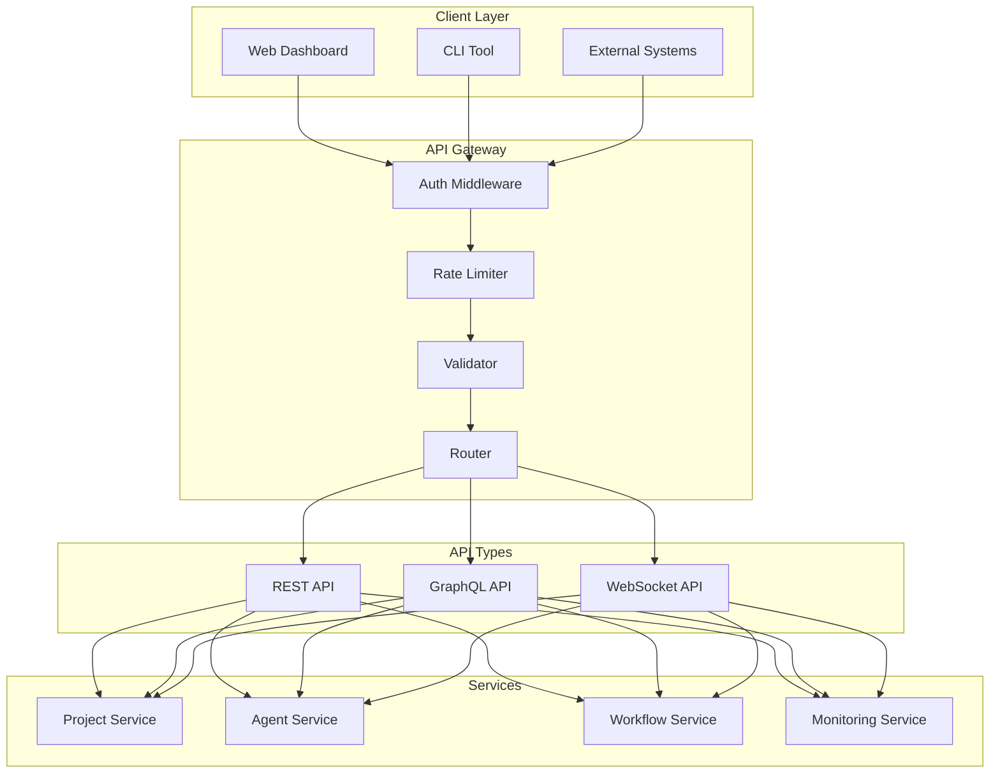

# API Specification

#AutoSDLC #API #GraphQL #REST #Specification

[[AutoSDLC Documentation Hub|← Back to Index]] | [[23-Inter-Agent-Communication|← Inter-Agent Communication]]

## Overview

The AutoSDLC API provides a comprehensive interface for managing the autonomous software development system. It offers both REST and GraphQL endpoints for different use cases, with real-time subscriptions for monitoring agent activities and workflow progress. All agent interactions use BAML framework for schema-validated, type-safe communication.

## API Architecture

### API Gateway



## Authentication

### JWT Authentication

```typescript
interface AuthToken {
  token: string;
  type: 'Bearer';
  expiresIn: number;
  refreshToken: string;
}

interface TokenPayload {
  sub: string;  // User ID
  email: string;
  roles: string[];
  permissions: string[];
  iat: number;
  exp: number;
}
```

### API Key Authentication

```typescript
interface APIKey {
  id: string;
  key: string;
  name: string;
  permissions: Permission[];
  rateLimit: RateLimit;
  expiresAt?: Date;
  createdAt: Date;
}
```

### Authentication Endpoints

```http
POST /api/v1/auth/login
Content-Type: application/json

{
  "email": "user@example.com",
  "password": "secure_password"
}

Response:
{
  "token": "eyJhbGciOiJIUzI1NiIs...",
  "type": "Bearer",
  "expiresIn": 3600,
  "refreshToken": "refresh_token_here"
}
```

## GraphQL API

### Schema Definition

```graphql
schema {
  query: Query
  mutation: Mutation
  subscription: Subscription
}

scalar DateTime
scalar JSON

# Common types
enum Status {
  ACTIVE
  INACTIVE
  PENDING
  ERROR
}

interface Node {
  id: ID!
  createdAt: DateTime!
  updatedAt: DateTime!
}

# Error handling
type Error {
  code: String!
  message: String!
  field: String
}

type Result {
  success: Boolean!
  errors: [Error!]
}
```

### Project Types

```graphql
type Project implements Node {
  id: ID!
  name: String!
  description: String
  repository: Repository!
  agents: [Agent!]!
  workflows: [Workflow!]!
  issues: [Issue!]!
  pullRequests: [PullRequest!]!
  metrics: ProjectMetrics!
  configuration: JSON!
  status: Status!
  createdAt: DateTime!
  updatedAt: DateTime!
}

type Repository {
  id: ID!
  owner: String!
  name: String!
  url: String!
  defaultBranch: String!
  visibility: RepositoryVisibility!
}

enum RepositoryVisibility {
  PUBLIC
  PRIVATE
  INTERNAL
}

type ProjectMetrics {
  featuresDelivered: Int!
  bugsFixed: Int!
  codeQuality: Float!
  testCoverage: Float!
  velocity: Float!
}
```

### Agent Types

```graphql
type Agent implements Node {
  id: ID!
  type: AgentType!
  name: String!
  status: AgentStatus!
  capabilities: [String!]!
  currentTask: Task
  taskQueue: [Task!]!
  performance: AgentPerformance!
  configuration: JSON!
  lastActivity: DateTime!
  createdAt: DateTime!
  updatedAt: DateTime!
}

enum AgentType {
  CUSTOMER
  PRODUCT_MANAGER
  CODER
  CODE_REVIEWER
  TESTER
}

enum AgentStatus {
  INITIALIZING
  IDLE
  BUSY
  ERROR
  SHUTDOWN
}

type AgentPerformance {
  tasksCompleted: Int!
  successRate: Float!
  averageResponseTime: Float!
  currentLoad: Float!
}

type Task {
  id: ID!
  type: String!
  priority: Priority!
  status: TaskStatus!
  assignedAgent: Agent
  input: JSON!
  output: JSON
  startTime: DateTime
  endTime: DateTime
  error: String
}

enum Priority {
  LOW
  MEDIUM
  HIGH
  CRITICAL
}

enum TaskStatus {
  PENDING
  ASSIGNED
  IN_PROGRESS
  COMPLETED
  FAILED
  CANCELLED
}
```

### Workflow Types

```graphql
type Workflow implements Node {
  id: ID!
  definitionId: String!
  name: String!
  status: WorkflowStatus!
  inputs: JSON!
  outputs: JSON
  currentStep: WorkflowStep
  steps: [WorkflowStep!]!
  startTime: DateTime!
  endTime: DateTime
  duration: Int
  error: WorkflowError
  createdAt: DateTime!
  updatedAt: DateTime!
}

enum WorkflowStatus {
  CREATED
  INITIALIZED
  RUNNING
  PAUSED
  COMPLETED
  FAILED
  CANCELLED
}

type WorkflowStep {
  id: ID!
  name: String!
  type: StepType!
  status: StepStatus!
  agent: Agent
  startTime: DateTime
  endTime: DateTime
  inputs: JSON
  outputs: JSON
  error: String
  retryCount: Int!
}

enum StepType {
  TASK
  PARALLEL
  CONDITIONAL
  LOOP
  SUBWORKFLOW
}

enum StepStatus {
  PENDING
  RUNNING
  COMPLETED
  FAILED
  SKIPPED
}

type WorkflowError {
  code: String!
  message: String!
  step: String
  details: JSON
}
```

### Query Operations

```graphql
type Query {
  # Project queries
  project(id: ID!): Project
  projects(
    filter: ProjectFilter
    pagination: PaginationInput
    sort: ProjectSort
  ): ProjectConnection!
  
  # Agent queries
  agent(id: ID!): Agent
  agents(
    projectId: ID!
    filter: AgentFilter
  ): [Agent!]!
  
  # Workflow queries
  workflow(id: ID!): Workflow
  workflows(
    projectId: ID!
    filter: WorkflowFilter
    pagination: PaginationInput
  ): WorkflowConnection!
  
  # Task queries
  task(id: ID!): Task
  tasks(
    agentId: ID
    filter: TaskFilter
    pagination: PaginationInput
  ): TaskConnection!
  
  # Metrics queries
  systemMetrics: SystemMetrics!
  projectMetrics(projectId: ID!): ProjectMetrics!
  agentMetrics(agentId: ID!): AgentMetrics!
}

# Filters
input ProjectFilter {
  name: StringFilter
  status: Status
  createdAfter: DateTime
  createdBefore: DateTime
}

input StringFilter {
  eq: String
  contains: String
  startsWith: String
  endsWith: String
}

input PaginationInput {
  limit: Int = 20
  offset: Int = 0
  cursor: String
}

# Connections
type ProjectConnection {
  nodes: [Project!]!
  pageInfo: PageInfo!
  totalCount: Int!
}

type PageInfo {
  hasNextPage: Boolean!
  hasPreviousPage: Boolean!
  startCursor: String
  endCursor: String
}
```

### Mutation Operations

```graphql
type Mutation {
  # Project mutations
  createProject(input: CreateProjectInput!): ProjectResult!
  updateProject(id: ID!, input: UpdateProjectInput!): ProjectResult!
  deleteProject(id: ID!): Result!
  
  # Agent mutations
  deployAgent(input: DeployAgentInput!): AgentResult!
  updateAgentConfig(id: ID!, config: JSON!): AgentResult!
  restartAgent(id: ID!): AgentResult!
  shutdownAgent(id: ID!): Result!
  
  # Workflow mutations
  startWorkflow(input: StartWorkflowInput!): WorkflowResult!
  pauseWorkflow(id: ID!): WorkflowResult!
  resumeWorkflow(id: ID!): WorkflowResult!
  cancelWorkflow(id: ID!): Result!
  
  # Task mutations
  assignTask(input: AssignTaskInput!): TaskResult!
  updateTaskStatus(id: ID!, status: TaskStatus!): TaskResult!
  cancelTask(id: ID!): Result!
}

# Inputs
input CreateProjectInput {
  name: String!
  description: String
  repository: RepositoryInput!
  agents: [AgentType!]!
  configuration: JSON
}

input RepositoryInput {
  owner: String!
  name: String!
}

input DeployAgentInput {
  projectId: ID!
  type: AgentType!
  configuration: JSON
}

input StartWorkflowInput {
  projectId: ID!
  definitionId: String!
  inputs: JSON!
}

# Results
type ProjectResult {
  success: Boolean!
  project: Project
  errors: [Error!]
}

type AgentResult {
  success: Boolean!
  agent: Agent
  errors: [Error!]
}

type WorkflowResult {
  success: Boolean!
  workflow: Workflow
  errors: [Error!]
}
```

### Subscription Operations

```graphql
type Subscription {
  # Agent subscriptions
  agentStatusChanged(
    projectId: ID
    agentId: ID
  ): AgentStatusUpdate!
  
  agentTaskUpdated(
    agentId: ID!
  ): TaskUpdate!
  
  # Workflow subscriptions
  workflowStatusChanged(
    projectId: ID
    workflowId: ID
  ): WorkflowStatusUpdate!
  
  workflowStepCompleted(
    workflowId: ID!
  ): StepUpdate!
  
  # System subscriptions
  systemEvent(
    eventTypes: [SystemEventType!]
  ): SystemEvent!
  
  metrics(
    projectId: ID
    interval: Int = 5
  ): MetricsUpdate!
}

# Update types
type AgentStatusUpdate {
  agent: Agent!
  previousStatus: AgentStatus!
  newStatus: AgentStatus!
  timestamp: DateTime!
}

type TaskUpdate {
  task: Task!
  updateType: UpdateType!
  timestamp: DateTime!
}

type WorkflowStatusUpdate {
  workflow: Workflow!
  previousStatus: WorkflowStatus!
  newStatus: WorkflowStatus!
  timestamp: DateTime!
}

enum UpdateType {
  CREATED
  UPDATED
  COMPLETED
  FAILED
}

enum SystemEventType {
  AGENT_DEPLOYED
  AGENT_SHUTDOWN
  WORKFLOW_STARTED
  WORKFLOW_COMPLETED
  ERROR_OCCURRED
  METRIC_THRESHOLD
}
```

## REST API

### Base URL

```
https://api.autosdlc.com/v1
```

### Common Headers

```http
Authorization: Bearer {token}
Content-Type: application/json
Accept: application/json
X-Request-ID: {uuid}
```

### Projects

#### List Projects
```http
GET /api/v1/projects
Query Parameters:
  - page: number (default: 1)
  - limit: number (default: 20, max: 100)
  - sort: string (name, created_at, updated_at)
  - order: string (asc, desc)
  - status: string (active, inactive)

Response: 200 OK
{
  "data": [
    {
      "id": "proj_123",
      "name": "My Project",
      "description": "Project description",
      "repository": {
        "owner": "org",
        "name": "repo",
        "url": "https://github.com/org/repo"
      },
      "status": "active",
      "created_at": "2025-01-01T00:00:00Z",
      "updated_at": "2025-01-01T00:00:00Z"
    }
  ],
  "pagination": {
    "page": 1,
    "limit": 20,
    "total": 100,
    "pages": 5
  }
}
```

#### Create Project
```http
POST /api/v1/projects
Body:
{
  "name": "New Project",
  "description": "Project description",
  "repository": {
    "owner": "org",
    "name": "repo"
  },
  "agents": ["customer", "product_manager", "coder", "reviewer", "tester"],
  "configuration": {
    "auto_merge": true,
    "branch_protection": true
  }
}

Response: 201 Created
{
  "data": {
    "id": "proj_124",
    "name": "New Project",
    ...
  }
}
```

### Agents

#### List Agents
```http
GET /api/v1/projects/{project_id}/agents
Query Parameters:
  - type: string (customer, product_manager, coder, reviewer, tester)
  - status: string (idle, busy, error)

Response: 200 OK
{
  "data": [
    {
      "id": "agent_123",
      "type": "coder",
      "name": "Coder Agent #1",
      "status": "idle",
      "capabilities": ["code_generation", "test_generation"],
      "current_task": null,
      "performance": {
        "tasks_completed": 152,
        "success_rate": 0.98,
        "average_response_time": 45.2
      },
      "last_activity": "2025-01-01T00:00:00Z"
    }
  ]
}
```

#### Deploy Agent
```http
POST /api/v1/projects/{project_id}/agents
Body:
{
  "type": "coder",
  "configuration": {
    "max_concurrent_tasks": 5,
    "languages": ["typescript", "python"],
    "frameworks": ["react", "fastapi"]
  }
}

Response: 201 Created
{
  "data": {
    "id": "agent_124",
    "type": "coder",
    ...
  }
}
```

### Workflows

#### Start Workflow
```http
POST /api/v1/projects/{project_id}/workflows
Body:
{
  "definition_id": "feature-development",
  "inputs": {
    "issue_number": 123,
    "priority": "high"
  }
}

Response: 201 Created
{
  "data": {
    "id": "wf_123",
    "definition_id": "feature-development",
    "status": "initialized",
    "created_at": "2025-01-01T00:00:00Z"
  }
}
```

#### Get Workflow Status
```http
GET /api/v1/workflows/{workflow_id}

Response: 200 OK
{
  "data": {
    "id": "wf_123",
    "name": "Feature Development",
    "status": "running",
    "current_step": {
      "id": "step_3",
      "name": "Code Implementation",
      "status": "in_progress",
      "agent": "agent_123"
    },
    "progress": 0.45,
    "start_time": "2025-01-01T00:00:00Z",
    "estimated_completion": "2025-01-01T02:00:00Z"
  }
}
```

### Tasks

#### Get Task Details
```http
GET /api/v1/tasks/{task_id}

Response: 200 OK
{
  "data": {
    "id": "task_123",
    "type": "implement_feature",
    "priority": "high",
    "status": "in_progress",
    "assigned_agent": {
      "id": "agent_123",
      "type": "coder"
    },
    "input": {
      "specification": "...",
      "requirements": [...]
    },
    "start_time": "2025-01-01T00:00:00Z",
    "progress": 0.75
  }
}
```

## WebSocket API

### Connection

```javascript
const ws = new WebSocket('wss://api.autosdlc.com/v1/ws');

ws.onopen = () => {
  // Authenticate
  ws.send(JSON.stringify({
    type: 'auth',
    token: 'Bearer {token}'
  }));
  
  // Subscribe to events
  ws.send(JSON.stringify({
    type: 'subscribe',
    channels: ['agents', 'workflows', 'metrics']
  }));
};
```

### Event Types

```typescript
interface WebSocketMessage {
  type: MessageType;
  channel: string;
  event: string;
  data: any;
  timestamp: string;
}

enum MessageType {
  AUTH = 'auth',
  SUBSCRIBE = 'subscribe',
  UNSUBSCRIBE = 'unsubscribe',
  EVENT = 'event',
  ERROR = 'error',
  PING = 'ping',
  PONG = 'pong'
}

// Agent events
interface AgentEvent {
  channel: 'agents';
  event: 'status_changed' | 'task_assigned' | 'task_completed';
  data: {
    agent_id: string;
    agent_type: string;
    previous_status?: string;
    new_status?: string;
    task?: Task;
  };
}

// Workflow events
interface WorkflowEvent {
  channel: 'workflows';
  event: 'started' | 'step_completed' | 'completed' | 'failed';
  data: {
    workflow_id: string;
    status: string;
    current_step?: string;
    error?: string;
  };
}

// Metrics events
interface MetricsEvent {
  channel: 'metrics';
  event: 'update';
  data: {
    agents: {
      total: number;
      active: number;
      idle: number;
    };
    workflows: {
      running: number;
      completed_today: number;
      failed_today: number;
    };
    performance: {
      avg_response_time: number;
      task_completion_rate: number;
    };
  };
}
```

## Error Handling

### Error Response Format

```json
{
  "error": {
    "code": "VALIDATION_ERROR",
    "message": "Validation failed",
    "details": [
      {
        "field": "name",
        "message": "Name is required"
      }
    ],
    "request_id": "req_123456",
    "timestamp": "2025-01-01T00:00:00Z"
  }
}
```

### Error Codes

```typescript
enum ErrorCode {
  // Authentication errors
  UNAUTHORIZED = 'UNAUTHORIZED',
  FORBIDDEN = 'FORBIDDEN',
  TOKEN_EXPIRED = 'TOKEN_EXPIRED',
  
  // Validation errors
  VALIDATION_ERROR = 'VALIDATION_ERROR',
  INVALID_INPUT = 'INVALID_INPUT',
  
  // Resource errors
  NOT_FOUND = 'NOT_FOUND',
  CONFLICT = 'CONFLICT',
  
  // Rate limiting
  RATE_LIMITED = 'RATE_LIMITED',
  
  // Server errors
  INTERNAL_ERROR = 'INTERNAL_ERROR',
  SERVICE_UNAVAILABLE = 'SERVICE_UNAVAILABLE'
}
```

## Rate Limiting

### Rate Limit Headers

```http
X-RateLimit-Limit: 1000
X-RateLimit-Remaining: 999
X-RateLimit-Reset: 1640995200
X-RateLimit-Reset-After: 3600
```

### Rate Limit Response

```http
429 Too Many Requests
Retry-After: 60

{
  "error": {
    "code": "RATE_LIMITED",
    "message": "Rate limit exceeded",
    "retry_after": 60
  }
}
```

## SDK Examples

### TypeScript/JavaScript

```typescript
import { AutoSDLCClient } from '@autosdlc/sdk';

const client = new AutoSDLCClient({
  apiKey: process.env.AUTOSDLC_API_KEY,
  baseUrl: 'https://api.autosdlc.com/v1'
});

// Create project
const project = await client.projects.create({
  name: 'My Project',
  repository: {
    owner: 'myorg',
    name: 'myrepo'
  }
});

// Start workflow
const workflow = await client.workflows.start({
  projectId: project.id,
  definitionId: 'feature-development',
  inputs: {
    issueNumber: 123
  }
});

// Subscribe to updates
client.on('workflow:completed', (event) => {
  console.log('Workflow completed:', event.workflow);
});
```

### Python

```python
from autosdlc import Client

client = Client(
    api_key=os.environ['AUTOSDLC_API_KEY'],
    base_url='https://api.autosdlc.com/v1'
)

# Create project
project = client.projects.create(
    name='My Project',
    repository={
        'owner': 'myorg',
        'name': 'myrepo'
    }
)

# Monitor agents
agents = client.agents.list(project_id=project.id)
for agent in agents:
    print(f"{agent.type}: {agent.status}")

# GraphQL query
result = client.graphql('''
  query GetProject($id: ID!) {
    project(id: $id) {
      name
      agents {
        type
        status
        performance {
          tasksCompleted
          successRate
        }
      }
    }
  }
''', variables={'id': project.id})
```

## API Versioning

### Version Header

```http
API-Version: 2025-01-01
```

### Version in URL

```
https://api.autosdlc.com/v1/...
https://api.autosdlc.com/v2/...
```

### Deprecation Notice

```http
Deprecation: true
Sunset: 2024-12-31
Link: <https://docs.autosdlc.com/api/v2>; rel="successor-version"
```

## Best Practices

### 1. Authentication
- Use API keys for server-to-server communication
- Use JWT tokens for user authentication
- Rotate keys and tokens regularly
- Never expose credentials in client-side code

### 2. Error Handling
- Always check response status codes
- Implement exponential backoff for retries
- Log errors with request IDs
- Handle rate limits gracefully

### 3. Performance
- Use pagination for large datasets
- Implement caching where appropriate
- Use GraphQL for complex queries
- Minimize API calls through batching

### 4. Security
- Always use HTTPS
- Validate all inputs
- Implement CORS properly
- Use webhook signatures

## Related Documents

- [[31-WebSocket-Events|WebSocket Event System]]
- [[40-UI-Architecture|UI Architecture]]
- [[52-Security-Guidelines|Security Guidelines]]
- [[60-Development-Workflow|Development Workflow]]

---

**Tags**: #AutoSDLC #API #GraphQL #REST #WebSocket #Specification
**Last Updated**: 2025-06-09
**Next**: [[31-WebSocket-Events|WebSocket Event System →]]