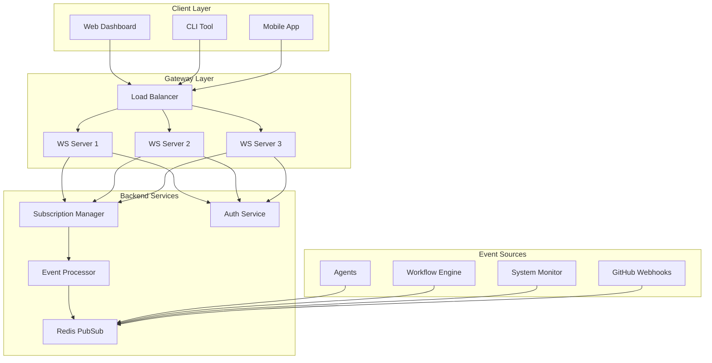

# WebSocket Event System

#AutoSDLC #WebSocket #RealTime #Events

[[AutoSDLC Documentation Hub|← Back to Index]] | [[30-API-Specification|← API Specification]]

## Overview

The WebSocket Event System provides real-time bidirectional communication between the AutoSDLC web interface and backend services. This enables live updates of agent status, task progress, system notifications, and interactive debugging capabilities.

## Architecture

### WebSocket Infrastructure



### Connection Management
- Automatic reconnection with exponential backoff
- Heartbeat/ping-pong for connection health monitoring
- JWT or API key authentication
- Message queuing during disconnections
- Subscription restoration on reconnect

## Event Protocol

### Message Format

```typescript
interface WebSocketMessage {
  id: string;
  type: MessageType;
  timestamp: number;
  data: any;
  metadata?: {
    version: string;
    source?: string;
    correlationId?: string;
    compressed?: boolean;
  };
}
```

### Message Types

**Connection Management**: connect, disconnect, ping, pong, error

**Authentication**: auth_request, auth_success, auth_failure

**Subscriptions**: subscribe, unsubscribe, subscription_update

**Agent Events**: agent_status, agent_task_update, agent_log, agent_metric, agent_error

**TDD Events**: tdd_phase_change, test_result, coverage_update

**Workflow Events**: workflow_started, workflow_step_complete, workflow_complete, workflow_failed

**System Events**: system_notification, system_alert, deployment_status

**GitHub Events**: github_issue_update, github_pr_update, github_workflow_update

### Event Examples

#### Agent Status Event
```json
{
  "id": "evt-123",
  "type": "agent_status",
  "timestamp": 1703775135000,
  "data": {
    "agentId": "coder-001",
    "agentType": "coder",
    "status": "busy",
    "currentTask": {
      "id": "task-789",
      "type": "implement_feature",
      "progress": 65
    },
    "metrics": {
      "cpuUsage": 45.2,
      "memoryUsage": 1024000000,
      "tasksCompleted": 12
    }
  }
}
```

#### TDD Phase Change Event
```json
{
  "id": "evt-234",
  "type": "tdd_phase_change",
  "timestamp": 1703775200000,
  "data": {
    "agentId": "coder-001",
    "taskId": "task-789",
    "previousPhase": "red",
    "currentPhase": "green",
    "testResults": {
      "total": 45,
      "passing": 45,
      "failing": 0
    },
    "coverage": {
      "lines": 98.5,
      "branches": 95.2,
      "functions": 100
    }
  }
}
```

## Client Implementation

### TypeScript Client

Basic client provides connection management, event subscription, and message handling:

```typescript
export class AutoSDLCWebSocketClient {
  constructor(config: ClientConfig)
  async connect(): Promise<void>
  on(eventType: string, handler: EventHandler): Unsubscribe
  async subscribe(subscription: SubscriptionConfig): Promise<string>
  async send(message: Partial<WebSocketMessage>): Promise<void>
}
```

### React Hook

```typescript
export function useWebSocket(url: string, options?: WebSocketOptions) {
  // Returns: { isConnected, lastMessage, sendMessage, subscribe }
}
```

Usage for agent status monitoring:
- Subscribe to specific agent events (status, task_update, metrics)
- Handle real-time updates in React components
- Automatic cleanup on component unmount

### Python SDK

Basic async client for Python applications:

```python
class AutoSDLCWebSocket:
    async def connect(self)
    async def subscribe_to_agent(self, agent_id: str, events: List[str])
    def on(self, event: str, handler: Callable)
```

## Server Implementation

### Core Components

**WebSocket Server**: Handles connections, authentication, message routing

**Event Broadcaster**: Distributes events to subscribed clients using Redis PubSub

**Subscription Manager**: Manages client subscriptions with resource indexing

**Rate Limiter**: Prevents abuse with per-client, per-message-type limits

**Message Validator**: Validates incoming messages against JSON schemas

### Scaling Features

**Horizontal Scaling**: Multi-worker setup with Redis adapter for cross-worker communication

**Message Compression**: GZIP compression for messages over 1KB threshold

**Sticky Sessions**: Ensures client reconnects to same worker

## Event Types

### Agent Events
- **Status**: Agent state changes (idle, busy, error)
- **Task Updates**: Progress on current tasks
- **Logs**: Debug and operational logs
- **Metrics**: Performance and resource usage

### TDD Events
- **Phase Changes**: Red → Green → Refactor transitions
- **Test Results**: Pass/fail counts, duration, failures
- **Coverage Updates**: Line, branch, function coverage percentages

### Workflow Events
- **Lifecycle**: Started, step completion, final result
- **Progress**: Current step, estimated completion
- **Outputs**: Generated artifacts, metrics

### System Events
- **Notifications**: Info, warnings, errors for users
- **Alerts**: Critical system issues requiring attention
- **Deployment**: Environment status, component health

## Security

### Authentication
- JWT or API key verification before connection upgrade
- Token validation from query params, headers, or cookies
- Permission checks for WebSocket access

### Message Security
- JSON schema validation for all message types
- Rate limiting per client and message type
- Input sanitization and size limits

## Monitoring

### Metrics
- Connection counts (total, active)
- Message rates (received, sent) by type
- Message sizes and latency
- Subscription counts by resource

### Debugging
- Configurable message logging with filters
- Connection state tracking
- Error aggregation and alerting

## Best Practices

### Connection Management
- Implement automatic reconnection with exponential backoff
- Use heartbeat/ping-pong to detect stale connections
- Queue messages during disconnections
- Handle connection state changes in UI

### Event Design
- Keep payloads small and focused
- Use consistent naming conventions
- Include timestamps and version info
- Design for forward compatibility

### Performance
- Use compression for large payloads
- Filter subscriptions to reduce traffic
- Batch related events when possible
- Monitor connection and message metrics

### Security
- Authenticate all connections
- Validate all messages
- Implement rate limiting
- Use TLS for connections

## Related Documents

- [[30-API-Specification|API Specification]]
- [[40-UI-Architecture|UI Architecture]]
- [[23-Inter-Agent-Communication|Inter-Agent Communication]]
- [[51-Monitoring-Setup|Monitoring & Logging Setup]]

---

**Tags**: #AutoSDLC #WebSocket #RealTime #Events #Communication
**Last Updated**: 2025-06-09
**Next**: [[32-Database-Schema|Database Schema Design →]]