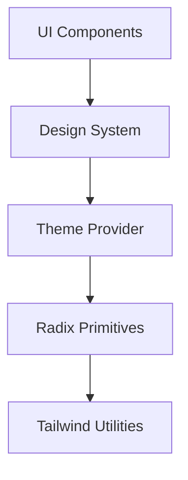
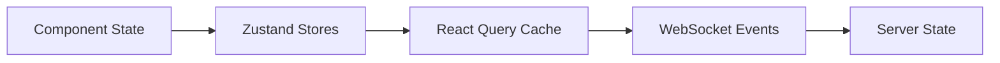

# UI Architecture

#AutoSDLC #UI #Architecture #Frontend

[[AutoSDLC Documentation Hub|← Back to Index]]

## Overview

The AutoSDLC UI provides a modern, responsive interface for monitoring and controlling the autonomous development system. Built with React, TypeScript, and real-time WebSocket communication, it offers comprehensive visibility into agent activities and system health.

## Design Principles

### 1. **Real-Time First**
- Live updates via WebSocket connections
- Optimistic UI updates with rollback
- Event-driven state management

### 2. **Developer Experience**
- Intuitive navigation and information hierarchy
- Keyboard shortcuts for power users
- Dark/light theme support

### 3. **Performance**
- Virtual scrolling for large datasets
- Lazy loading and code splitting
- Efficient re-rendering with React memo

### 4. **Accessibility**
- WCAG 2.1 AA compliance
- Keyboard navigation support
- Screen reader optimizations

## Technology Stack

### Core Technologies
```yaml
Frontend Framework: React 18
Language: TypeScript 5.x
State Management: Zustand + React Query
Styling: Tailwind CSS + Radix UI
Build Tool: Vite
Testing: Vitest + React Testing Library
```

### Key Libraries
```yaml
UI Components: Radix UI primitives
Charts: Recharts for visualizations
Forms: React Hook Form + Zod
Routing: React Router v6
WebSocket: Socket.io client
Icons: Lucide React
```

## Architecture Layers

### 1. Presentation Layer


### 2. State Management


### 3. Data Flow
```typescript
// Unidirectional data flow
interface DataFlow {
  source: 'user-action' | 'websocket' | 'api';
  action: Action;
  store: Store;
  component: React.Component;
  render: () => void;
}
```

## Component Architecture

### Component Hierarchy
```
App
├── Layout
│   ├── Header
│   ├── Sidebar
│   └── Main
├── Pages
│   ├── Dashboard
│   ├── Agents
│   ├── Workflows
│   ├── Projects
│   └── Settings
└── Providers
    ├── ThemeProvider
    ├── AuthProvider
    └── WebSocketProvider
```

### Component Design Patterns

#### 1. **Compound Components**
```typescript
// Example: Agent Card compound component
<AgentCard>
  <AgentCard.Header agent={agent} />
  <AgentCard.Status />
  <AgentCard.Metrics />
  <AgentCard.Actions />
</AgentCard>
```

#### 2. **Render Props**
```typescript
// Example: Data fetcher with render prop
<DataFetcher
  endpoint="/api/agents"
  render={({ data, loading, error }) => (
    <AgentList agents={data} loading={loading} />
  )}
/>
```

#### 3. **Custom Hooks**
```typescript
// Example: Agent status hook
const { status, metrics, actions } = useAgent(agentId);
```

## State Management Strategy

### Store Organization
```typescript
interface AppState {
  // Domain stores
  agents: AgentStore;
  workflows: WorkflowStore;
  projects: ProjectStore;
  
  // UI stores
  ui: UIStore;
  notifications: NotificationStore;
  preferences: PreferenceStore;
}
```

### Real-Time Updates
```typescript
// WebSocket event handling
interface WebSocketEvent {
  type: 'agent.status' | 'workflow.update' | 'project.change';
  payload: any;
  timestamp: Date;
}

// Optimistic updates
const updateAgent = async (agentId: string, updates: Partial<Agent>) => {
  // Optimistic update
  store.updateAgent(agentId, updates);
  
  try {
    await api.updateAgent(agentId, updates);
  } catch (error) {
    // Rollback on failure
    store.rollbackAgent(agentId);
  }
};
```

## Routing Architecture

### Route Structure
```typescript
const routes = [
  {
    path: '/',
    element: <Dashboard />,
    loader: dashboardLoader,
  },
  {
    path: '/agents',
    element: <AgentsLayout />,
    children: [
      { index: true, element: <AgentList /> },
      { path: ':agentId', element: <AgentDetail /> },
      { path: 'new', element: <AgentConfig /> },
    ],
  },
  {
    path: '/workflows',
    element: <WorkflowsLayout />,
    children: [
      { index: true, element: <WorkflowList /> },
      { path: ':workflowId', element: <WorkflowEditor /> },
    ],
  },
];
```

## Design System

### Component Library Structure
```
design-system/
├── primitives/
│   ├── Button
│   ├── Input
│   ├── Card
│   └── Modal
├── patterns/
│   ├── DataTable
│   ├── FormField
│   └── Navigation
└── layouts/
    ├── PageLayout
    ├── SplitView
    └── GridLayout
```

### Theme Configuration
```typescript
interface Theme {
  colors: {
    primary: ColorScale;
    gray: ColorScale;
    success: ColorScale;
    warning: ColorScale;
    danger: ColorScale;
  };
  spacing: SpacingScale;
  typography: {
    fonts: FontFamily;
    sizes: FontSizes;
    weights: FontWeights;
  };
  radii: BorderRadii;
  shadows: Shadows;
}
```

## Performance Optimization

### Code Splitting Strategy
```typescript
// Route-based splitting
const Dashboard = lazy(() => import('./pages/Dashboard'));
const Agents = lazy(() => import('./pages/Agents'));

// Component-based splitting
const HeavyChart = lazy(() => import('./components/HeavyChart'));
```

### Memoization Patterns
```typescript
// Expensive computations
const expensiveMetrics = useMemo(
  () => calculateMetrics(agentData),
  [agentData]
);

// Component memoization
const AgentCard = memo(({ agent }) => {
  // Component implementation
}, (prevProps, nextProps) => {
  return prevProps.agent.id === nextProps.agent.id &&
         prevProps.agent.status === nextProps.agent.status;
});
```

## WebSocket Integration

### Connection Management
```typescript
class WebSocketManager {
  private socket: Socket;
  private reconnectAttempts = 0;
  
  connect() {
    this.socket = io(WS_URL, {
      transports: ['websocket'],
      reconnection: true,
      reconnectionAttempts: 5,
    });
    
    this.setupEventHandlers();
  }
  
  private setupEventHandlers() {
    this.socket.on('agent:update', this.handleAgentUpdate);
    this.socket.on('workflow:progress', this.handleWorkflowProgress);
    this.socket.on('system:alert', this.handleSystemAlert);
  }
}
```

## Testing Strategy

### Component Testing
```typescript
// Example component test
describe('AgentCard', () => {
  it('displays agent status correctly', () => {
    const agent = createMockAgent({ status: 'active' });
    render(<AgentCard agent={agent} />);
    
    expect(screen.getByText('Active')).toBeInTheDocument();
    expect(screen.getByRole('status')).toHaveClass('text-green-500');
  });
});
```

### Integration Testing
```typescript
// Example integration test
describe('Agent Management Flow', () => {
  it('creates and configures new agent', async () => {
    const user = userEvent.setup();
    render(<App />);
    
    await user.click(screen.getByText('New Agent'));
    await user.type(screen.getByLabelText('Name'), 'Test Agent');
    await user.click(screen.getByText('Create'));
    
    expect(await screen.findByText('Test Agent')).toBeInTheDocument();
  });
});
```

## Security Considerations

### XSS Prevention
- Sanitize all user inputs
- Use React's built-in XSS protection
- Validate data from WebSocket events

### Authentication Flow
```typescript
interface AuthFlow {
  login: (credentials: Credentials) => Promise<Token>;
  refresh: () => Promise<Token>;
  logout: () => void;
  validateToken: (token: Token) => boolean;
}
```

## Deployment Architecture

### Build Pipeline
```yaml
stages:
  - install: pnpm install --frozen-lockfile
  - lint: pnpm lint && pnpm type-check
  - test: pnpm test:unit && pnpm test:integration
  - build: pnpm build
  - deploy: pnpm deploy:preview
```

### Environment Configuration
```typescript
interface EnvironmentConfig {
  API_URL: string;
  WS_URL: string;
  GITHUB_APP_ID: string;
  SENTRY_DSN?: string;
  FEATURE_FLAGS?: FeatureFlags;
}
```

## Related Documents

- [[41-Dashboard-Components|Dashboard Components]] - Component library
- [[42-Configuration-Interface|Configuration Interface]] - Settings UI
- [[31-WebSocket-Events|WebSocket Event System]] - Real-time events
- [[30-API-Specification|API Specification]] - Backend integration

---

**Tags**: #AutoSDLC #UI #Architecture #Frontend #React
**Last Updated**: 2025-06-09
**Next**: [[41-Dashboard-Components|Dashboard Components →]]