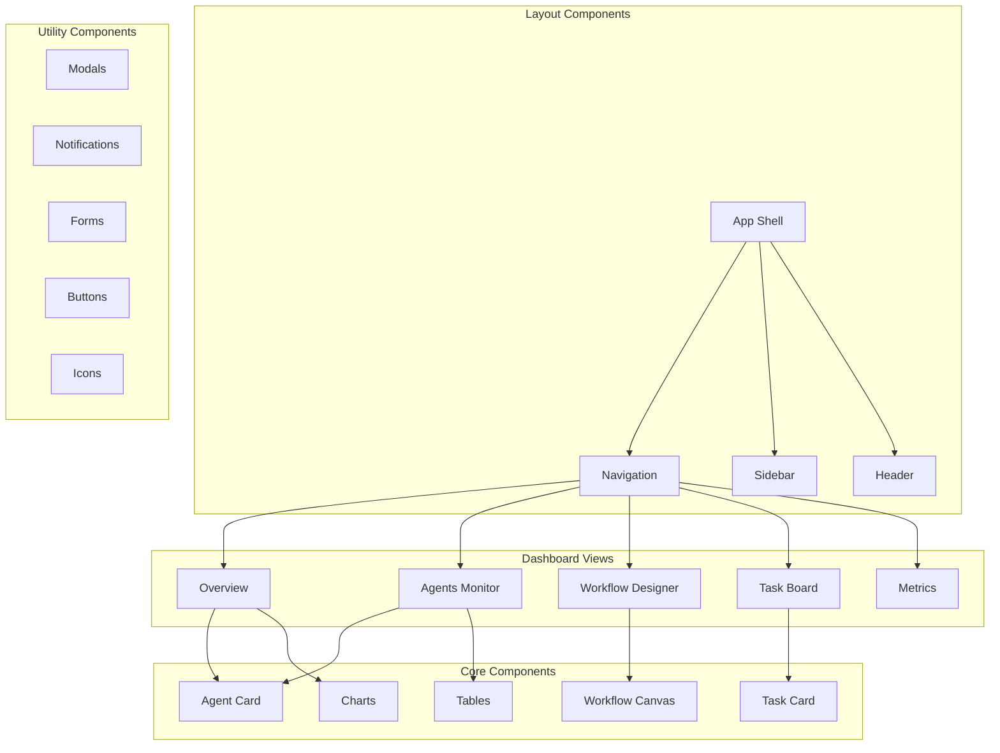

# Dashboard Components

#AutoSDLC #UI #Dashboard #Components

[[AutoSDLC Documentation Hub|← Back to Index]] | [[40-UI-Architecture|← UI Architecture]]

## Overview

Dashboard components provide real-time visibility into agent activities, system health, task progress, and workflow management. The interface enables users to monitor and control their autonomous development processes.

## Design System

The dashboard uses a consistent design system with:

- **Color Palette**: Agent-specific colors (Customer: purple, PM: blue, Coder: teal, Reviewer: orange, Tester: gray)
- **TDD Phase Colors**: Red (failing tests), Green (passing tests), Blue (refactor)
- **Semantic Colors**: Success (green), Warning (orange), Error (red), Info (blue)
- **Typography**: Inter font family with consistent sizing scale
- **Spacing**: 4px-48px scale for consistent layouts

## Component Architecture

## Core Dashboard Components

### System Overview Dashboard
Displays key system metrics in a grid layout:
- **Active Agents**: Count with trend indicator
- **Tasks in Progress**: Current workload
- **Success Rate**: Percentage with delta
- **Average Response Time**: Performance metric
- **Charts**: Task completion by agent, resource usage visualization

### Agent Monitor
Central hub for agent management:
- **Agent Grid**: Card-based layout showing agent status
- **Filtering**: Status, type, and performance filters
- **Real-time Updates**: Live status indicators
- **Quick Actions**: View logs, restart, view output

### Agent Card
Individual agent status display:
- **Status Indicators**: Active (green), Busy (yellow), Error (red), Idle (gray)
- **Current Task**: Progress bar and task name
- **Metrics**: Tasks completed today, success rate
- **Error Display**: Last error for failed agents
- **Action Buttons**: Log access, output viewing, restart controls

### TDD Status Component
Tracks Test-Driven Development progress:
- **Phase Indicator**: Red (failing tests), Green (passing tests), Blue (refactor)
- **Test Progress**: Pass/fail ratio with visual progress bar
- **Code Coverage**: Percentage with color-coded status (green ≥80%, yellow 60-79%, red <60%)
- **Phase Validation**: Warns if tests pass during red phase

### Workflow Designer
Visual workflow creation interface:
- **Drag-and-Drop Canvas**: Node-based workflow builder
- **Node Types**: Trigger (purple), Agent (blue), Condition (orange), Action (green)
- **Real-time Editing**: Live connection and modification
- **Mini-map**: Overview navigation for complex workflows

### Task Board
Kanban-style task management:
- **Column Structure**: Pending → In Progress → Testing → Review → Completed
- **Drag-and-Drop**: Task movement between columns
- **Task Cards**: Compact task information display
- **Filtering**: Status and assignment filters

## Specialized Components

### Agent Communication Visualizer
D3.js force-directed graph showing:
- **Agent Nodes**: Color-coded by agent type
- **Communication Links**: Thickness represents frequency
- **Interactive Dragging**: Manual node positioning
- **Real-time Updates**: Live communication patterns

### Code Coverage Heatmap
Visual representation of test coverage:
- **Module Grid**: Coverage percentage by file and module
- **Color Coding**: Green (≥80%), Orange (60-79%), Red (<60%)
- **Interactive Tooltips**: Detailed coverage information

### System Health Monitor
Comprehensive system status:
- **Overall Health Score**: Percentage with color coding
- **Resource Metrics**: CPU, Memory, Database latency, API response time
- **Issue Tracking**: Active problems with impact assessment
- **Threshold Alerts**: Performance warnings

### Real-time Metrics Chart
Live system performance visualization:
- **Dual Y-axis**: Response time and active task count
- **Sliding Window**: Last 20 data points
- **WebSocket Updates**: Real-time data streaming
- **Smooth Animations**: Chart transitions

## Utility Components

### Notification System
Toast-style notifications with:
- **Type Support**: Success, Error, Warning, Info
- **Auto-dismiss**: Configurable timeout
- **Action Buttons**: Interactive responses
- **Animation**: Slide-in/out transitions

### Command Palette
Keyboard-driven interface (Cmd+K):
- **Quick Actions**: Deploy agents, create workflows
- **Navigation**: Jump to different dashboard sections
- **Search**: Fuzzy search functionality
- **Keyboard Navigation**: Full accessibility support

### Mobile Dashboard
Responsive mobile interface:
- **Bottom Navigation**: Tab-based view switching
- **Slide-out Menu**: Side navigation for additional options
- **Touch Optimized**: Mobile-friendly interactions
- **Simplified Views**: Condensed information display

## Performance Features

### Virtual Scrolling
Efficient rendering for large lists:
- **Fixed Item Heights**: Consistent list item sizing
- **Viewport Rendering**: Only visible items rendered
- **Smooth Scrolling**: Optimized scroll performance

### Lazy Loading
Code-splitting for performance:
- **Route-based Splitting**: Components loaded on demand
- **Suspense Boundaries**: Loading state management
- **Skeleton Loading**: Placeholder content during loading

## UX Patterns

### Responsive Design
- **Mobile-first**: Progressive enhancement approach
- **Breakpoint Strategy**: Consistent across components
- **Touch Interactions**: Mobile-optimized controls

### Accessibility
- **ARIA Labels**: Screen reader support
- **Keyboard Navigation**: Full keyboard accessibility
- **Color Contrast**: WCAG compliance
- **Focus Management**: Clear focus indicators

### Error Handling
- **Error Boundaries**: Graceful component failure
- **Retry Mechanisms**: User-initiated recovery
- **Fallback UI**: Alternative content when errors occur

## Related Documents

- [[40-UI-Architecture|UI Architecture]]
- [[31-WebSocket-Events|WebSocket Event System]]
- [[42-Configuration-Interface|Configuration Interface]]
- [[30-API-Specification|API Specification]]

---

**Tags**: #AutoSDLC #UI #Dashboard #Components
**Last Updated**: 2025-06-09
**Next**: [[42-Configuration-Interface|Configuration Interface →]]