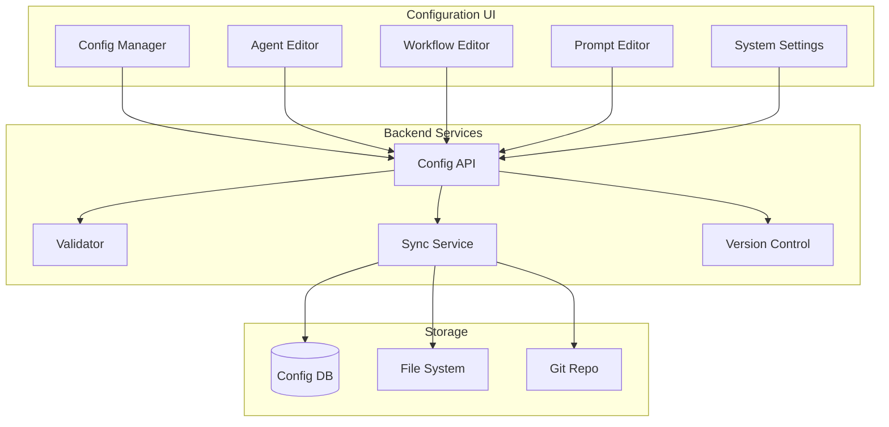

# Configuration Interface

#AutoSDLC #Configuration #UI #Management

[[AutoSDLC Documentation Hub|← Back to Index]] | [[41-Dashboard-Components|← Dashboard Components]]

## Overview

The Configuration Interface provides a comprehensive UI for managing AutoSDLC system settings, agent configurations, workflow definitions, and operational parameters. This interface enables both technical and non-technical users to configure and optimize the system.

## Architecture

### Component Structure



### Configuration Types

```typescript
interface ConfigurationTypes {
  system: SystemConfiguration;
  agents: AgentConfiguration[];
  workflows: WorkflowConfiguration[];
  prompts: PromptConfiguration[];
  integrations: IntegrationConfiguration[];
  security: SecurityConfiguration;
  monitoring: MonitoringConfiguration;
}

interface SystemConfiguration {
  environment: 'development' | 'staging' | 'production';
  features: FeatureFlags;
  performance: PerformanceSettings;
  limits: ResourceLimits;
  maintenance: MaintenanceWindow[];
}
```

## User Interface Design

### Main Configuration Dashboard

```tsx
// components/ConfigDashboard.tsx
import React from 'react';
import { Tabs, TabsContent, TabsList, TabsTrigger } from '@/components/ui/tabs';

export const ConfigDashboard: React.FC = () => {
  return (
    <div className="config-dashboard">
      <header className="dashboard-header">
        <h1>AutoSDLC Configuration</h1>
        <div className="actions">
          <button className="btn-export">Export Config</button>
          <button className="btn-import">Import Config</button>
          <button className="btn-validate">Validate All</button>
        </div>
      </header>
      
      <Tabs defaultValue="agents" className="config-tabs">
        <TabsList>
          <TabsTrigger value="agents">Agents</TabsTrigger>
          <TabsTrigger value="workflows">Workflows</TabsTrigger>
          <TabsTrigger value="prompts">Prompts</TabsTrigger>
          <TabsTrigger value="system">System</TabsTrigger>
          <TabsTrigger value="integrations">Integrations</TabsTrigger>
        </TabsList>
        
        <TabsContent value="agents">
          <AgentConfiguration />
        </TabsContent>
        
        <TabsContent value="workflows">
          <WorkflowConfiguration />
        </TabsContent>
        
        <TabsContent value="prompts">
          <PromptConfiguration />
        </TabsContent>
        
        <TabsContent value="system">
          <SystemConfiguration />
        </TabsContent>
        
        <TabsContent value="integrations">
          <IntegrationConfiguration />
        </TabsContent>
      </Tabs>
    </div>
  );
};
```

### Agent Configuration Interface

```tsx
// components/AgentConfiguration.tsx
export const AgentConfiguration: React.FC = () => {
  const [agents, setAgents] = useState<AgentConfig[]>([]);
  const [selectedAgent, setSelectedAgent] = useState<AgentConfig | null>(null);
  
  return (
    <div className="agent-configuration">
      <div className="agent-list">
        <h2>Configured Agents</h2>
        <div className="agent-grid">
          {agents.map(agent => (
            <AgentCard
              key={agent.id}
              agent={agent}
              onClick={() => setSelectedAgent(agent)}
              onStatusChange={handleStatusChange}
            />
          ))}
          <AddAgentCard onClick={handleAddAgent} />
        </div>
      </div>
      
      {selectedAgent && (
        <AgentEditor
          agent={selectedAgent}
          onChange={handleAgentChange}
          onSave={handleSaveAgent}
          onDelete={handleDeleteAgent}
        />
      )}
    </div>
  );
};

// Agent Editor Component
interface AgentEditorProps {
  agent: AgentConfig;
  onChange: (agent: AgentConfig) => void;
  onSave: (agent: AgentConfig) => void;
  onDelete: (agentId: string) => void;
}

export const AgentEditor: React.FC<AgentEditorProps> = ({
  agent,
  onChange,
  onSave,
  onDelete
}) => {
  return (
    <div className="agent-editor">
      <h3>Edit Agent: {agent.name}</h3>
      
      <Tabs defaultValue="general">
        <TabsList>
          <TabsTrigger value="general">General</TabsTrigger>
          <TabsTrigger value="claude">Claude Settings</TabsTrigger>
          <TabsTrigger value="resources">Resources</TabsTrigger>
          <TabsTrigger value="capabilities">Capabilities</TabsTrigger>
          <TabsTrigger value="commands">Commands</TabsTrigger>
        </TabsList>
        
        <TabsContent value="general">
          <GeneralSettings agent={agent} onChange={onChange} />
        </TabsContent>
        
        <TabsContent value="claude">
          <ClaudeSettings agent={agent} onChange={onChange} />
        </TabsContent>
        
        <TabsContent value="resources">
          <ResourceSettings agent={agent} onChange={onChange} />
        </TabsContent>
        
        <TabsContent value="capabilities">
          <CapabilityEditor agent={agent} onChange={onChange} />
        </TabsContent>
        
        <TabsContent value="commands">
          <CommandEditor agent={agent} onChange={onChange} />
        </TabsContent>
      </Tabs>
      
      <div className="editor-actions">
        <button className="btn-save" onClick={() => onSave(agent)}>
          Save Changes
        </button>
        <button className="btn-delete" onClick={() => onDelete(agent.id)}>
          Delete Agent
        </button>
      </div>
    </div>
  );
};
```

### Claude Code Configuration

```tsx
// components/ClaudeSettings.tsx
interface ClaudeSettingsProps {
  agent: AgentConfig;
  onChange: (agent: AgentConfig) => void;
}

export const ClaudeSettings: React.FC<ClaudeSettingsProps> = ({
  agent,
  onChange
}) => {
  const [claudeMd, setClaudeMd] = useState(agent.claudeCode.instructions);
  const [previewMode, setPreviewMode] = useState(false);
  
  return (
    <div className="claude-settings">
      <div className="claude-config-grid">
        <div className="form-group">
          <label>Headless Mode</label>
          <input
            type="checkbox"
            checked={agent.claudeCode.headless}
            onChange={(e) => onChange({
              ...agent,
              claudeCode: {
                ...agent.claudeCode,
                headless: e.target.checked
              }
            })}
          />
        </div>
        
        <div className="form-group">
          <label>Max Tokens</label>
          <input
            type="number"
            value={agent.claudeCode.maxTokens}
            onChange={(e) => onChange({
              ...agent,
              claudeCode: {
                ...agent.claudeCode,
                maxTokens: parseInt(e.target.value)
              }
            })}
          />
        </div>
        
        <div className="form-group">
          <label>Timeout (seconds)</label>
          <input
            type="number"
            value={agent.claudeCode.timeout}
            onChange={(e) => onChange({
              ...agent,
              claudeCode: {
                ...agent.claudeCode,
                timeout: parseInt(e.target.value)
              }
            })}
          />
        </div>
        
        <div className="form-group">
          <label>Working Directory</label>
          <input
            type="text"
            value={agent.claudeCode.workingDir}
            readOnly
            className="readonly"
          />
        </div>
      </div>
      
      <div className="claude-md-editor">
        <div className="editor-header">
          <h4>CLAUDE.md Instructions</h4>
          <button onClick={() => setPreviewMode(!previewMode)}>
            {previewMode ? 'Edit' : 'Preview'}
          </button>
        </div>
        
        {previewMode ? (
          <div className="markdown-preview">
            <ReactMarkdown>{claudeMd}</ReactMarkdown>
          </div>
        ) : (
          <MonacoEditor
            height="400px"
            language="markdown"
            value={claudeMd}
            onChange={(value) => {
              setClaudeMd(value || '');
              onChange({
                ...agent,
                claudeCode: {
                  ...agent.claudeCode,
                  instructions: value || ''
                }
              });
            }}
            options={{
              minimap: { enabled: false },
              lineNumbers: 'on',
              wordWrap: 'on'
            }}
          />
        )}
      </div>
      
      <div className="output-settings">
        <h4>Agent Output Configuration</h4>
        <div className="form-group">
          <label>Update Interval (seconds)</label>
          <input
            type="number"
            value={agent.claudeCode.outputInterval}
            onChange={(e) => onChange({
              ...agent,
              claudeCode: {
                ...agent.claudeCode,
                outputInterval: parseInt(e.target.value)
              }
            })}
          />
        </div>
      </div>
    </div>
  );
};
```

### Workflow Configuration

```tsx
// components/WorkflowConfiguration.tsx
export const WorkflowConfiguration: React.FC = () => {
  const [workflows, setWorkflows] = useState<Workflow[]>([]);
  const [selectedWorkflow, setSelectedWorkflow] = useState<Workflow | null>(null);
  
  return (
    <div className="workflow-configuration">
      <div className="workflow-list">
        <h2>Workflows</h2>
        {workflows.map(workflow => (
          <WorkflowItem
            key={workflow.id}
            workflow={workflow}
            onClick={() => setSelectedWorkflow(workflow)}
          />
        ))}
        <button className="btn-add-workflow" onClick={handleAddWorkflow}>
          + New Workflow
        </button>
      </div>
      
      {selectedWorkflow && (
        <WorkflowEditor
          workflow={selectedWorkflow}
          onChange={handleWorkflowChange}
          onSave={handleSaveWorkflow}
        />
      )}
    </div>
  );
};

// Visual Workflow Editor
export const WorkflowEditor: React.FC<WorkflowEditorProps> = ({
  workflow,
  onChange,
  onSave
}) => {
  return (
    <div className="workflow-editor">
      <div className="editor-header">
        <input
          type="text"
          value={workflow.name}
          onChange={(e) => onChange({ ...workflow, name: e.target.value })}
          className="workflow-name-input"
        />
        <div className="workflow-actions">
          <button onClick={handleValidate}>Validate</button>
          <button onClick={handleSimulate}>Simulate</button>
          <button onClick={() => onSave(workflow)}>Save</button>
        </div>
      </div>
      
      <div className="workflow-canvas">
        <ReactFlow
          nodes={workflow.nodes}
          edges={workflow.edges}
          onNodesChange={handleNodesChange}
          onEdgesChange={handleEdgesChange}
          onConnect={handleConnect}
        >
          <Controls />
          <MiniMap />
          <Background variant="dots" gap={12} size={1} />
          
          <Panel position="top-left">
            <NodePalette />
          </Panel>
        </ReactFlow>
      </div>
      
      <div className="workflow-properties">
        {selectedNode && (
          <NodeProperties
            node={selectedNode}
            onChange={handleNodeChange}
          />
        )}
      </div>
    </div>
  );
};
```

### Prompt Configuration

```tsx
// components/PromptConfiguration.tsx
export const PromptConfiguration: React.FC = () => {
  const [prompts, setPrompts] = useState<PromptTemplate[]>([]);
  const [selectedPrompt, setSelectedPrompt] = useState<PromptTemplate | null>(null);
  const [testMode, setTestMode] = useState(false);
  
  return (
    <div className="prompt-configuration">
      <div className="prompt-library">
        <h2>Prompt Library</h2>
        <div className="prompt-filters">
          <select className="agent-filter">
            <option value="">All Agents</option>
            <option value="customer">Customer Agent</option>
            <option value="pm">PM Agent</option>
            <option value="coder">Coder Agent</option>
            <option value="reviewer">Reviewer Agent</option>
            <option value="tester">Tester Agent</option>
          </select>
          <input
            type="search"
            placeholder="Search prompts..."
            className="prompt-search"
          />
        </div>
        
        <div className="prompt-list">
          {prompts.map(prompt => (
            <PromptCard
              key={prompt.id}
              prompt={prompt}
              onClick={() => setSelectedPrompt(prompt)}
            />
          ))}
        </div>
      </div>
      
      {selectedPrompt && (
        <div className="prompt-editor-panel">
          <PromptEditor
            prompt={selectedPrompt}
            onChange={handlePromptChange}
            onSave={handleSavePrompt}
          />
          
          {testMode && (
            <PromptTester
              prompt={selectedPrompt}
              onResults={handleTestResults}
            />
          )}
        </div>
      )}
    </div>
  );
};

// Prompt Editor with Variables
export const PromptEditor: React.FC<PromptEditorProps> = ({
  prompt,
  onChange,
  onSave
}) => {
  const [variables, setVariables] = useState<Variable[]>(
    extractVariables(prompt.content)
  );
  
  return (
    <div className="prompt-editor">
      <div className="editor-header">
        <input
          type="text"
          value={prompt.name}
          onChange={(e) => onChange({ ...prompt, name: e.target.value })}
        />
        <div className="prompt-version">v{prompt.version}</div>
      </div>
      
      <div className="prompt-metadata">
        <select
          value={prompt.agentType}
          onChange={(e) => onChange({ ...prompt, agentType: e.target.value })}
        >
          <option value="customer">Customer Agent</option>
          <option value="pm">PM Agent</option>
          <option value="coder">Coder Agent</option>
          <option value="reviewer">Reviewer Agent</option>
          <option value="tester">Tester Agent</option>
        </select>
        
        <select
          value={prompt.taskType}
          onChange={(e) => onChange({ ...prompt, taskType: e.target.value })}
        >
          <option value="system">System Prompt</option>
          <option value="task">Task Prompt</option>
          <option value="error">Error Handling</option>
          <option value="collaboration">Collaboration</option>
        </select>
      </div>
      
      <div className="prompt-content-editor">
        <MonacoEditor
          height="400px"
          language="markdown"
          value={prompt.content}
          onChange={(value) => {
            onChange({ ...prompt, content: value || '' });
            setVariables(extractVariables(value || ''));
          }}
          options={{
            minimap: { enabled: false },
            lineNumbers: 'on',
            wordWrap: 'on',
            bracketPairColorization: { enabled: true }
          }}
        />
      </div>
      
      <div className="prompt-variables">
        <h4>Variables</h4>
        <div className="variable-list">
          {variables.map(variable => (
            <div key={variable.name} className="variable-item">
              <code>{`{${variable.name}}`}</code>
              <input
                type="text"
                placeholder="Description"
                value={variable.description}
                onChange={(e) => updateVariableDescription(variable.name, e.target.value)}
              />
            </div>
          ))}
        </div>
      </div>
      
      <div className="prompt-actions">
        <button onClick={handleValidatePrompt}>Validate</button>
        <button onClick={handleVersionPrompt}>New Version</button>
        <button onClick={() => onSave(prompt)}>Save</button>
      </div>
    </div>
  );
};
```

## Configuration Management

### Version Control Integration

```typescript
// services/ConfigVersionControl.ts
export class ConfigVersionControl {
  private git: GitService;
  private configPath: string;
  
  async saveConfiguration(
    config: Configuration,
    message: string,
    author: User
  ): Promise<CommitResult> {
    // Validate configuration
    const validation = await this.validateConfig(config);
    if (!validation.valid) {
      throw new ValidationError(validation.errors);
    }
    
    // Convert to YAML
    const yamlContent = yaml.dump(config, {
      indent: 2,
      lineWidth: 120,
      noRefs: true
    });
    
    // Write to file system
    const filePath = path.join(this.configPath, `config-${config.environment}.yaml`);
    await fs.writeFile(filePath, yamlContent);
    
    // Commit to Git
    const commit = await this.git.commit({
      message: message,
      author: {
        name: author.name,
        email: author.email
      },
      files: [filePath]
    });
    
    // Tag if production
    if (config.environment === 'production') {
      await this.git.tag({
        name: `config-${new Date().toISOString()}`,
        message: `Production configuration: ${message}`,
        commit: commit.sha
      });
    }
    
    return commit;
  }
  
  async getConfigHistory(
    environment: string,
    limit: number = 50
  ): Promise<ConfigHistory[]> {
    const filePath = `config-${environment}.yaml`;
    const commits = await this.git.log({
      file: filePath,
      limit: limit
    });
    
    return commits.map(commit => ({
      version: commit.sha.substring(0, 7),
      date: commit.date,
      author: commit.author,
      message: commit.message,
      changes: this.parseChanges(commit.diff)
    }));
  }
  
  async rollbackConfiguration(
    environment: string,
    version: string
  ): Promise<Configuration> {
    // Get historical version
    const filePath = `config-${environment}.yaml`;
    const content = await this.git.show({
      commit: version,
      file: filePath
    });
    
    // Parse and validate
    const config = yaml.load(content) as Configuration;
    const validation = await this.validateConfig(config);
    
    if (!validation.valid) {
      throw new Error(`Historical config invalid: ${validation.errors.join(', ')}`);
    }
    
    // Save as new version
    await this.saveConfiguration(
      config,
      `Rollback to version ${version}`,
      { name: 'System', email: 'system@autosdlc.com' }
    );
    
    return config;
  }
}
```

### Configuration Validation

```typescript
// services/ConfigValidator.ts
export class ConfigValidator {
  private schemas: Map<string, Schema>;
  
  async validateConfiguration(
    config: Configuration
  ): Promise<ValidationResult> {
    const errors: ValidationError[] = [];
    
    // Validate structure
    const structureErrors = await this.validateStructure(config);
    errors.push(...structureErrors);
    
    // Validate agent configurations
    for (const agent of config.agents) {
      const agentErrors = await this.validateAgent(agent);
      errors.push(...agentErrors);
    }
    
    // Validate workflows
    for (const workflow of config.workflows) {
      const workflowErrors = await this.validateWorkflow(workflow);
      errors.push(...workflowErrors);
    }
    
    // Validate cross-references
    const refErrors = await this.validateReferences(config);
    errors.push(...refErrors);
    
    // Validate resource allocation
    const resourceErrors = await this.validateResources(config);
    errors.push(...resourceErrors);
    
    return {
      valid: errors.length === 0,
      errors: errors,
      warnings: await this.checkWarnings(config)
    };
  }
  
  private async validateAgent(agent: AgentConfig): Promise<ValidationError[]> {
    const errors: ValidationError[] = [];
    
    // Validate Claude.md exists
    if (!agent.claudeCode.instructions) {
      errors.push({
        path: `agents.${agent.id}.claudeCode.instructions`,
        message: 'CLAUDE.md instructions are required'
      });
    }
    
    // Validate resource limits
    if (agent.resources.memory > '64Gi') {
      errors.push({
        path: `agents.${agent.id}.resources.memory`,
        message: 'Memory limit exceeds maximum (64Gi)'
      });
    }
    
    // Validate capabilities
    for (const capability of agent.capabilities) {
      if (!this.isValidCapability(capability)) {
        errors.push({
          path: `agents.${agent.id}.capabilities`,
          message: `Invalid capability: ${capability}`
        });
      }
    }
    
    // Validate commands
    for (const command of agent.commands) {
      if (!command.script || !command.name) {
        errors.push({
          path: `agents.${agent.id}.commands`,
          message: 'Commands must have name and script'
        });
      }
    }
    
    return errors;
  }
}
```

### Live Configuration Updates

```typescript
// services/ConfigSyncService.ts
export class ConfigSyncService {
  private configWatcher: ConfigWatcher;
  private agentManager: AgentManager;
  private workflowEngine: WorkflowEngine;
  
  async applyConfiguration(
    config: Configuration,
    options: ApplyOptions = {}
  ): Promise<ApplyResult> {
    const plan = await this.createApplyPlan(config);
    
    if (options.dryRun) {
      return {
        success: true,
        plan: plan,
        applied: false
      };
    }
    
    // Apply in phases
    const results = {
      phase1: await this.applySystemConfig(config.system),
      phase2: await this.applyAgentConfigs(config.agents, plan.agentChanges),
      phase3: await this.applyWorkflowConfigs(config.workflows),
      phase4: await this.applyIntegrationConfigs(config.integrations)
    };
    
    // Verify application
    const verification = await this.verifyConfiguration(config);
    
    return {
      success: verification.success,
      plan: plan,
      applied: true,
      results: results,
      verification: verification
    };
  }
  
  private async applyAgentConfigs(
    agents: AgentConfig[],
    changes: AgentChanges
  ): Promise<ApplyPhaseResult> {
    const results = [];
    
    // Stop removed agents
    for (const agentId of changes.removed) {
      results.push(await this.agentManager.stopAgent(agentId));
    }
    
    // Update existing agents
    for (const agent of changes.updated) {
      results.push(await this.updateAgent(agent));
    }
    
    // Start new agents
    for (const agent of changes.added) {
      results.push(await this.agentManager.startAgent(agent));
    }
    
    return {
      phase: 'agents',
      success: results.every(r => r.success),
      details: results
    };
  }
  
  private async updateAgent(agent: AgentConfig): Promise<UpdateResult> {
    // Update CLAUDE.md
    await this.updateClaudeInstructions(agent);
    
    // Update commands
    await this.updateAgentCommands(agent);
    
    // Update configuration
    await this.agentManager.updateConfig(agent.id, agent);
    
    // Restart if necessary
    if (this.requiresRestart(agent)) {
      await this.agentManager.restartAgent(agent.id);
    }
    
    return {
      agentId: agent.id,
      success: true,
      restarted: this.requiresRestart(agent)
    };
  }
}
```

## API Endpoints

### Configuration API

```typescript
// api/configuration.ts
export const configurationRouter = createRouter()
  .get('/config/:environment', async (req, res) => {
    const config = await configService.getConfiguration(req.params.environment);
    res.json(config);
  })
  
  .put('/config/:environment', async (req, res) => {
    const validation = await configValidator.validate(req.body);
    if (!validation.valid) {
      return res.status(400).json({ errors: validation.errors });
    }
    
    const result = await configService.updateConfiguration(
      req.params.environment,
      req.body,
      req.user
    );
    
    res.json(result);
  })
  
  .post('/config/:environment/validate', async (req, res) => {
    const validation = await configValidator.validate(req.body);
    res.json(validation);
  })
  
  .post('/config/:environment/apply', async (req, res) => {
    const result = await configSyncService.applyConfiguration(
      req.body,
      { dryRun: req.query.dryRun === 'true' }
    );
    
    res.json(result);
  })
  
  .get('/config/:environment/history', async (req, res) => {
    const history = await configVersionControl.getHistory(
      req.params.environment,
      parseInt(req.query.limit as string) || 50
    );
    
    res.json(history);
  })
  
  .post('/config/:environment/rollback/:version', async (req, res) => {
    const config = await configVersionControl.rollback(
      req.params.environment,
      req.params.version
    );
    
    res.json(config);
  })
  
  .get('/config/:environment/diff/:version', async (req, res) => {
    const diff = await configVersionControl.diff(
      req.params.environment,
      req.params.version
    );
    
    res.json(diff);
  });
```

## Security & Access Control

### Role-Based Access

```typescript
interface ConfigurationRoles {
  viewer: ConfigPermission[];
  editor: ConfigPermission[];
  admin: ConfigPermission[];
}

const configRoles: ConfigurationRoles = {
  viewer: ['config:read'],
  editor: ['config:read', 'config:write', 'config:validate'],
  admin: ['config:read', 'config:write', 'config:validate', 'config:apply', 'config:rollback']
};

// Middleware
export const requireConfigPermission = (permission: string) => {
  return async (req: Request, res: Response, next: NextFunction) => {
    if (!req.user.permissions.includes(permission)) {
      return res.status(403).json({ error: 'Insufficient permissions' });
    }
    next();
  };
};
```

### Audit Logging

```typescript
// services/ConfigAuditLogger.ts
export class ConfigAuditLogger {
  async logConfigChange(
    user: User,
    action: ConfigAction,
    config: Configuration,
    changes: ConfigChanges
  ): Promise<void> {
    const auditEntry = {
      timestamp: new Date(),
      user: {
        id: user.id,
        name: user.name,
        email: user.email
      },
      action: action,
      environment: config.environment,
      changes: this.summarizeChanges(changes),
      metadata: {
        ip: user.ipAddress,
        userAgent: user.userAgent,
        sessionId: user.sessionId
      }
    };
    
    await this.auditDb.insert(auditEntry);
    await this.notifyAdmins(auditEntry);
  }
}
```

## Best Practices

### 1. Configuration Management
- Use version control for all configurations
- Test configurations in staging first
- Implement gradual rollouts
- Monitor configuration changes

### 2. Validation
- Validate before saving
- Check cross-references
- Verify resource allocations
- Test agent communications

### 3. Security
- Encrypt sensitive values
- Use role-based access
- Audit all changes
- Regular security reviews

### 4. UI/UX
- Provide helpful tooltips
- Show validation errors clearly
- Enable configuration preview
- Support bulk operations

### 5. Performance
- Cache configurations
- Optimize large config loads
- Use pagination for lists
- Implement search functionality

## Related Documents

- [[40-UI-Architecture|UI Architecture]]
- [[41-Dashboard-Components|Dashboard Components]]
- [[10-Agent-Framework|Agent Framework]]
- [[22-Workflow-Engine|Workflow Engine]]
- [[61-Agent-Prompt-Engineering|Prompt Engineering]]

---

**Tags**: #AutoSDLC #Configuration #UI #Management #Interface
**Last Updated**: 2025-06-09
**Next**: [[50-Deployment-Guide|Deployment Guide →]]