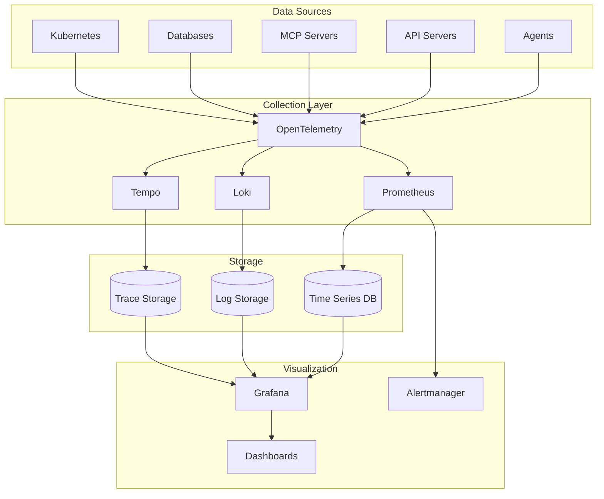

# Monitoring & Logging Setup

#AutoSDLC #Monitoring #Logging #Observability

[[AutoSDLC Documentation Hub|← Back to Index]] | [[50-Deployment-Guide|← Deployment Guide]]

## Overview

Comprehensive observability for the AutoSDLC system covering agent performance tracking, system health monitoring, distributed tracing, and centralized logging. This guide provides monitoring infrastructure patterns for both development and production environments.

## Architecture

### Monitoring Stack

### Core Components

**Metrics Collection (Prometheus)**
- Time-series database for numerical metrics
- Scrapes metrics from agent endpoints
- Configurable retention periods (typically 30 days)
- Query language (PromQL) for analysis

**Logging Aggregation (Loki)**
- Centralized log storage and indexing
- Label-based log aggregation
- Longer retention periods (typically 90 days)
- Integration with log shipping agents

**Distributed Tracing (Tempo)**
- Request tracing across agent boundaries
- Performance bottleneck identification
- Shorter retention periods (typically 7 days)
- Correlation with logs and metrics

**Visualization (Grafana)**
- Unified dashboards for all observability data
- Alert visualization and management
- Role-based access control
- Custom dashboard provisioning

**Alerting (Alertmanager)**
- Alert routing and notification management
- Incident escalation workflows
- Integration with external systems (PagerDuty, Slack)
- Alert silencing and grouping

## Metrics Collection

### Agent Metrics Strategy

**Task Performance Metrics**
- Task receipt, completion, and failure rates
- Task execution duration histograms
- Queue depth and processing lag
- Success/failure ratios by task type

**TDD Compliance Metrics**
- Test execution frequency by TDD phase
- Red/Green/Refactor phase transitions
- Test coverage percentages
- TDD violation detection and counting
- Time spent in each TDD phase

**Resource Utilization Metrics**
- CPU usage percentages per agent
- Memory consumption patterns
- File descriptor usage
- Network connection metrics

**Communication Metrics**
- Inter-agent message rates and latencies
- MCP protocol performance
- Status update frequencies
- Communication error rates

**Custom Business Metrics**
- Feature completion rates
- Code quality scores
- Review iteration counts
- Agent collaboration efficiency

### System-Level Metrics

**Infrastructure Monitoring**
- Kubernetes cluster health
- Node resource utilization
- Pod lifecycle events
- Service discovery health

**Database Performance**
- Query execution times
- Connection pool utilization
- Transaction rates and durations
- Lock contention metrics

**API Performance**
- Request rates and response times
- Error rates by endpoint
- Authentication success rates
- Rate limiting metrics

## Logging Infrastructure

### Structured Logging Principles

**Consistent Format**
- JSON-structured log entries
- Standardized field names across agents
- Correlation IDs for request tracing
- Contextual metadata inclusion

**Log Level Strategy**
- ERROR: System failures requiring immediate attention
- WARN: Recoverable issues that may indicate problems
- INFO: Normal operational events and state changes
- DEBUG: Detailed execution flow for troubleshooting

**Agent-Specific Patterns**
- Task lifecycle events (start, progress, completion)
- TDD phase transitions with test results
- Inter-agent communication events
- Status file update operations
- Error conditions with full context

### Log Aggregation Architecture

**Collection Layer**
- Agents write structured logs to stdout/stderr
- Log shipping agents (Fluent Bit, Promtail) collect logs
- Network-resilient log transmission
- Local buffering during outages

**Storage and Indexing**
- Loki for label-based log storage
- Efficient compression and indexing
- Configurable retention policies
- Query optimization for common patterns

**Analysis Capabilities**
- LogQL for querying and filtering
- Regular expression pattern matching
- Metric extraction from logs
- Alert generation from log patterns

## Distributed Tracing

### OpenTelemetry Integration

**Automatic Instrumentation**
- HTTP request/response tracing
- Database query tracing
- File system operation tracing
- Inter-service communication tracing

**Custom Instrumentation**
- Agent task execution spans
- TDD phase operation tracing
- MCP protocol interaction tracing
- Status update operation tracing

**Trace Correlation**
- Span relationships across agent boundaries
- Trace ID propagation through MCP messages
- Error attribution to specific operations
- Performance bottleneck identification

### Agent Tracing Patterns

**Task Execution Tracing**
- Complete task lifecycle spans
- Sub-operation breakdown within tasks
- Error propagation and handling
- Resource allocation and cleanup

**TDD Workflow Tracing**
- Red phase test execution spans
- Implementation spans in green phase
- Refactoring operation spans
- Test result correlation

**Communication Tracing**
- Message sending and receiving spans
- MCP protocol handshake tracing
- Status synchronization spans
- Agent coordination workflows

## Dashboard Design

### System Overview Dashboard

**Key Performance Indicators**
- Active agent count by type
- Overall task processing rates
- System-wide error rates
- TDD compliance percentages

**Visual Components**
- Real-time agent status indicators
- Task throughput time series graphs
- Error rate trend analysis
- Resource utilization heatmaps

### Agent Performance Dashboards

**Individual Agent Metrics**
- Task completion rates and durations
- Resource consumption trends
- Error frequency analysis
- TDD phase distribution

**Comparative Analysis**
- Performance across agent types
- Resource efficiency comparisons
- Error pattern analysis
- Workload distribution visualization

### Operational Dashboards

**Infrastructure Health**
- Kubernetes cluster status
- Resource utilization across nodes
- Service discovery health
- Network connectivity status

**Application Health**
- API endpoint performance
- Database query performance
- Cache hit rates and efficiency
- Message queue health

## Alerting Strategy

### Alert Categories

**Critical System Alerts**
- Agent unavailability (>2 minutes)
- Database connectivity failures
- Kubernetes node failures
- Critical resource exhaustion

**Performance Degradation Alerts**
- High task failure rates (>10%)
- Excessive task processing delays
- Resource utilization thresholds
- TDD compliance violations

**Quality Assurance Alerts**
- Test coverage below thresholds
- TDD workflow violations
- Code quality metric degradation
- Review process anomalies

### Alert Management

**Escalation Workflows**
- Immediate notification for critical issues
- Escalation paths for unresolved alerts
- Team-based alert routing
- Business hours vs. off-hours handling

**Alert Optimization**
- Threshold tuning to reduce noise
- Alert grouping and correlation
- Automatic resolution detection
- Runbook integration

## Performance Monitoring

### Service Level Objectives (SLOs)

**Availability Targets**
- Agent uptime: 99.9% (30-day window)
- API availability: 99.95% (30-day window)
- Database availability: 99.99% (30-day window)

**Performance Targets**
- Task processing latency: 95th percentile <300 seconds
- API response times: 95th percentile <500ms
- TDD compliance rate: 100% (7-day window)

**Quality Targets**
- Task success rate: >99% (30-day window)
- Test coverage: >80% (continuous)
- Code review approval rate: >95% (7-day window)

### Performance Analysis

**Bottleneck Identification**
- Agent wait time analysis
- Resource contention detection
- Database query optimization opportunities
- Network latency impact assessment

**Trend Analysis**
- Performance degradation detection
- Capacity planning insights
- Seasonal pattern recognition
- Growth trend extrapolation

**Optimization Recommendations**
- Resource scaling suggestions
- Configuration tuning opportunities
- Architecture improvement proposals
- Cost optimization strategies

## Best Practices

### Metrics Design
- Use consistent naming conventions across all metrics
- Include relevant dimensional labels for filtering
- Avoid high-cardinality label combinations
- Document metric purposes and expected ranges

### Logging Standards
- Implement structured logging consistently
- Include correlation IDs for request tracing
- Log at appropriate levels to avoid noise
- Never log sensitive information (passwords, tokens)

### Tracing Strategy
- Trace critical user journeys end-to-end
- Include business context in span attributes
- Configure sampling rates appropriately
- Ensure trace-to-log correlation

### Dashboard Guidelines
- Focus on actionable metrics and clear visualizations
- Maintain consistent layout patterns
- Provide drill-down capabilities for investigation
- Include context and threshold indicators

### Alert Management
- Define clear SLOs and error budgets
- Avoid alert fatigue through proper thresholding
- Include runbooks and remediation steps
- Test alert delivery paths regularly

## Implementation Considerations

### Resource Requirements
- Prometheus: 2-4 GB RAM, sufficient disk for retention period
- Loki: 2-4 GB RAM, distributed storage for logs
- Grafana: 512 MB - 1 GB RAM, minimal storage
- Tempo: 1-2 GB RAM, fast storage for trace data

### Scalability Planning
- Horizontal scaling for Prometheus and Loki
- Federation for multi-cluster deployments
- Storage optimization for long-term retention
- Network bandwidth planning for log shipping

### Security Considerations
- Secure communication between monitoring components
- Access control for sensitive metrics and logs
- Data retention compliance with regulations
- Audit logging for monitoring system access

## Related Documents

- [[50-Deployment-Guide|Deployment Guide]]
- [[10-Agent-Framework|Agent Framework]]
- [[24-Agent-Output-Management|Agent Output Management]]
- [[52-Security-Guidelines|Security Guidelines]]

---

**Tags**: #AutoSDLC #Monitoring #Logging #Observability #Metrics
**Last Updated**: 2025-06-09
**Next**: [[52-Security-Guidelines|Security Guidelines →]]