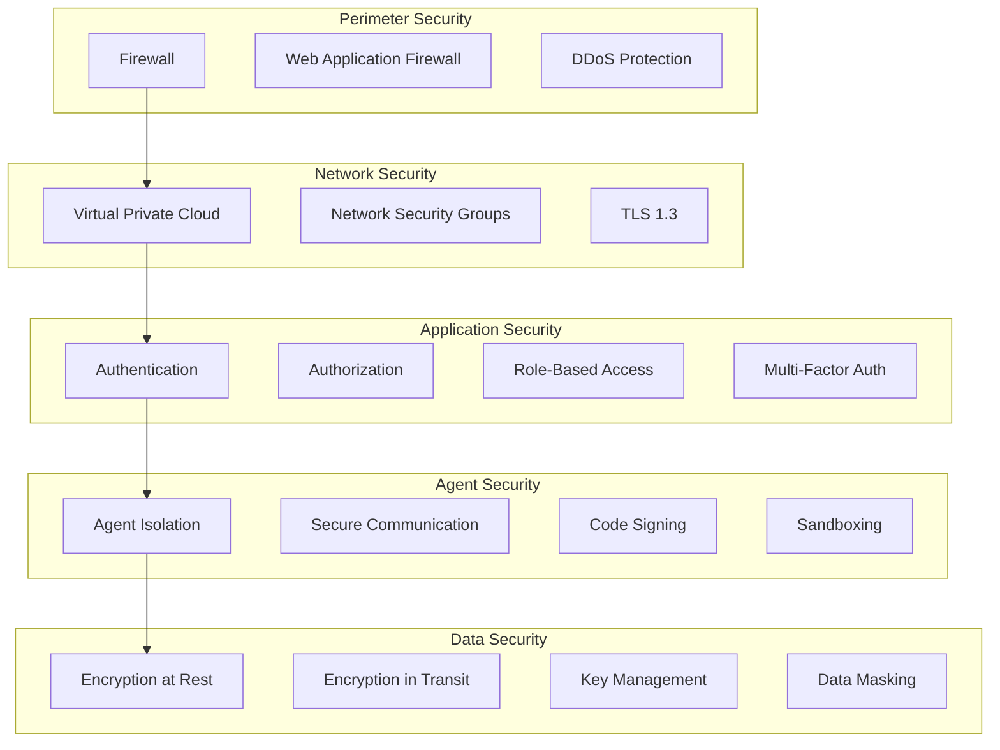

# Security Guidelines

#AutoSDLC #Security #Guidelines #BestPractices

[[AutoSDLC Documentation Hub|← Back to Index]] | [[51-Monitoring-Setup|← Monitoring Setup]]

## Overview

Comprehensive security guidelines for the AutoSDLC system, covering agent security, communication encryption, access control, vulnerability management, and compliance requirements. Security is paramount in an autonomous development system with access to code repositories and development infrastructure.

## Security Architecture

### Defense in Depth

### Security Principles

1. **Zero Trust Architecture**: Never trust, always verify
2. **Least Privilege**: Minimal permissions for all components
3. **Defense in Depth**: Multiple layers of security
4. **Secure by Default**: Security enabled out of the box
5. **Continuous Monitoring**: Real-time threat detection

## Agent Security

### Agent Isolation

**Network Isolation Requirements:**
- Kubernetes NetworkPolicy configuration restricts agent communication
- Only authorized namespaces can access agent MCP server ports (8081)
- Agents limited to specific egress destinations (MCP server, GitHub API)
- Process isolation with non-root user execution

**Process Security Configuration:**
- Run as non-root user (UID 1000) with minimal capabilities
- Read-only root filesystem prevents tampering
- SecComp profiles restrict system calls
- Drop all capabilities except NET_BIND_SERVICE

### Agent Authentication

**Certificate-Based Authentication:**
- X.509 certificates for agent identity verification
- Certificate chain validation against trusted CAs
- Automatic certificate revocation checking
- Session tokens with 1-hour expiry

**Authentication Flow:**
1. Agent presents certificate and signature
2. System verifies certificate validity and chain
3. Signature validation confirms agent identity  
4. JWT session token issued with role-based permissions

### Secure Agent Communication

**Encryption Standards:**
- AES-256-GCM for message encryption
- PBKDF2 key derivation with 100,000 iterations
- Unique IV per message prevents pattern analysis
- Authentication tags prevent tampering

**Message Security:**
- All MCP messages encrypted end-to-end
- Timestamp validation prevents replay attacks
- Message integrity verified via auth tags
- 5-minute message validity window

### Code Execution Sandboxing

**Resource Limits:**
- Maximum memory: 512MB per execution
- CPU timeout: 30 seconds
- Maximum file size: 10MB
- Restricted module access (path, fs, crypto, util, @autosdlc/sdk only)

**Security Measures:**
- VM2 isolation for code execution
- Worker threads for additional isolation
- Static analysis for dangerous patterns (eval, Function, child_process)
- Input/output validation and sanitization
- Comprehensive audit logging for all executions

## Access Control

### Role-Based Access Control (RBAC)

**Role Definitions:**
- **autosdlc-admin**: Full cluster access for platform management
- **autosdlc-developer**: Limited access to deployments, jobs, pods (read/write)
- **autosdlc-operator**: Infrastructure management with deployment updates
- **autosdlc-viewer**: Read-only access to all resources for monitoring

### API Authentication & Authorization

**Authentication Methods:**
- API Key authentication with SHA-256 hashing
- OAuth2 Bearer token validation
- JWT cookie-based authentication
- Rate limiting per API key

**Authorization Process:**
- User permission lookup after authentication
- Resource-action access validation
- Authorization failure logging and alerting
- Insufficient permission blocking with audit trail

### Multi-Factor Authentication

**MFA Implementation:**
- TOTP-based authentication using speakeasy
- QR code generation for authenticator app setup
- 32-character secret generation with encryption
- Backup codes (10 single-use codes) for recovery
- 2-step time window tolerance for clock drift

## Data Security

### Encryption at Rest

**Data Encryption Strategy:**
- AES-256-GCM algorithm for all sensitive data
- AWS KMS integration for key management
- Classification-based key selection (public/internal/confidential/secret)
- Automatic IV generation and auth tag validation

**Key Management:**
- Separate encryption keys per data classification level
- Automatic data key generation through KMS
- Encrypted key storage with plaintext key isolation
- Key rotation and lifecycle management

### Secrets Management

**Secret Storage:**
- Kubernetes SealedSecrets for encrypted secret storage
- External Secrets Operator for AWS Secrets Manager integration
- Automated secret rotation with overlap periods
- Encrypted backup code generation and storage

### Key Rotation

**Rotation Schedule:**
- API keys: 90 days
- JWT secrets: 30 days
- Encryption keys: 365 days
- Certificates: 365 days

**Rotation Process:**
- Overlapping validity periods during transitions
- Automated user notification for key updates
- Failed rotation logging and alerting
- Verification of successful key application

## Network Security

### TLS Configuration

**TLS Standards:**
- TLS 1.3 only with strong cipher suites
- ECDHE key exchange for forward secrecy
- OCSP stapling for certificate validation
- HTTP Strict Transport Security (HSTS) with preload

**Security Headers:**
- X-Frame-Options: DENY
- X-Content-Type-Options: nosniff
- X-XSS-Protection: 1; mode=block
- Content Security Policy for script/style restrictions
- Public Key Pinning for certificate validation

### Network Policies

**Default Security:**
- Deny-all ingress policy as baseline
- Explicit allow rules for required communication
- Agent egress limited to DNS, MCP server, and GitHub API
- Namespace-based traffic segmentation

## Vulnerability Management

### Dependency Scanning

**Automated Security Scanning:**
- Snyk vulnerability scanning with high-severity threshold
- npm audit with automatic fix application
- OWASP Dependency Check for comprehensive analysis
- Trivy container scanning for image vulnerabilities
- CodeQL static analysis and Semgrep security rules

### Security Patching

**Patch Management Process:**
- Vulnerability severity classification (critical/high/medium/low)
- Staging environment testing before production application
- Automated patch prioritization and application
- Verification of successful patch deployment
- Security event logging for all patch activities

## Incident Response

### Incident Response Plan

**Response Timeline:**
- Critical: 15 minutes response, immediate escalation
- High: 60 minutes response, 1-hour escalation
- Medium: 4 hours response, 4-hour escalation
- Low: 24 hours response, 24-hour escalation

**Response Process:**
1. Detection & Analysis of security incident
2. Containment through component isolation and IP blocking
3. Eradication of identified threats and vulnerabilities
4. Recovery of affected systems and services
5. Post-incident analysis and recommendations
6. Stakeholder notification and documentation

### Security Monitoring

**Detection Rules:**
- Brute force attack detection (5 failed logins in 60 seconds)
- Privilege escalation attempts on admin resources
- Data exfiltration through large external transfers
- Code injection patterns in agent execution

**Monitoring Capabilities:**
- Real-time event stream processing
- ML-based anomaly detection with scoring
- Automated threat response and isolation
- Security metrics and alerting integration

## Compliance

### Compliance Framework

**GDPR Requirements:**
- Encryption at rest and in transit
- Data minimization and right to erasure
- Consent management and data portability
- 72-hour breach notification requirement

**SOC2 Controls:**
- Access control implementation and monitoring
- AES-256 encryption standards
- Continuous security monitoring
- Documented incident response procedures
- 99.9% uptime SLA with quarterly DR testing

**ISO 27001 Standards:**
- Annual risk assessment procedures
- Documented security policies
- Role-based access control implementation
- Strong cryptography standards

### Audit Logging

**Audit Requirements:**
- Immutable audit log storage with event signing
- Required fields: timestamp, userId, action, resource, result, IP, userAgent
- SIEM integration for centralized logging
- Compliance violation detection and alerting

**Log Integrity:**
- HMAC-SHA256 signature for each audit event
- Event canonicalization for consistent signing
- Query authorization for audit log access
- Integrity verification for log retrieval

## Security Best Practices

### Development Security

**Code Review Requirements:**
- Minimum 2 reviewers with security team involvement
- Automated security checks (static analysis, dependency scan, secret scan)
- Branch protection with required security checks
- Code owner review requirements

**Secrets Management:**
- Pre-commit hooks for secret detection
- CI pipeline scanning and periodic repository scans
- Regular credential rotation (API keys: 90 days, passwords: 60 days, certificates: 365 days)

### Agent Security Guidelines

**Essential Security Practices:**
- Verify agent identity before processing any requests
- Use mutual TLS for all agent-to-agent communication
- Implement least privilege access control principles
- Rotate agent credentials according to schedule
- Sandbox all code execution with resource limits
- Encrypt sensitive data with proper classification
- Monitor communication patterns for anomalies
- Maintain comprehensive security event logging

### Deployment Security Checklist

**Pre-Deployment Verification:**
- Secrets stored securely (not in code repositories)
- Network policies applied with deny-all baseline
- RBAC policies configured and tested
- TLS certificates valid and properly configured
- Container images scanned for vulnerabilities
- Audit logging enabled and functional
- Security monitoring active with alerting

## Related Documents

- [[50-Deployment-Guide|Deployment Guide]]
- [[51-Monitoring-Setup|Monitoring & Logging Setup]]
- [[20-MCP-Integration|MCP Integration Guide]]
- [[10-Agent-Framework|Agent Framework]]

---

**Tags**: #AutoSDLC #Security #Guidelines #BestPractices #Compliance
**Last Updated**: 2025-06-09
**Next**: [[60-Development-Workflow|Development Workflow →]]