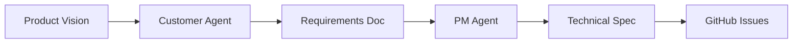
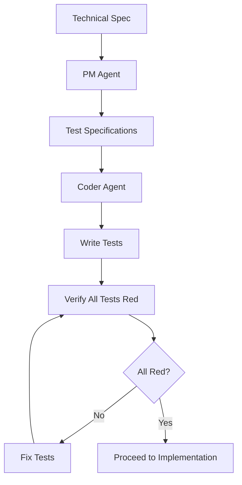
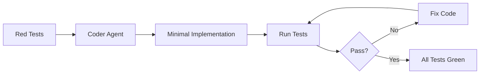
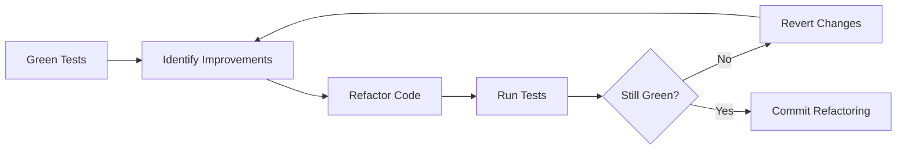
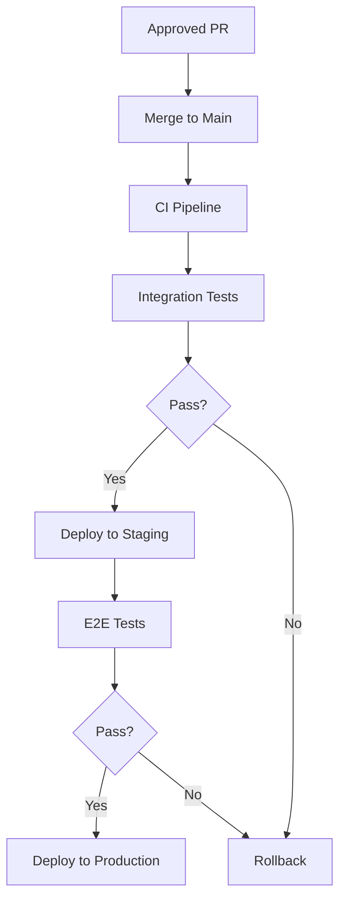

# Development Workflow

#AutoSDLC #Development #Workflow #TDD

[[AutoSDLC Documentation Hub|← Back to Index]] | [[52-Security-Guidelines|← Security Guidelines]]

## Overview

This document outlines the development workflow for AutoSDLC, emphasizing our strict Test-Driven Development (TDD) approach, Claude Code integration, and collaborative agent-based development process.

## Core Development Principles

### 1. Test-Driven Development (TDD)
- **Tests First**: Always write tests before implementation
- **No Mocks**: Use real implementations and integrations
- **Red-Green-Refactor**: Follow the cycle religiously
- **100% Specification Coverage**: All requirements must have tests

### 2. Agent Collaboration
- **Autonomous Agents**: Each agent works independently
- **Status Transparency**: Agent_Output.md provides real-time status
- **Bidirectional Communication**: Agents act as both MCP clients and servers
- **Claude Code Execution**: All agents run via `cc -p` in headless mode

### 3. Continuous Integration
- **Automated Testing**: Tests run on every commit
- **Real Integration Tests**: No mocked services
- **Continuous Deployment**: Automated release pipeline
- **Quality Gates**: Strict quality requirements

## Development Process

### Phase 1: Requirements Definition



#### 1.1 Customer Agent Activities
```yaml
responsibilities:
  - Maintain product vision
  - Define acceptance criteria
  - Create user stories
  - Validate implementations

outputs:
  - Requirements documents
  - Acceptance criteria
  - User scenarios
  - Validation reports
```

#### 1.2 PM Agent Activities
```yaml
responsibilities:
  - Translate requirements to technical specs
  - Create GitHub issues
  - Define test specifications
  - Manage sprint planning

outputs:
  - Technical specifications
  - GitHub issues with labels
  - Test specifications (for TDD)
  - Sprint plans
```

### Phase 2: Test Specification (TDD Phase 1)



#### 2.1 Test Specification Format
```typescript
interface TestSpecification {
  feature: string;
  requirements: Requirement[];
  testCases: TestCase[];
  acceptanceCriteria: AcceptanceCriterion[];
  coverage: CoverageRequirement;
}

interface TestCase {
  description: string;
  input: any;
  expectedOutput: any;
  edgeCases: EdgeCase[];
  errorScenarios: ErrorScenario[];
}

// Example
const authTestSpec: TestSpecification = {
  feature: "User Authentication",
  requirements: [
    { id: "REQ-001", description: "Users can register with email" },
    { id: "REQ-002", description: "Passwords must be secure" }
  ],
  testCases: [
    {
      description: "Should register user with valid email",
      input: { email: "user@example.com", password: "SecurePass123!" },
      expectedOutput: { success: true, userId: "string" },
      edgeCases: [
        { description: "Email with special characters" },
        { description: "Maximum length email" }
      ],
      errorScenarios: [
        { input: { email: "invalid" }, expectedError: "Invalid email format" }
      ]
    }
  ],
  acceptanceCriteria: [
    "All security requirements met",
    "Performance under 200ms",
    "Works with all supported databases"
  ],
  coverage: {
    minimum: 100,
    includeEdgeCases: true,
    includeErrorPaths: true
  }
};
```

#### 2.2 Test Writing Process
```bash
# 1. Generate test structure from specification
npm run test:generate -- --spec=auth-spec.json

# 2. Write comprehensive tests (no mocks!)
npm run test:write -- --feature=authentication

# 3. Verify all tests fail
npm run test:verify-red -- --feature=authentication

# Output should show:
# ✗ All 45 tests failing (RED state confirmed)
# ✓ Test coverage matches specification: 100%
# ✓ Ready for implementation phase
```

### Phase 3: Implementation (TDD Phase 2)



#### 3.1 Implementation Rules
1. **Write Minimal Code**: Just enough to pass tests
2. **No Extra Features**: Don't implement beyond tests
3. **Continuous Testing**: Run tests after each change
4. **Update Status**: Keep Agent_Output.md current

#### 3.2 Coder Agent Workflow
```typescript
class CoderAgentWorkflow {
  async implementFeature(testSpec: TestSpecification): Promise<Implementation> {
    // 1. Verify tests are red
    const redState = await this.verifyTestsRed(testSpec);
    if (!redState.allRed) {
      throw new Error('Tests must be red before implementation');
    }
    
    // 2. Analyze test requirements
    const requirements = await this.analyzeTests(testSpec);
    
    // 3. Implement iteratively
    let implementation = await this.createMinimalImplementation(requirements);
    let testResults = await this.runTests(implementation);
    
    while (!testResults.allPassing) {
      // Update Agent_Output.md with progress
      await this.updateStatus({
        phase: 'implementation',
        passing: testResults.passing,
        total: testResults.total,
        currentFocus: testResults.nextFailingTest
      });
      
      // Fix failing test
      implementation = await this.fixFailingTest(
        implementation,
        testResults.nextFailingTest
      );
      
      testResults = await this.runTests(implementation);
    }
    
    // 4. All tests green!
    await this.updateStatus({
      phase: 'green',
      allTestsPassing: true,
      coverage: testResults.coverage
    });
    
    return implementation;
  }
}
```

### Phase 4: Refactoring (TDD Phase 3)



#### 4.1 Refactoring Guidelines
- Only refactor when tests are green
- Run tests after each refactoring step
- Focus on code quality and maintainability
- Document significant changes

### Phase 5: Code Review

#### 5.1 Review Process
```typescript
interface CodeReviewProcess {
  automated: {
    linting: boolean;
    formatting: boolean;
    complexity: boolean;
    security: boolean;
    testCoverage: boolean;
  };
  manual: {
    codeQuality: boolean;
    architecture: boolean;
    performance: boolean;
    documentation: boolean;
  };
}
```

#### 5.2 Review Checklist
- [ ] All tests passing
- [ ] Test coverage meets requirements
- [ ] No mocks used in tests
- [ ] Code follows standards
- [ ] Documentation complete
- [ ] Performance acceptable
- [ ] Security best practices followed

### Phase 6: Integration & Deployment



## Agent Collaboration Patterns

### Communication Flow

```typescript
// 1. PM Agent creates task
const task = {
  type: 'implement_feature',
  specification: authSpec,
  testFiles: ['auth.test.ts'],
  priority: 'high',
  deadline: '2025-12-30'
};

// 2. PM Agent notifies Coder Agent
await pmAgent.sendTask('coder-agent', task);

// 3. Coder Agent acknowledges
await coderAgent.acknowledge(task, {
  estimatedTime: '4 hours',
  startTime: new Date()
});

// 4. Coder Agent updates progress via Agent_Output.md
// Other agents monitor ../shared/Agent_Status/coder_status.md

// 5. Coder Agent completes and notifies
await coderAgent.notifyCompletion(task, {
  pullRequestUrl: 'https://github.com/org/repo/pull/123',
  testResults: { passing: 45, total: 45 },
  coverage: 98.5
});
```

### Status Monitoring

```bash
# Monitor all agent statuses
watch -n 5 'tail -n 20 agents/shared/Agent_Status/*_status.md'

# Check specific agent
cat agents/shared/Agent_Status/coder_status.md

# Monitor agent logs
tail -f logs/agents/*.log
```

## Development Environment

### Local Setup

```bash
# 1. Clone repository
git clone https://github.com/your-org/autosdlc.git
cd autosdlc

# 2. Install dependencies
npm install

# 3. Start complete development environment
npm run dev
# This automatically handles:
# - Building TypeScript code
# - Starting Docker services (PostgreSQL, Redis)
# - Running database migrations
# - Starting MCP server

# 4. Initialize agents (when implementing agent framework)
npm run agents:init
```

### Agent Development

```bash
# Start individual agent for development
npm run agent:dev -- --type=coder

# Run agent tests
npm run agent:test -- --type=coder

# Debug agent
npm run agent:debug -- --type=coder --verbose
```

### Testing During Development

```bash
# Run complete test cycle with automatic setup/cleanup
npm test

# Run specific test file (requires manual test environment setup)
npm test -- auth.test.ts

# Run tests with coverage
npm run test:coverage

# Run tests in watch mode (for development)
npm run test:watch

# Verify TDD compliance
npm run tdd:verify
```

## Git Workflow

### Branch Strategy

```
main
  ├── develop
  │     ├── feature/REQ-001-user-auth
  │     ├── feature/REQ-002-api-endpoints
  │     └── fix/BUG-001-login-issue
  └── release/v1.0.0
```

### Commit Convention

```
<type>(<scope>): <subject>

<body>

<footer>

Types: feat, fix, docs, test, refactor, style, chore
Scope: agent-name, component, feature

Example:
feat(coder-agent): implement user authentication

- Added registration endpoint
- Implemented password hashing
- Created JWT token generation
- All tests passing (45/45)

Closes #123
```

### Pull Request Template

```markdown
## Description
Brief description of changes

## Type of Change
- [ ] Bug fix
- [ ] New feature
- [ ] Breaking change
- [ ] Documentation update

## TDD Compliance
- [ ] Tests written first
- [ ] All tests were red before implementation
- [ ] No mocks used
- [ ] 100% specification coverage

## Testing
- [ ] Unit tests pass
- [ ] Integration tests pass
- [ ] E2E tests pass
- [ ] Test coverage: ____%

## Agent Status
- [ ] Agent_Output.md updated
- [ ] All agent communications logged
- [ ] Status synced to shared directory

## Checklist
- [ ] Code follows style guidelines
- [ ] Self-review completed
- [ ] Documentation updated
- [ ] No new warnings
```

## Continuous Integration

### CI Pipeline Configuration

```yaml
# .github/workflows/ci.yml
name: CI Pipeline

on:
  pull_request:
    branches: [main, develop]

jobs:
  tdd-verification:
    runs-on: ubuntu-latest
    steps:
      - uses: actions/checkout@v3
      
      - name: Verify TDD Compliance
        run: |
          # Check that tests exist for all features
          npm run tdd:verify-coverage
          
          # Verify no mocks in tests
          npm run test:check-no-mocks
          
          # Run all tests
          npm test -- --coverage
          
      - name: Check Test Coverage
        run: |
          npm run test:coverage:check
          # Fails if coverage < 80%
          
  code-quality:
    runs-on: ubuntu-latest
    steps:
      - name: Lint
        run: npm run lint
        
      - name: Type Check
        run: npm run typecheck
        
      - name: Security Scan
        run: npm run security:scan
        
  integration-tests:
    runs-on: ubuntu-latest
    services:
      postgres:
        image: postgres:15
        options: --health-cmd pg_isready
      redis:
        image: redis:7
        
    steps:
      - name: Run Integration Tests
        run: npm run test:integration
        
      - name: Run E2E Tests
        run: npm run test:e2e
```

## Best Practices

### 1. TDD Discipline
- Never write implementation before tests
- Always verify red state
- Keep tests simple and focused
- Test behavior, not implementation

### 2. Agent Development
- Keep agents focused on single responsibility
- Update Agent_Output.md frequently
- Use custom commands for complex operations
- Monitor other agents' status

### 3. Code Quality
- Follow established patterns
- Write self-documenting code
- Keep functions small
- Handle errors gracefully

### 4. Collaboration
- Communicate through proper channels
- Document decisions
- Share knowledge
- Review each other's code

### 5. Performance
- Profile before optimizing
- Test with realistic data
- Monitor resource usage
- Cache appropriately

## Troubleshooting

### Common Issues

#### Tests Not Failing (Should Be Red)
```bash
# Check test implementation
npm run test:analyze -- --file=problem.test.ts

# Verify no implementation exists
find src -name "*.ts" | xargs grep -l "functionName"

# Force clean state
npm run test:clean && npm test
```

#### Agent Communication Issues
```bash
# Check agent status
cat agents/{agent-type}-agent/Agent_Output.md

# Verify MCP connection
curl http://localhost:8080/health

# Check agent logs
tail -f logs/agents/{agent-type}.log
```

#### Integration Test Failures
```bash
# Check service health
docker-compose ps

# View service logs
docker-compose logs -f [service]

# Reset test database
npm run db:test:reset
```

## Related Documents

- [[62-Testing-Strategy|Testing Strategy]]
- [[63-TDD-Implementation-Guide|TDD Implementation Guide]]
- [[10-Agent-Framework|Agent Framework]]
- [[24-Agent-Output-Management|Agent Output Management]]
- [[25-Claude-Code-Integration|Claude Code Integration]]

---

**Tags**: #AutoSDLC #Development #Workflow #TDD #Process
**Last Updated**: 2025-06-09
**Next**: [[61-Agent-Prompt-Engineering|Agent Prompt Engineering →]]