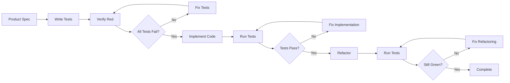

# TDD Implementation Guide

#AutoSDLC #TDD #Testing #Implementation

[[AutoSDLC Documentation Hub|← Back to Index]] | [[62-Testing-Strategy|← Testing Strategy]]

## Overview

This guide provides a comprehensive approach to Test-Driven Development (TDD) in the AutoSDLC system. Our TDD implementation is strict: tests are written first based on product specifications, verified to fail completely, and only then is implementation code written. **No mocks are used** - all tests work with real implementations.

## TDD Principles in AutoSDLC

### Core Philosophy

1. **Tests Are Specifications**: Tests define the exact behavior expected
2. **Red-Green-Refactor**: The only acceptable workflow
3. **No Mocks Policy**: All tests use real implementations
4. **Coverage Is Mandatory**: 100% coverage of product specifications
5. **Tests Drive Design**: Implementation emerges from test requirements

### The TDD Cycle



## Phase 1: Writing Tests First

### From Specification to Tests

Transform product specifications into comprehensive test suites:

#### Specification Structure
```typescript
interface FeatureSpecification {
  title: string;
  requirements: string[];
  acceptanceCriteria: string[];
  edgeCases?: string[];
  performanceRequirements?: string[];
}
```

#### Test Structure Patterns
- **Setup Phase**: Real services, databases, external dependencies
- **Test Coverage**: Every requirement becomes multiple tests
- **Cleanup Phase**: Proper resource management
- **Isolation**: Each test runs independently

#### Key Test Patterns
1. **Happy Path Tests**: Normal use cases with valid inputs
2. **Validation Tests**: Invalid inputs and edge cases
3. **Error Handling Tests**: System failure scenarios
4. **State Verification Tests**: Data persistence and side effects
5. **Integration Tests**: Component interaction verification

#### Real Implementation Requirements
- Use actual databases (test instances)
- Real network calls (to test services)
- Actual file system operations
- Genuine external service integrations
- No stubbing or mocking of business logic

## Phase 2: Verifying Red State

### Red State Verification Process

1. **Run Complete Test Suite**: All tests must fail initially
2. **Analyze Failure Reasons**: Ensure failures are due to missing implementation
3. **Specification Coverage**: Verify all requirements are tested
4. **Test Quality Check**: Validate test logic and assertions

### Verification Principles
- **100% Failure Rate**: No tests should pass without implementation
- **Meaningful Failures**: Tests fail for the right reasons (not syntax errors)
- **Complete Coverage**: Every specification point has corresponding tests
- **Clear Error Messages**: Failures indicate what needs to be implemented

### Automated Verification
- Script-based test execution
- Coverage analysis of specifications
- Failure pattern verification
- Test quality metrics

## Phase 3: Implementation (Green Phase)

### Implementation Strategy

#### Minimal Implementation Approach
1. **Simplest Solution**: Write just enough code to pass the test
2. **Progressive Building**: Implement one test at a time
3. **Avoid Over-Engineering**: Don't implement features not yet tested
4. **Focus on Behavior**: Make tests pass, worry about structure later

#### Implementation Patterns
- **Interface-First**: Define contracts before implementation
- **Error-First**: Handle error cases explicitly
- **State Management**: Proper data persistence and retrieval
- **Resource Management**: Proper cleanup and lifecycle handling

#### Progressive Implementation Guidelines
- Implement features in test order
- Run tests after each change
- Verify no regressions occur
- Maintain clean compilation

## Phase 4: Refactoring (Maintaining Green)

### Refactoring Principles

#### When to Refactor
- All tests are green
- Code duplication exists
- Complex methods need simplification
- Better structure is apparent

#### Safe Refactoring Process
1. **Verify Green State**: All tests passing
2. **Make One Change**: Small, focused refactoring
3. **Run Tests**: Ensure still green
4. **Repeat**: Continue with next refactoring

#### Common Refactoring Patterns
- **Extract Methods**: Break down complex functions
- **Extract Classes**: Separate concerns
- **Remove Duplication**: Consolidate repeated code
- **Improve Naming**: Clarify intent
- **Simplify Logic**: Reduce complexity

## TDD Workflow Automation

### Automated TDD Pipeline

#### CI/CD Integration
- **Test-First Verification**: Automated checks for commit order
- **Coverage Enforcement**: Minimum coverage thresholds
- **Mock Detection**: Automated scanning for mocking violations
- **TDD Compliance Reporting**: Metrics and trend analysis

#### Pipeline Components
1. **Commit Analysis**: Verify tests committed before implementation
2. **Coverage Verification**: Ensure adequate test coverage
3. **Mock Usage Detection**: Flag any mocking patterns
4. **TDD Metrics Collection**: Track compliance over time

### TDD Metrics and Monitoring

#### Key Metrics
- **Test-First Compliance**: Percentage of features with tests written first
- **Mock-Free Rate**: Percentage of tests using real implementations
- **Coverage Rates**: Line, branch, function, and statement coverage
- **Red-Green-Refactor Cycles**: Number of proper TDD cycles completed

#### Automated Analysis
- **Commit History Analysis**: Pattern recognition for TDD compliance
- **Code Pattern Detection**: Identify anti-patterns and violations
- **Coverage Trend Analysis**: Track improvement over time
- **Quality Metrics**: Measure test effectiveness and maintainability

## Agent Integration for TDD

### PM Agent TDD Workflow

#### Test Specification Creation
1. **Requirement Analysis**: Break down features into testable behaviors
2. **Test Case Generation**: Create comprehensive test scenarios
3. **Acceptance Criteria Mapping**: Ensure complete requirement coverage
4. **Red State Verification**: Confirm all tests fail initially

#### Task Management
- Create GitHub issues with test specifications
- Assign implementation tasks to Coder Agent
- Track progress through TDD phases
- Validate completion against specifications

### Coder Agent TDD Implementation

#### Implementation Phases
1. **Red Phase Verification**: Confirm all tests are failing
2. **Green Phase Implementation**: Write minimal code to pass tests
3. **Refactor Phase**: Improve code structure while maintaining green tests
4. **Integration**: Create pull requests with full test coverage

#### Progress Tracking
- Real-time status updates during implementation
- Test-by-test progress reporting
- Coverage metrics monitoring
- Quality gate validation

### Code Reviewer Agent TDD Validation

#### Review Criteria
- Verify TDD process was followed
- Check test quality and coverage
- Validate no mocking violations
- Ensure proper refactoring practices

#### Automated Checks
- Test-first commit verification
- Coverage threshold validation
- Code quality metrics
- TDD best practice compliance

## Best Practices

### 1. Test Quality
- Write descriptive test names that explain the behavior
- One assertion per test when possible
- Test behavior, not implementation
- Include edge cases and error scenarios
- Use real data that reflects production scenarios

### 2. Implementation Discipline
- Never write code without a failing test
- Implement the simplest solution first
- Refactor only when all tests are green
- Keep test and implementation commits separate
- Document TDD phases in commit messages

### 3. Continuous Integration
- Automate red phase verification
- Enforce coverage thresholds
- Block merges without full test passes
- Monitor TDD compliance metrics
- Regular TDD process audits

### 4. Team Collaboration
- Share test specifications before implementation
- Review tests as thoroughly as implementation
- Pair on complex test scenarios
- Maintain shared testing utilities
- Document testing patterns

## Common Pitfalls and Solutions

### Pitfall 1: Writing Tests After Code
**Solution**: Use commit hooks and automated verification to ensure test-first approach

**Prevention Strategies**:
- Git pre-commit hooks that verify test files exist
- Automated commit analysis in CI/CD
- Code review process verification
- Agent workflow enforcement

### Pitfall 2: Using Mocks
**Solution**: Provide comprehensive test utilities for real implementations

**Real Implementation Approach**:
- Test databases with proper isolation
- Test services with controlled environments  
- Test utilities that mirror production behavior
- Cleanup mechanisms for test resources

### Pitfall 3: Incomplete Test Coverage
**Solution**: Specification-driven test generation and coverage analysis

**Coverage Strategies**:
- Map every requirement to tests
- Generate test templates from specifications
- Automated coverage verification
- Gap analysis and reporting

### Pitfall 4: Skipping Red Phase
**Solution**: Automated verification of failing tests before implementation

**Red Phase Enforcement**:
- Automated test execution and verification
- Commit analysis for proper TDD flow
- Coverage analysis of specifications
- Quality gate validation

## Monitoring TDD Compliance

### TDD Compliance Dashboard

#### Core Metrics
- **Test-First Rate**: Percentage of features with tests written first
- **Mock-Free Rate**: Percentage of tests using real implementations  
- **Coverage Rate**: Average test coverage across projects
- **Red Phase Compliance**: Percentage following proper red phase

#### Trend Analysis
- Daily, weekly, and monthly compliance trends
- Agent-specific performance metrics
- Project-level compliance scores
- Historical improvement tracking

#### Violation Tracking
- Recent TDD violations and their resolution
- Violation patterns by agent and type
- Root cause analysis and prevention
- Compliance improvement recommendations

### Automated Reporting and Analysis

#### Compliance Reports
- Automated generation of TDD compliance reports
- Integration with project management tools
- Real-time alerts for violations
- Trend analysis and recommendations

#### Quality Gates
- Automated blocking of non-compliant changes
- Coverage threshold enforcement
- Test quality validation
- Process compliance verification

## Conclusion

Test-Driven Development is not just a testing strategy in AutoSDLC—it's the fundamental methodology that ensures quality, maintainability, and correct implementation of requirements. By following these strict TDD principles:

1. **Always write tests first** based on specifications
2. **Verify all tests fail** before implementing
3. **Write minimal code** to pass tests
4. **Never use mocks**—work with real implementations
5. **Refactor only** when tests are green

The AutoSDLC system ensures that every feature is built correctly from the ground up, with comprehensive test coverage and high confidence in the implementation.

## Related Documents

- [[62-Testing-Strategy|Testing Strategy]]
- [[13-Coder-Agent|Coder Agent Specification]]
- [[12-Product-Manager-Agent|PM Agent Specification]]
- [[60-Development-Workflow|Development Workflow]]

---

**Tags**: #AutoSDLC #TDD #Testing #Implementation #BestPractices
**Last Updated**: 2025-06-09

---
