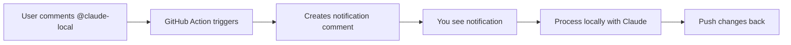

# How to Use @claude-local

This guide explains how to use the `@claude-local` workflow for cost-free Claude assistance on GitHub issues and PRs.

## What is @claude-local?

`@claude-local` is a GitHub workflow that creates notifications when someone needs Claude's help. Instead of using expensive API calls, it notifies you to process the request locally using your Claude Code installation.

## How It Works



## Step-by-Step Usage

### 1. Someone Requests Help

On any issue or PR in your repository, someone (including you) comments:
```
@claude-local please review this code and suggest improvements
```

### 2. GitHub Action Creates Notification

The workflow automatically adds a comment like:
```
🔔 Claude Local Task Notification

@user requested Claude assistance on this PR.

To process this locally:
1. Navigate to project
2. Checkout the PR
3. Process with Claude Code
4. Push changes
```

### 3. You Process Locally

When you see the notification, open your terminal:

```bash
# Navigate to your project
cd /Users/reza/Projects/AutoSDLC

# Use the helper script (easiest way)
./scripts/claude-github-helper.sh 12

# Or manually:
gh pr checkout 12  # For PRs
gh issue view 12   # For issues
```

### 4. Use Claude Code

Now use Claude to implement the requested changes:

```bash
# Example: Review and implement changes
claude "Review PR #12 and implement the suggestions from the comments"

# Example: Fix a specific issue
claude "Fix the bug described in issue #12"

# Example: Add a feature
claude "Implement the feature requested in issue #12"
```

### 5. Push Changes Back

After Claude makes the changes:

```bash
# For PRs - just push to the existing branch
git add .
git commit -m "Implement requested changes via Claude

- Added error handling as suggested
- Improved code documentation
- Fixed the reported bug"
git push

# For Issues - create a new PR
git checkout -b fix-issue-12
git add .
git commit -m "Fix issue #12"
git push -u origin fix-issue-12
gh pr create --title "Fix: Resolve issue #12" --body "This PR fixes the issue described in #12"
```

## Common Scenarios

### Scenario 1: Code Review Request
```
Comment: @claude-local please review this code for security issues
You run: claude "Review the code in PR #12 for security vulnerabilities"
```

### Scenario 2: Bug Fix
```
Comment: @claude-local there's a bug in the login function
You run: claude "Find and fix the bug in the login function mentioned in issue #15"
```

### Scenario 3: Feature Implementation
```
Comment: @claude-local add dark mode support to the settings page
You run: claude "Implement dark mode toggle in the settings page as requested in issue #20"
```

## Benefits

1. **Zero API Costs**: No Claude API charges
2. **Full Control**: You decide when and how to process requests
3. **Local Context**: Claude has access to your full project context
4. **Flexible**: Can handle complex, multi-step tasks

## Testing the Workflow

Before using, test that the workflow is properly set up:

```bash
# Option 1: Use GitHub UI
# Go to Actions → Claude Local Runner → Run workflow
# Enter an issue/PR number and check "Run in test mode"

# Option 2: Use GitHub CLI
gh workflow run claude-local.yml -f issue_number=12 -f test_mode=true

# Option 3: Test locally with act
act -W .github/workflows/claude-local.yml workflow_dispatch \
  --input issue_number=12 --input test_mode=true
```

## Comparison: @claude vs @claude-local

| Feature | @claude | @claude-local |
|---------|---------|---------------|
| Cost | Uses API credits | Free |
| Speed | Immediate | Requires manual processing |
| Automation | Fully automated | Semi-automated |
| Control | Limited | Full control |
| Context | Limited by API | Full project context |
| Best for | Simple tasks | Complex tasks |

## Tips

1. **Set up notifications**: Watch your repo to get notified of `@claude-local` mentions
2. **Batch process**: Handle multiple requests in one session
3. **Use templates**: Create Claude prompts for common tasks
4. **Document changes**: Always include clear commit messages

## Troubleshooting

### Workflow doesn't trigger
- Check the comment includes exactly `@claude-local`
- Ensure the workflow file exists in `.github/workflows/claude-local.yml`
- Verify GitHub Actions are enabled for your repository

### Can't checkout PR
- Ensure you have the GitHub CLI installed: `brew install gh`
- Authenticate with: `gh auth login`
- Check you have write access to the repository

### Claude Code issues
- Ensure Claude Code is installed: `npm install -g @anthropic-ai/claude-code`
- Check you're in the correct directory
- Verify your Claude API key is set (for local use)

## Example Workflow

Here's a complete example of handling a code review request:

```bash
# 1. Someone comments on PR #25
# "@claude-local please review for performance issues"

# 2. You see the notification and start processing
cd /Users/reza/Projects/AutoSDLC
./scripts/claude-github-helper.sh 25

# 3. Use Claude to review
claude "Review PR #25 for performance issues, suggest optimizations"

# 4. Claude makes changes, you review them
git diff

# 5. Commit and push
git add -A
git commit -m "Optimize performance based on code review

- Reduced database queries in hot path
- Added caching for frequently accessed data
- Improved algorithm complexity from O(n²) to O(n log n)"

git push

# 6. Add a comment on the PR
gh pr comment 25 --body "Performance review complete! I've pushed optimizations based on Claude's analysis."
```